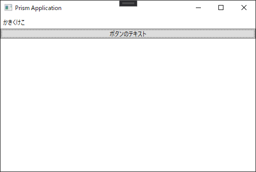

# Prism(C# の MVVM フレームワーク) を使ってみるテスト

VisualStudio 2019 に、Prism Template Pack を入れた状態で使っています。
とりあえず、.NET 5 でやってみます。(何か問題があったら .NET Core 3 か .NET Framework に切り替えます)

## ウィンドウの表示位置を画面中央にする

とりあえず、自動生成された MainWindow を画面中央に表示されるようにします。

```xml
<Window x:Class="PrismTest.Views.MainWindow"
        xmlns="http://schemas.microsoft.com/winfx/2006/xaml/presentation"
        xmlns:x="http://schemas.microsoft.com/winfx/2006/xaml"
        xmlns:prism="http://prismlibrary.com/"
        prism:ViewModelLocator.AutoWireViewModel="True"
        Title="{Binding Title}" Height="350" Width="525"
        WindowStartupLocation="CenterScreen">
    <Grid>
        <ContentControl prism:RegionManager.RegionName="ContentRegion" />
    </Grid>
</Window>
```

上記の **WindowStartupLocation="CenterScreen"** の部分で画面中央表示を指定しています。

## データのバインド

自動生成されたソースファイルでタイトル文字列がデータバインドされています。
MainWindow.xaml の *Title="{Binding Title}"* の部分で、ウィンドウの *Title* に Title というデータをバインドしています。

バインドされているデータは、MainWindowViewModel.cs の下記の部分で指定されています。

```cs
        private string _title = "Prism Application";
        public string Title { get => _title; set => SetProperty(ref _title, value); }
```

MainWindow.xaml の *Title* に、MainWindowViewModel.cs の *Title(_title)* がバインドされています。

## ラベルデータのバインド

次に、ラベルのデータをバインドしてみます。
MainWindow.xqml を以下のように変更します。

```xml
  <Grid>
    <StackPanel>
      <Label Content="{Binding LabelData}"/>
      <ContentControl prism:RegionManager.RegionName="ContentRegion" />
    </StackPanel>
  </Grid>
```

MainWindowViewModel.cs に下記のコードを追加します。
これで、xaml の LabelData に "あいうえお" が表示されます。

```cs
    private string _labelData = "あいうえお";
    public string LabelData { get => _labelData; set => SetProperty(ref _labelData, value); }
```


MainWindow.xaml の *Content="{Binding LabelData}"* の部分で、ラベルの内容が MainWindowViewModel.cs の *LabelData(_labelData)* にバインドされています。

**ラベルは Content をバインドする**ということですね。

## ボタンデータのバインド

次はボタンデータをバインドしてみます。
MainWindow.xaml に書きを追加します。

```xml
  <Grid>
    <StackPanel>
      <Label Content="{Binding LabelData}"/>
      <Button Content="ボタンのテキスト" Command="{Binding TestButton}"/>
      <ContentControl prism:RegionManager.RegionName="ContentRegion" />
    </StackPanel>
  </Grid>
```

*\<Button Content="ボタンのテキスト" Command="{Binding TestButton}"/\>* の部分が追加された部分です。

MainWindowViewModel.cs に書きを追加します。

```cs
    public MainWindowViewModel() {
      TestButton = new DelegateCommand(TestButtonExecute);
    }

    public DelegateCommand TestButton { get; }

    private void TestButtonExecute() {
      LabelData = "かきくけこ";
    }
```

TestButton という MainWindow.xaml で定義したオブジェクトを、DelegateCommant で、引数にイベとハンドラを指定して作成し、TestButtonExecute でクリック時の処理を書きます。



**ボタンは Command をバインドする**ということですね。

## 画面遷移

次は、RequestNavigate を使用して画面遷移する方法です。


### 以下作成中

***

**[戻る](../../index.md)**
