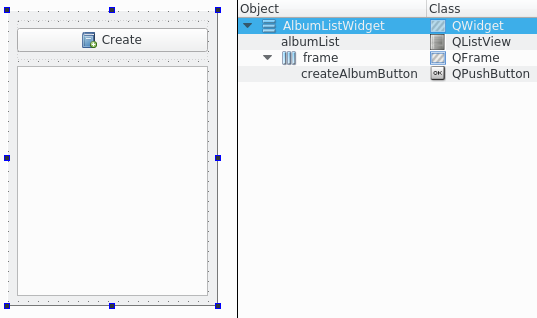
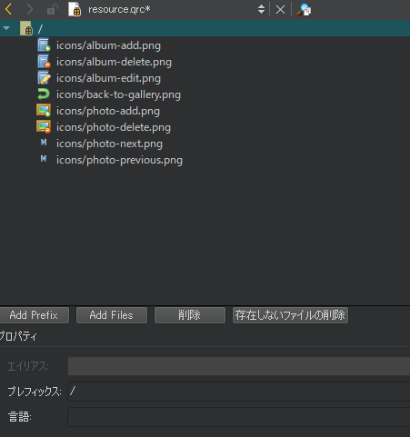

# AlbumListWidgetでアルバムをリストアップ

このウィジェットは、新しいアルバムを作成し、既存のアルバムを表示する方法を提供しなければなりません。アルバムを選択すると、他のウィジェットが適切なデータを表示するために使用するイベントをトリガーしなければなりません。AlbumListWidget コンポーネントは、Qt ビュー機構を使用したこのプロジェクトで最もシンプルなウィジェットです。次のウィジェットにジャンプする前に、時間をかけて AlbumListWidget を十分に理解してください。

次のスクリーンショットは、ファイル AlbumListWidget.ui のフォームエディタビューです。



レイアウトは非常にシンプルです。コンポーネントの説明は以下の通りです。

* AlbumListWidget コンポーネントは、垂直レイアウトを使用して、リストの上に作成ボタンを表示します。
* フレームコンポーネントには、魅力的なボタンが含まれています。
* createAlbumButton コンポーネントは、アルバムの作成を処理します。
* albumListコンポーネントは、アルバムリストを表示します。

あなたはここで使用されるタイプのほとんどを認識しているはずです。ここでは、本当に新しい型の話をしましょう。QListViewです。前の章ですでに見たように、Qtはモデル/ビューのアーキテクチャを提供しています。このシステムは、モデルクラスを介して一般的なデータアクセスを提供するために実装しなければならない特定のインターフェイスに依存しています。これは gallery-core プロジェクトで AlbumModel と PictureModel クラスを使って行ったことです。

いよいよビューの部分を扱うことになりました。ビューはデータの表示を担当します。また、選択、ドラッグ＆ドロップ、アイテムの編集などのユーザーインタラクションを処理します。幸いなことに、これらのタスクを達成するために、ビューはQItemSelectionModel、QModelIndex、QStyledItemDelegateなどの他のQtクラスに助けられています。

Qtが提供するすぐに使えるビューの一つを楽しむことができるようになりました。

* QListView: このビューは、モデルのアイテムをシンプルなリストとして表示します。
* QTableView: このビューは、モデルのアイテムを2次元の表として表示します。
* QTreeView: このビューは、リストの階層から項目を表示します。

ここでは、アルバム名のリストを表示したいので、選択はかなり明白です。しかし、より複雑な状況では、適切なビューを選択するための経験則はモデルタイプを探すことです。ここでは QAbstractListModel 型の AlbumModel 用のビューを追加したいので、QListView クラスが正しいようです。

前のスクリーンショットにあるように、createAlbumButton オブジェクトにはアイコンがあります。アイコンを QPushButton クラスに追加するには、ウィジェット**プロパティの icon** → **Choose resource** を選択します。これで、resource.qrc ファイルから画像を選択できるようになりました。

**Qtリソース**ファイルとは、アプリケーションにバイナリファイルを埋め込むためのファイルの集まりです。どのようなタイプのファイルを格納することもできますが、一般的には画像、サウンド、翻訳ファイルを格納するために使用します。リソースファイルを作成するには、プロジェクト名を右クリックし、**新規追加** → **Qt** → **Qtリソースファイル**と進みます。Qt Creatorは、デフォルトのresource.qrcというファイルを作成し、gallery-desktop.proというファイルにこの行を追加します。

```QMake
RESOURCES += \
    resource.qrc
```

リソースファイルは主に2つの方法で表示することができます。**リソースエディタ**と**プレインテキストエディタ**です。リソースファイルの上で右クリックして開くを選択することで、エディタを選択することができます。

**リソースエディタ**は、以下のスクリーンショットのように、リソースファイル内のファイルを簡単に追加・削除できるビジュアルエディタです。



**プレーンテキストエディタ**は、このXMLベースのファイルresource.qrcをこのように表示します。

```XML
<RCC>
    <qresource prefix="/">
        <file>icons/album-add.png</file>
        <file>icons/album-delete.png</file>
        <file>icons/album-edit.png</file>
        <file>icons/back-to-gallery.png</file>
        <file>icons/photo-add.png</file>
        <file>icons/photo-delete.png</file>
        <file>icons/photo-next.png</file>
        <file>icons/photo-previous.png</file>
    </qresource>
</RCC>
```

ビルド時には、qmake と rcc (Qt Resource Compiler) がアプリケーションのバイナリにリソースを埋め込みます。

これでフォームの部分が明確になったので、AlbumListWidget.h ファイルを解析してみましょう。

```C++
#include <QWidget>
#include <QItemSelectionModel>

namespace Ui {
class AlbumListWidget;
}

class AlbumModel;

class AlbumListWidget : public QWidget
{
    Q_OBJECT

public:
    explicit AlbumListWidget(QWidget *parent = nullptr);
    ~AlbumListWidget();

    void setModel(AlbumModel* model);
    void setSelectionModel(QItemSelectionModel* selectionModel);

private slots:
    void createAlbum();

private:
    Ui::AlbumListWidget *ui;
    AlbumModel* mAlbumModel;
};
```

setModel()関数とsetSelectionModel()関数はこのスニペットの中で最も重要な行です。このウィジェットが正しく動作するためには2つのことが必要です。

* AlbumModel: データへのアクセスを提供するモデルクラスです。gallery-coreプロジェクトではすでにこのクラスを作成しています。
* QItemSelectionModel: これはビューの選択を処理するQtクラスです。デフォルトでは、ビューは独自の選択モデルを使用します。異なるビューやウィジェットで同じ選択モデルを共有することで、アルバムの選択を簡単に同期させることができます。

AlbumListWidget.cpp のメイン部分です。

```C++
#include <QInputDialog>

#include "albummodel.h"

AlbumListWidget::AlbumListWidget(QWidget *parent) :
    QWidget(parent),
    ui(new Ui::AlbumListWidget),
    mAlbumModel(nullptr)
{
    ui->setupUi(this);
    connect(ui->createAlbumButton, &QPushButton::clicked,
            this, &AlbumListWidget::createAlbum);
}

AlbumListWidget::~AlbumListWidget()
{
    delete ui;
}

void AlbumListWidget::setModel(AlbumModel *model)
{
    mAlbumModel = model;
    ui->albumList->setModel(mAlbumModel);
}

void AlbumListWidget::setSelectionModel(QItemSelectionModel *selectionModel)
{
    ui->albumList->setSelectionModel(selectionModel);
}
```

2つのセッターは主にAlbumListのモデルと選択モデルを設定するために使用されます。そして、私たちのQListViewクラスは自動的にモデル(AlbumModel)を要求して、それぞれの行数とQt::DisplayRole(アルバムの名前)を取得します。

アルバム作成を処理する AlbumListWidget.cpp ファイルの最後の部分を見てみましょう。

```C++
void AlbumListWidget::createAlbum()
{
    if (!mAlbumModel) {
        return;
    }

    bool ok;
    QString albumName = QInputDialog::getText(this,
                                              "Create a new Album",
                                              "Choose an name",
                                              QLineEdit::Normal,
                                              "New album",
                                              &ok);

    if (ok && !albumName.isEmpty()) {
        Album album(albumName);
        QModelIndex createdIndex = mAlbumModel->addAlbum(album);
        ui->albumList->setCurrentIndex(createdIndex);
    }
}
```

QInputDialog クラスについては、第 1 章の Qt入門 で既に説明しました。今回は、アルバムの名前を入力するようにユーザーに要求するために使用します。次に、要求された名前でアルバム・クラスを作成します。このオブジェクトは単なる「データ・ホルダー」であり、addAlbum() はこれを使用して、一意の ID を持つ実際のオブジェクトを作成して保存します。

関数 addAlbum() は、作成されたアルバムに対応する QModelIndex 値を返します。ここから、この新しいアルバムを選択するためにリストビューを要求することができます。

***
**[戻る](../index.html)**
