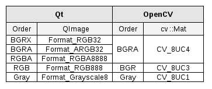

# OpenCVフィルタの実装

これで、開発環境の準備ができたので、楽しみな部分を始めましょう。OpenCVを使って、3つのフィルタを実装します．

* FilterOriginal: このフィルターは何もせずに同じ画像を返します (怠惰な!)
* FilterGrayscale: このフィルターは画像をカラーからグレースケールに変換します。
* FilterBlur: このフィルターは画像を滑らかにします。

これらすべてのフィルタの親クラスは Filter です。ここにこの抽象クラスがあります。

```C++
//Filter.h
class Filter
{
    public:
    Filter();
    virtual ~Filter();

    virtualQImage process(constQImage& image) = 0;
};

//Filter.cpp
Filter::Filter() {}
Filter::~Filter() {}
```

ご覧の通り、process() は純粋な抽象メソッドです。すべてのフィルタはこの関数で特定の動作を実装します。まずはシンプルな FilterOriginal クラスから始めましょう。以下は FilterOriginal.h です。

```C++
class FilterOriginal : public Filter
{
    public:
    FilterOriginal();
    ~FilterOriginal();

    QImageprocess(constQImage& image) override;
};
```

このクラスはFilterを継承しており、process()関数をオーバーライドしています。実装も非常にシンプルです。FilterOriginal.cppを以下のように埋めます。

```C++
FilterOriginal::FilterOriginal() :
Filter()
{
}

FilterOriginal::~FilterOriginal()
{
}

QImageFilterOriginal::process(constQImage& image)
{
    return image;
}
```

変更は行われず、同じ画像が返されます。フィルタの構造が明確になったので、FilterGrayscale を作成します。.h/.cppファイルはFilterOriginalFilterに近いので、FilterGrayscale.cppのprocess()関数に飛んでみましょう。

```C++
QImageFilterGrayscale::process(constQImage& image)
{
    // QImage => cv::mat
    cv::Mattmp(image.height(),
    image.width(),
        CV_8UC4,
        (uchar*)image.bits(),
        image.bytesPerLine());

    cv::MatresultMat;
    cv::cvtColor(tmp, resultMat, CV_BGR2GRAY);

    // cv::mat =>QImage
    QImageresultImage((constuchar *) resultMat.data,
    resultMat.cols,
    resultMat.rows,
    resultMat.step,
    QImage::Format_Grayscale8);
    returnresultImage.copy();
}
```

Qt フレームワークでは、画像を操作するために QImage クラスを利用します。OpenCV の世界では、Mat クラスを利用しますので、最初のステップは、QImage のソースから正しい Mat オブジェクトを作成することです。OpenCV と Qt は、両方とも多くの画像フォーマットを扱います。画像フォーマットは、次のような情報でデータバイトの編成を記述します。

* Channel count: グレースケール画像では1つのチャンネル(白の強度)しか必要ありませんが、カラー画像では3つのチャンネル(赤、緑、青)が必要です。不透明度 (アルファ) ピクセル情報を処理するためには 4 つのチャンネルが必要です。
* Bit depth: ピクセルの色を格納するために使用されるビット数。
* Channel order: 最も一般的な注文はRGBとBGRです。アルファは色情報の前後に発注することができます。

例えば、OpenCV の画像フォーマット CV_8UC4 は、符号なし 8 ビットの 4 チャンネルを意味し、アルファカラー画像に最適です。私たちの場合は、互換性のあるQtとOpenCVの画像フォーマットを使用して、MatでQImageを変換しています。以下に少しまとめてみます。



QImageクラスのフォーマットも、プラットフォームのエンディアンに依存するものがあることに注意してください。前述の表は、少しエンディアンが低いシステムの場合のものです。OpenCVの場合，順序は常に同じです：BGRA。このプロジェクトの例では必須ではありませんが、以下のように青チャンネルと赤チャンネルを入れ替えることができます。

```C++
// with OpenCV
cv::cvtColor(mat, mat, CV_BGR2RGB);

// with Qt
QImage swapped = image.rgbSwapped();
```

OpenCV Mat と Qt QImage クラスは、デフォルトで浅い構築／コピーを行います。これは、メタデータのみが実際にコピーされ、ピクセルデータが共有されることを意味します。画像の深いコピーを作成するには、 copy() 関数を呼び出す必要があります。

```C++
// with OpenCV
mat.clone();

// with Qt
image.copy();
```

QImage クラスから tmp という Mat クラスを作成しました。 tmp は、image の深いコピーではないことに注意してください。そして、OpenCV 関数を呼び出して、 cv::cvtColor() を用いて画像をカラーからグレースケールに変換します。最後に、グレースケールの resultMat 要素から QImage クラスを作成します。この場合も、 resultMat と resultImage は同じデータポインタを共有します。これが終わると、 resultImage の深いコピーが返されます。

最後のフィルタを実装しましょう。FilterBlur.cppのprocess()関数です。

```C++
QImageFilterBlur::process(constQImage& image)
{
    // QImage => cv::mat
    cv::Mattmp(image.height(),
        image.width(),
        CV_8UC4,
        (uchar*)image.bits(),
        image.bytesPerLine());

    int blur = 17;
    cv::MatresultMat;
    cv::GaussianBlur(tmp,
        resultMat,
        cv::Size(blur, blur),
        0.0,
        0.0);

    // cv::mat =>QImage
    QImageresultImage((constuchar *) resultMat.data,
    resultMat.cols,
    resultMat.rows,
    resultMat.step,
    QImage::Format_RGB32);
    returnresultImage.copy();
}
```

QImage から Mat への変換は同じです。処理が異なるのは、画像を滑らかにするために cv::GaussianBlur() OpenCV 関数を利用しているからです。blur は、ガウスぼかしで利用されるカーネルサイズです。この値を大きくすることで、よりソフトな画像を得ることができますが、奇数と正の値だけを利用してください。最後に、マットをQImageに変換し、呼び出し元に深いコピーを返します。

***

**[戻る](../index.html)**
