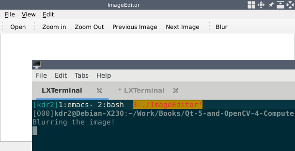
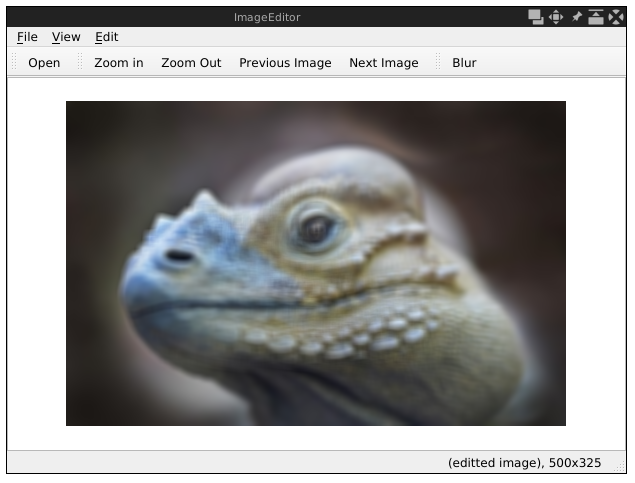

# プロ並みの画像編集

第1章「画像ビューアの構築」では、Qtで画像を閲覧するための簡単なアプリケーションをゼロから構築しました。このアプリケーションでは、ローカルディスクにある画像を表示したり、表示を拡大・縮小したり、開いているディレクトリ内を移動したりすることができます。この章では、そのアプリケーションを継続し、ユーザーがオープニング画像を編集できるようにするための機能を追加します。この目標を達成するために、本書の冒頭で紹介したOpenCVライブラリを巻き込みます。また、アプリケーションの拡張性を高めるために、これらの編集機能のほとんどをQtのプラグイン機構を利用してプラグインとして開発する予定です。

本章では、以下のようなトピックを取り上げます。

* QtとOpenCVの間で画像を変換する
* Qt のプラグイン機構を利用したアプリケーションの拡張
* OpenCVが提供する画像処理アルゴリズムによる画像の修正

***

## 技術的要件

前章で作成した ImageViewer アプリケーションが正常に動作していることが必要です。本章での開発は、そのアプリケーションをベースに行います。

また、前提条件としてOpenCVの基本的な知識が必要です。今回はOpenCVの最新版、つまり本書の執筆時である2018年12月にリリースされたバージョン4.0を使用する予定です。この新バージョンは、Debian、Ubuntu、Fedoraなど多くのオペレータシステムのソフトウェアリポジトリにまだ含まれていないため、ソースからビルドする予定です。この点については心配しないでください。この章の後半で、インストール方法について簡単に説明します。

この章のコードはすべて、本書の GitHub リポジトリ（[https://github.com/PacktPublishing/Qt-5-and-OpenCV-4-Computer-Vision-Projects/tree/master/Chapter-02](https://github.com/PacktPublishing/Qt-5-and-OpenCV-4-Computer-Vision-Projects/tree/master/Chapter-02)）に掲載されています。

次のビデオで、コードが実際に動いているところをご覧ください： [http://bit.ly/2FhYLro](http://bit.ly/2FhYLro)

***

## ImageEditor アプリケーション

この章では、画像を編集するためのアプリケーションを作りますので、ImageEditorと名付けます。GUIアプリケーションで画像を編集するには、まずそのアプリケーションで画像を開いて見ることが必要ですが、これは前章でやったとおりです。そこで、画像編集機能を追加する前に、ImageViewerアプリケーションのコピーを作成し、ImageEditorと名前を変更することにしました。

まずは、ソースをコピーするところから始めましょう。

```sh
    $ mkdir Chapter-02
    $ cp -r Chapter-01/ImageViewer/ Chapter-02/ImageEditor
    $ ls Chapter-02
    ImageEditor
    $ cd Chapter-02/ImageEditor
    $ make clean
    $ rm -f ImageViewer
```

以上のコマンドで、Chapter-01 ディレクトリの下にある ImageViewer ディレクトリを Chapter-02/ImageEditor にコピーしています。そして、そのディレクトリに入り、make clean を実行して、コンパイル時に生成された中間ファイルをすべてクリーニングし、rm -f ImageViewer を使って古いターゲットの実行ファイルを削除してください。

 クリーンアップされたプロジェクトができたので、その一部をリネームしてみましょう。

* プロジェクトディレクトリには、コピー時に新しいプロジェクト名ImageEditorが付けられているので、ここでは何もする必要がありません。
* QtプロジェクトファイルImageViewer.proは、ImageEditor.proに名前を変更する必要があります。これは、ファイルマネージャかターミナルで行います。
* ImageEditor.proファイルのTARGET = ImageViewerの行をTARGET = ImageEditorに変更して、TARGETをImageEditorに変更する必要があります。
* ソースファイル main.cpp の window.setWindowTitle("ImageViewer"); の行を window.setWindowTitle("ImageEditor"); に変更し、ウィンドウタイトルを変更する必要があります。

これですべての名前が変更されたので、ImageViewerからコピーした新しいImageEditorアプリケーションをコンパイルして実行しましょう。

```sh
    $ qmake -makefile
    $ make
    g++ -c -pipe ...
    # output truncated
    # ...
    $ ls
    ImageEditor ImageEditor.pro main.cpp main.o mainwindow.cpp mainwindow.h
    mainwindow.o Makefile moc_mainwindow.cpp moc_mainwindow.o moc_predefs.h
    $ export LD_LIBRARY_PATH=/home/kdr2/programs/opencv/lib/.
    $ ./ImageEditor
```

ImageEditorというウィンドウタイトルが違うだけで、ImageViewerのウィンドウと全く同じであることが分かると思います。とにかく、今は画像編集の機能はないものの、エディタアプリケーションをセットアップすることができました。次の章では、簡単な編集機能を追加する予定です。

***

## OpenCVを用いた画像のぼかし処理

前節では、エディタアプリケーションをセットアップしました。このセクションでは、画像編集の簡単な機能である、画像をぼかすためのアクション（メニューとツールバーの両方）を追加します。

これは、2つのステップで行います。

* まず、UIをセットアップしてアクションを追加し、アクションをダミースロットに接続します。
* 次に、ダミースロットを画像をぼかすように書き換えて、OpenCVライブラリーを巻き込みます。

***

## ブラーアクションの追加

この章で追加するアクションのほとんどは、画像を編集するために使用されるので、新しいメニューとツールバーに分類しておきます。まず、mainwindow.hヘッダーファイルのprivateセクションで、編集メニュー、編集ツールバー、ブラーアクションの3つのメンバを宣言します。

```cpp
         QMenu *editMenu;
         QToolBar *editToolBar;
         QAction *blurAction;
```

そして、以下のように、それぞれMainWindow::initUI、MainWindow::createActionsのメソッドで作成することになります。

MainWindow::initUIでは、以下のように実行しています。

```cpp
         editMenu = menuBar()->addMenu("&Edit");
         editToolBar = addToolBar("Edit")。
```

MainWindow::createActionsでは、以下のように実行されます。

```cpp
         blurAction = new QAction("Blur", this);
         editMenu->addAction(blurAction);
         editToolBar->addAction(blurAction);
```

今までは、編集メニューと編集ツールバーがあり、その両方にぼかしアクションがありました。しかし、ユーザーがツールバーのぼかしボタンや編集メニューのぼかし項目をクリックしても、何も起こりません。これは、まだそのアクションにスロットを接続していないためです。では、そのアクションにスロットを与えてみましょう。まず、mainwindow.h の private slots セクションで、以下のようにスロットを宣言します。

```cpp
         // for editting
         void blurImage();
```

   次に、mainwindow.cpp でダミーの実装をします。

```cpp
     void MainWindow::blurImage()
     {
         qDebug() << "Blurring the image!";
     }
```

スロットの準備ができたので、mainwindow::createActionsメソッドの最後で、blurアクションのトリガーシグナルをこのスロットに接続しましょう。

```cpp
         connect(blurAction, SIGNAL(triggered(bool)), this, SLOT(blurImage()));
```

アプリケーションをコンパイルして実行すると、メニュー、ツールバー、そしてアクションが表示されます。アクションをクリックしてトリガーすると、Blurring the image! というメッセージが印刷されるのがわかります。

ウィンドウと印刷されたメッセージはこのような感じです。



UI部分の準備ができたので、次の章からはOpenCVをスロットに使って、どのように画像をぼかすかに集中できます。

***

## OpenCVのソースからのビルドとインストール

前の節では、ぼかし処理用のダミースロットをインストールしました。このスロットは、簡単なメッセージを表示するだけで、何もしません。今度は、そのスロットの実装を書き換えて、本当のぼかし処理を行うようにします。

前のセクションで述べたように、画像の編集には OpenCV ライブラリ、より正確にはその最新版 (4.0) を使用する予定です。そこで、コードを書き始める前に、最新版のOpenCVライブラリをインストールし、プロジェクトに組み込みます。

OpenCV は、コンピュータビジョンアプリケーションの構築に必要なクラスや関数を含むライブラリ、ツール、モジュールのセットです。そのリリースファイルは、公式サイトのリリースページ（[https://opencv.org/releases.html](https://opencv.org/releases.html)）で見ることができます。もう一つ知っておくべきことは、OpenCVはCMakeと呼ばれる最新のビルドツールを使ってビルドシステムを構築していることです。つまり，OpenCV をソースからビルドするには，オペレーティングシステムに CMake がインストールされている必要があり，少なくともバージョン 3.12 の CMake が必要なので，お使いの CMake のバージョンが適切に設定されていることを確認してください．

*プロジェクト、特に大規模なプロジェクトをどのように構築するかは、ソフトウェア工学の世界では複雑なテーマです。ソフトウェア工学の発展過程における波乱の中で、このテーマに関連して様々な状況に対処するために、多くのツールが発明されてきました。makeからAutotools、SConsからCMake、Ninjaからbazelまで、ここでは語り尽くせないほどです。しかし、これまで本書で紹介したのは、そのうちの2つだけでした。Qmakeは、Qtチームによって開発された、Qtプロジェクトのビルドに特化したものです。CMakeは、OpenCVを含む多くのプロジェクトで広く採用されているもう一つのものです。

この本では，これらのツールの使い方を簡単かつ明確にすることに努めます。*

OpenCVのリリースページは以下のような感じです。


Sources のリンクをクリックすると，そのソースの ZIP パッケージをローカルディスクにダウンロードし，それを解凍することができます．OpenCV のビルドは，ターミナル上で CMake を用いて行いますので，ターミナルを開き，ワークディレクトリを解凍されたソースのディレクトリに変更します．また、OpenCVはソースツリーのルートディレクトリに直接ビルドすることができないので、別のディレクトリを作成してビルドする必要があります。

以下は、OpenCVをビルドする際に使用したターミナルでの手順です。

```sh
     $ cd ~/opencv-4.0.0 # path to the unzipped source
     $ mkdir release # create the separate dir
     $ cd release
     $ cmake -D CMAKE_BUILD_TYPE=RELEASE -D CMAKE_INSTALL_PREFIX=$HOME/programs/opencv ..
     # ... output of cmake ...
     # rm ../CMakeCache.txt if it tells you are not in a separate dir
     $ make
     # ... output of make ...
     $ make install
```

cmake ...行は、解凍したソースのルートディレクトリにあるCMakeLists.txtを読み込んで、makefileを生成しています。cmake コマンドに -D で渡す CMAKE_BUILD_TYPE 変数は、OpenCV を RELEASE モードでビルドすることを指定します。同様に、CMAKE_INSTALL_PREFIX変数でOpenCVのライブラリのインストール先を指定します。ここでは、$HOME/programs/opencv、つまり、/home/kdr2/programs/opencvにOpenCVをインストールしていますが、必要に応じてCMAKE_INSTALL_PREFIXの値を変更し、インストール先ディレクトリを変更することが可能です。cmakeコマンドが成功に終わると、Makefileというファイルが生成されます。このMakefileがあれば、あとはmakeとmake installを実行して、ライブラリのコンパイルとインストールを行うことができます。

これまでの手順がすべてうまくいけば、OpenCVのバージョンは正しくインストールされているはずです。インストール先のディレクトリを閲覧することで確認できます。

```sh
     $ ls ~/programs/opencv/
     bin include lib share
     $ ls ~/programs/opencv/bin/
     opencv_annotation opencv_interactive-calibration opencv_version
     opencv_visualisation setup_vars_opencv4.sh
     $ ls -l ~/programs/opencv/lib/
     # ...
     lrwxrwxrwx 1 kdr2 kdr2 21 Nov 20 13:28 libopencv_core.so -> libopencv_core.so.4.0
     lrwxrwxrwx 1 kdr2 kdr2 23 Nov 20 13:28 libopencv_core.so.4.0 -> libopencv_core.so.4.0.0
     -rw-r--r-- 1 kdr2 kdr2 4519888 Nov 20 12:34 libopencv_core.so.4.0.0
     # ...
     lrwxrwxrwx 1 kdr2 kdr2 24 Nov 20 13:28 libopencv_imgproc.so -> libopencv_imgproc.so.4.0
     lrwxrwxrwx 1 kdr2 kdr2 26 Nov 20 13:28 libopencv_imgproc.so.4.0 -> libopencv_imgproc.so.4.0.0
     -rw-r--r-- 1 kdr2 kdr2 4714608 Nov 20 12:37 libopencv_imgproc.so.4.0.0
     # ... output truncated
```

OpenCV はモジュール化されたライブラリです．メインモジュールとエクストラモジュールの2種類から構成されています。

メインモジュールは，OpenCV をソースからビルドしたときにデフォルトで含まれ，画像処理タスク，フィルタリング，変換，その他多くの機能で利用されるモジュールとともに，OpenCV のコア機能をすべて含んでいます。

追加モジュールには，OpenCV ライブラリにデフォルトで含まれていないすべての OpenCV 機能が含まれており，そのほとんどはコンピュータビジョン関連の追加機能を含んでいます。

OpenCV が正しくインストールされているかどうかを確認した際に，OpenCV のインストールパスの下にある lib ディレクトリの内容を振り返ってみると，libopencv_*.so* というパターンの名前のファイルがたくさん見つかると思います．通常，これらのファイルはそれぞれ1つのOpenCVモジュールに対応しています．例えば，libopencv_imgproc.so ファイルは，画像処理タスクに使用される imgproc モジュールです。

OpenCVライブラリのインストールが完了したので、いよいよQtプロジェクトに取り込みます。Qt プロジェクトファイル ImageEditor.pro を開いて、以下の行を追加しましょう。

```qmake
     unix: !mac {
         INCLUDEPATH += /home/kdr2/programs/opencv/include/opencv4
         LIBS += -L/home/kdr2/programs/opencv/lib -lopencv_core -l opencv_imgproc
     }
```

unix: !macディレクティブは、macOS以外のUNIX系システムで、その隣の括弧内の設定を使用することを意味します。私はDebian GNU/Linuxを使用しているので、このディレクティブを使用しています。括弧の中のディレクティブは，以下の行でOpenCVライブラリをインポートするための重要な部分です．

* 最初の行は，INCLUDEPATH の値を更新することで，コード内で使用する OpenCV のヘッダファイルがどこにあるかをコンパイラに知らせます。
* 2行目は，リンカにどの OpenCV モジュール（共有オブジェクト）をリンクすべきか，そしてどこにあるべきかを伝えます。より具体的には、-lopencv_core -l opencv_imgproc は、私たちのアプリケーションを libopencv_core.so と libopencv_imgproc.so に対してリンクすべきであり、-L・・・はリンカが /home/kdr2/programs/opencv/lib ディレクトリの下でこれらの lib ファイル（共有オブジェクト）を見つけるべきであることを意味しています。

macOS や Windows では，OpenCV は別の方法でビルド，リンクされますが，モジュールの各ライブラリファイルには含まれません．その場合、すべてのモジュールは opencv_world と呼ばれる1つのライブラリにリンクされます。CMake に -DBUILD_opencv_world=on を渡すことで、Linux でも同じ効果を得ることができます。

```sh
     # on mac
     $ ls -l
     -rwxr-xr-x 1 cheftin staff 25454204 Dec 3 13:47 libopencv_world.4.0.0.dylib
     lrwxr-xr-x 1 cheftin staff 27 Dec 3 13:36 libopencv_world.4.0.dylib -> libopencv_world.4.0.0.dylib
     lrwxr-xr-x 1 cheftin staff 25 Dec 3 13:36 libopencv_world.dylib -> libopencv_world.4.0.dylib

     # on Linux with -D BUILD_opencv_world=on
     $ ls -l
     lrwxrwxrwx 1 kdr2 kdr2 22 Nov 29 22:55 libopencv_world.so -> libopencv_world.so.4.0
     lrwxrwxrwx 1 kdr2 kdr2 24 Nov 29 22:55 libopencv_world.so.4.0 -> libopencv_world.so.4.0.0
     -rw-r--r-- 1 kdr2 kdr2 57295464 Nov 29 22:09 libopencv_world.so.4.0.0
```

この方法で OpenCV をビルドすると、ソースをコンパイルする際のリンカーオプションが簡単になります -lopencv_core -lopencv_imgproc でやったようにリンカーにモジュールリストを与える必要がありません。opencv_world に対してリンクするようにリンカに指示すれば十分です。macOSとWindowsの場合、以下のコードをImageEditor.proに記述します。

```qmake
     unix: mac {
         INCLUDEPATH += /path/to/opencv/include/opencv4
         LIBS += -L/path/to/opencv/lib -lopencv_world
     }

     win32 {
         INCLUDEPATH += c:/path/to/opencv/include/opencv4
         LIBS += -lc:/path/to/opencv/lib/opencv_world
     }
```

この方法の方が簡単ですが、本書では、私たちが学習し使用しているOpenCVモジュールについて深く理解してもらうために、今でも個別のモジュールを使用しています。

Qmake は，サードパーティライブラリを設定する別の方法，つまり，ライブラリのメタ情報を管理するための機能である pkg-config を利用する方法を提供しています。残念ながら，[https://github.com/opencv/opencv/issues/13154](https://github.com/opencv/opencv/issues/13154) によると，OpenCVはバージョン4.0からpkg-configのサポートを非推奨にしたようです。つまり，QtプロジェクトでOpenCVを設定するためには，pkg-configを使うよりも，もっと直接的で柔軟な方法を使う必要があるのです。

***

## 画像をぼかす

最後に、OpenCVライブラリのインストールと設定を行いました。それでは、このライブラリを使って、blur アクションに接続されたスロット内の画像をぼかしてみましょう。

まず、mainwindow.cpp ファイルの冒頭に以下の行を追加し、OpenCV のヘッダーファイルをインクルードできるようにします。

```cpp
     #include "opencv2/opencv.hpp"
```

これで準備は完了しましたので、スロットメソッドの実装に集中しましょう。開いている1枚の画像に対して操作しようとする他のスロットと同様に、何かをする前に、現在開いている画像があるかどうかをチェックする必要があります。

```cpp
         if (currentImage == nullptr) {
             QMessageBox::information(this, "Information", "No image to edit.");
             return;
         }
```

このように、開いている画像がない場合は、メッセージボックスを表示し、関数からすぐに戻っています。

アプリケーションの現在時刻に開いている画像があることを確認したら、開いている画像を QPixmap のインスタンスとして取得すればよいことはわかりました。しかし、OpenCVを使ってQPixmapの形をした画像をぼかすにはどうしたらよいのでしょうか？答えは、「できない」です。OpenCV で画像に対して何らかの操作を行う前に，OpenCV が画像をどのように保持しているかを示す形式，つまり Mat クラスのインスタンスとして，画像を用意する必要があります．OpenCV の Mat クラスは，行列を意味します．つまり，画像は実際には，与えられた幅，高さ，チャンネル数，そして深度を持つ行列なのです．Qt では，画像の行列データを保持するために QImage という類似のクラスが利用されています．つまり，OpenCV を用いて QPixmap をぼかす方法は，QPixmap を QImage に変換し，QImage を用いて Mat を作成し，その Mat をぼかし，そして Mat を QImage と QPixmap にそれぞれ戻せばよいということです。

変換に関しては，かなり多くの作業を行わなければなりません．これについて，以下のコード行を通して説明しましょう．

```cpp
         QPixmap pixmap = currentImage->pixmap();
         QImage image = pixmap.toImage();
```

このスニペットは非常に簡単です。現在の画像のデータをQPixmapのインスタンスとして取得し、そのtoImageメソッドを呼び出してQImageのインスタンスに変換しているのです。

次のステップは，QImage を Mat に変換することですが，ここで少し複雑なことが起こります．モノクロ画像，グレースケール画像，あるいは異なるビット深度を持つカラー画像など，開く画像はどのような形式であっても構いません．ぼかすためには、そのフォーマットを知っておく必要があります。そこで、元のフォーマットとは別に、深さ8ビット、3チャンネルの通常のフォーマットに変換しておきます。これは，Qtでは QImage::Format_RGB888 によって表され，OpenCVでは CV_8UC3 によって表されます．では，どのように変換を行い，Mat オブジェクトを構築するかを見てみましょう。

```cpp
         image = image.convertToFormat(QImage::Format_RGB888);
         cv::Mat mat = cv::Mat(
             image.height(),
             image.width(),
             CV_8UC3,
             image.bits(),
             image.bytesPerLine());
```

ようやく，精査可能なコードになりました．Mat オブジェクトを得たので，それをぼかしてみましょう．

```cpp
         cv::Mat tmp;
         cv::blur(mat, tmp, cv::Size(8, 8));
         mat = tmp;
```

Blur 関数は，OpenCV の imgproc モジュールで提供されています．この関数は，正規化ボックスフィルタとカーネルを用いて画像をぼかします．最初の引数は，ぼかしたい画像，2番目の引数は，ぼかした画像を配置する場所です．一時的な行列を使ってぼかした画像を保存し、ぼかしが終わった後に元の行列に代入します。第3引数はカーネルの大きさである。ここで、カーネルは、任意のピクセルの値を、隣接するピクセルの異なる量と組み合わせることによってどのように変更するかをOpenCVに伝えるために使用されます。

これで，ぼかされた画像が Mat のインスタンスとして得られましたので，それを QPixmap のインスタンスに戻し，シーンやビューに表示しなければいけません．

```cpp
         QImage image_blurred(
             mat.data,
             mat.cols,
             mat.rows,
             mat.step,
             QImage::Format_RGB888);
         pixmap = QPixmap::fromImage(image_blurred);
         imageScene->clear();
         imageView->resetMatrix();
         currentImage = imageScene->addPixmap(pixmap);
         imageScene->update();
         imageView->setSceneRect(pixmap.rect());
```

このコードの新しい部分は、mat オブジェクトから QImage オブジェクト image_blurred を生成し、QPixmap::fromImage スタティックメソッドで QImage オブジェクトを QPixmap に変換しているところです。これは新しいものですが、十分に明確です。このコードの残りの部分は、MainWindowクラスのshowImageメソッドで使用しているコードと同じで、目新しいものではありません。

ぼやけた画像を表示できたので、ステータスバーのメッセージを更新して、表示している画像が編集されたものであり、開いた元の画像ではないことをユーザーに伝えることができます。

```cpp
         QString status = QString("(editted image), %1x%2")
             .arg(pixmap.width()).arg(pixmap.height());
         mainStatusLabel->setText(status);
```

この時点で、MainWindow::blurImage メソッドは終了です。それでは、Terminal から qmake -makefile と make コマンドを実行してプロジェクトを再構築し、新しい実行ファイルを実行してみましょう。

私のようにOpenCVを/usrや/usr/localでないパスにインストールした場合、実行ファイルを実行する際に問題が発生することがあります。

```sh
     $ ./ImageEditor
     ./ImageEditor: error while loading shared libraries: libopencv_core.so.4.0: cannot open shared object file: No such file or directory
```

これは，OpenCVのライブラリがシステムのライブラリ検索パスに含まれていないことが原因です．LinuxではLD_LIBRARY_PATH，macOSではDYLD_LIBRARY_PATHという環境変数を設定して，ライブラリの検索パスに追加してあげればよいでしょう．

```sh
     $ export LD_LIBRARY_PATH=/home/kdr2/programs/opencv/lib/を設定します。
     $ ./ImageEditor
```

このアプリで画像を開くと、次のような出力が得られます。


ツールバーの「ぼかし」ボタンをクリックすると、以下のように表示されます。



画像がうまくぼかされていることがわかります。

***

## QPixmap, QImage, そして Mat

前節では、ImageEditor アプリで開いた画像にぼかしをかける機能を新たに追加しました。画像をぼかしながら，QPixmap→QImage→Mat と変換し，さらに OpenCV を用いてぼかした後に逆変換を行いました．そこでは，作業を行いましたが，これらのクラスについては多くを語らなかったのです．それでは，これらのクラスについて説明しましょう．

***

## QPixmap

QPixmap は Qt ライブラリが提供するクラスで、画面に画像を表示するときに使用することを意図しています。このプロジェクトでは、このクラスのインスタンスとして画像を読み込み、そのインスタンスをQGraphicsSenceに追加して表示させています。

QPixmapのインスタンスを作成する方法はたくさんあります。第1章「画像ビューアの構築」やこの章の前のセクションで行ったように、画像ファイルのパスでインスタンスを作成することができます。

```cpp
      QPixmap map("/path/to/image.png");
```

あるいは、空の QPixmap をインスタンス化し、後からデータを読み込むこともできます。

```cpp
      QPixmap map;
      map.load("/path/to/image.png");
```

画像を保持しているインスタンスでは、save as アクションのスロットで行ったように、その save メソッドを呼び出して画像をファイルに保存することができます。

```cpp
      map.save("/path/to/output.png");
```

最後に、QPixmap メソッドを QImage メソッドに変換するには、その toImage メソッドを呼び出します。

```cpp
      //...
      QImage image = map.toImage();
```

***

## QImage

QPixmap は主に Qt で画像を表示するためのものですが、QImage は I/O 用に設計され、ピクセルへの直接アクセスや操作に最適化されています。このクラスでは、画像のサイズ、アルファチャンネルの有無、グレースケール画像かどうか、ピクセルの色などの情報を取得することができます。

QImageは、ピクセルに直接アクセスして操作するために設計されており、ピクセル操作や変換などの画像処理を行うための関数を提供します。結局のところ、Qtライブラリは画像処理に特化したライブラリではないので、この領域で提供される機能ではこの章の要件を満たすことはできません。したがって，QImage オブジェクトを Mat オブジェクトに変換した後，OpenCV を用いて画像処理を行う予定です．

ここで問題となるのは，QImage，QPixmap，Mat という 3 つのデータ型の間をどのように変換するか，ということです．前節では，QPixmap を QImage に変換する方法について述べましたが，ここでは，その逆変換の方法について見てみましょう．

```cpp
      QPixmap pixmap = QPixmap::fromImage(image);
```

QPixmap クラスの fromImage スタティックメソッドを QImage オブジェクトを唯一の引数として呼び出すだけです。

QImageの他の機能の詳細に興味があれば、[https://doc.qt.io/qt-5/qimage.html](https://doc.qt.io/qt-5/qimage.html) にあるドキュメントを参照するとよいでしょう。次のセクションでは，QImage を Mat に，あるいはその逆に変換する方法について述べます．

***

## Mat

Mat クラスは，OpenCV ライブラリで最も重要なクラスの1つであり，その名前は matrix の略です．コンピュータビジョンの領域では，前述したように，任意の画像は与えられた幅，高さ，チャンネル数，そして深度を持つ行列です．したがって，OpenCV では，画像を表現するために Mat クラスを利用します．実際， Mat クラスは，任意のデータ型を持つ 1 つまたは複数のチャンネルのデータを格納するために利用できる n 次元配列であり，それを様々な方法で作成，変更，操作するための多くのメンバやメソッドを含んでいます．

Mat クラスは，多くのコンストラクタを持ちます．例えば，以下のように，幅（列）が 800，高さ（行）が 600 で，8 ビット unsigned int 値を含む 3 つのチャンネルを持つインスタンスを作成することができます．

```cpp
      Mat mat(600, 800, CV_8UC3);
```

このコンストラクタの第 3 引数は，行列の型です．OpenCV では，行列に利用できる多くの値があらかじめ定義されています．これらの定義済み値は，その名前を見れば行列の型が分かるように，あるいは行列の性質が判明したときに使うべき名前を推測できるように，名前にパターンが用意されています．

このパターンは，CV_\<depth>\<type>C\<channels>と呼ばれます．

* \<depth> は，8，16，32，64で置き換えることができ，これらは，ピクセル内の各要素を格納するために使われるビット数を表します．
* \<type>は符号なし整数、符号あり整数、浮動小数点数でそれぞれU、S、Fに置き換える必要がある
* \<channel> は，チャンネル数を表します．

つまり，このコードにおいて CV_8UC3 は，宣言された画像のビット深度が8であり，各ピクセルが8ビットの符号なし整数型であり，3つのチャンネルを持つことを意味します． つまり，各ピクセルには3つの要素があり， CV_8UC3 は24ビット（深度 * チャンネル）を占有します．

また，画像を構成する際に，何らかのデータで埋めることもできます．例えば，以下のように定数色で埋めることができます．

```cpp
      int R = 40, G = 50, B = 60;
      Mat mat(600, 800, CV_8UC3, Scalar(B, G, R));
```

先のコードでは，前の例で作成した画像と同じものを作成していますが，第4引数で指定された定数色 RGB(40, 50, 60) で塗りつぶしています．

ここで重要なのは，OpenCVのデフォルトの色の順番はRGBではなくBGRであり，BとRの値が入れ替わっていることです．したがって，コード中では定常色を Scalar(R, G, B) ではなく Scalar(B, G, R) として表現しています．これは、OpenCVを使って画像を読み込んだ後、色の順序が異なる別のライブラリを使って操作する場合、またはその逆の場合、特に操作の際に画像の各チャンネルを別々に扱う場合に重要なことです。

このアプリケーションでは，Qt で画像を読み込んで OpenCV の Mat データ構造に変換し，それを処理して再び QImage に変換しています．しかし，ご覧の通り，画像をぼかしている間は，赤と青のチャンネルを入れ替えて色の順番に頼ることはしていません．これは、ぼかし関数がチャンネルに対して対称的に動作するためで、チャンネル間の干渉はないため、この状況では色順序は重要ではありません。以下のようにすれば，チャンネルの入れ替えを省略することができます．

* QImage を Mat に変換し，その Mat を処理してから再び QImage に変換します．
* Mat 上で行われる処理期間中のすべての操作は，チャンネルに対して対称的なものであり，つまりチャンネル間の干渉はありません．
* 処理中の画像は表示されず，QImage に変換された後の画像のみが表示されます．

このような状況では、色の順序の問題は無視すればよいのです。これは、この後書くプラグインのほとんどに適用されるでしょう。しかし、状況によっては、単純に無視できないこともある。例えば，OpenCV を用いて画像を読み込み，それを QImage のインスタンスに変換して Qt で表示する場合，以下のコードでは，赤と青のチャンネルが入れ替わった画像が表示されることになります．

```cpp
      cv::Mat mat = cv::imread("/path/to/an/image.png") ．
      QImage image(
          mat.data,
          mat.cols,
          mat.rows,
          mat.step,
          QImage::Format_RGB888
      );
```

QImage に変換する前に，R と B のチャンネルを入れ替えておく必要があります．

```cpp
      cv::Mat mat = cv::imread("/path/to/an/image.png");
      cv::cvtColor(mat, mat, cv::COLOR_BGR2RGB);
      QImage image(
          mat.data,
          mat.cols,
          mat.rows,
          mat.step,
          QImage::Format_RGB888
      );
```

OpenCV を用いて色チャンネルを対称的に扱わない処理を行う場合，その前に色の順序が BGR であることを確認しなければならないことを覚えておいてください．

色の順序について説明したところで，Mat オブジェクトの作成の話題に戻りましょう．先ほど、Mat オブジェクトを作成する際に一定の色で塗りつぶすことができることを学びましたが、我々のアプリケーションでは、与えられた QImage オブジェクトと同じ画像を保持する Mat オブジェクトを作成すべきです。これをどのように行ったか振り返ってみましょう．

```cpp
      // image is the give QImage object
      cv::Mat mat = cv::Mat(
          image.height(),
          image.width(),
          CV_8UC3,
          image.bits(),
          image.bytesPerLine()
      );
```

既に説明した最初の 3 つの引数の他に，QImage オブジェクトが保持し，その bits メソッドが返すデータポインタを第 4 の引数として渡します．これは，画像のパディングバイトをどのように処理し，効率的にメモリに保存するかを OpenCV に知らせるためのものです．

前述したように， Mat クラスのコンストラクタは，ここでは語り尽くせないほど多く存在します．また，より高い次元を持つ Mat オブジェクトを作成することもできます．コンストラクタの完全なリストは， [https://docs.opencv.org/4.0.0/d3/d63/classcv_1_1Mat.html](https://docs.opencv.org/4.0.0/d3/d63/classcv_1_1Mat.html) にあるドキュメントを参照してください．この章では，これらのコンストラクタについてこれ以上触れません．

さて，Qt と OpenCV の間で画像オブジェクトを変換する方法についての知識を得たので，次の節では，OpenCV を用いて画像を編集する方法に進みます．

***

## Qt のプラグイン機構を使った機能追加

前節では、アプリケーションに「編集」という名前の新しいメニューとツールバーを追加し、その両方にオープニング画像をぼかすためのアクションを追加しました。この機能を追加するまでの経過を思い出してみましょう。

まず、メニューとツールバーを追加し、次にアクションを追加しました。アクションを追加した後、アクションに新しいスロットを接続しました。このスロットでは、オープニング画像を QPixmap のインスタンスとして取得し、QImage オブジェクトに変換し、さらに Mat オブジェクトに変換しています。 重要な編集作業はここから始まります．編集作業を行うために，OpenCV を用いて Mat インスタンスを変更しました．そして，編集された画像を表示するために， Mat を QImage と QPixmap に適宜変換し直します．

さて，このアプリに別の編集機能を追加したい場合，どうすればよいでしょうか？もちろん、先ほどのぼかし処理の追加を繰り返すだけでも良いのですが、効率的ではありません。ぼかしアクションを追加したのと同じ方法で、別の編集アクションをアプリに追加しただけだと想像すると、ほとんどの作業やコードが同じであることに気づくでしょう。私たちは、同じことを繰り返しているのです。これは悪い開発パターンであるだけでなく、退屈な作業でもあります。

この問題を解決するには、繰り返されるプロセスを注意深く調べ、ステップに分割し、どのステップがまったく同じで、どのステップが異なるかを見つけることです。

そうすることで、異なる編集機能を追加する際のポイントが見えてくるのです。

* 編集機能が異なると，操作の名称が異なる．
* Mat インスタンスに対する操作は、異なる編集機能によって異なります。

異なる編集機能を追加する処理では，前の2つ以外の手順やロジックはすべて同じです．つまり，新しい編集機能を追加したい場合，2つのことだけを行えばよいのです．まず，名前をつけること，そして，OpenCV を用いて Mat インスタンスに対して編集操作を行う方法を考えることです．この2つがクリアになれば，新しい編集機能が決定されます．次にやるべきことは，この新機能をアプリケーションに組み込むことです．

では，どのようにアプリケーションに組み込むのでしょうか？これは，Qt のプラグイン機構を利用して行うことになり，各編集機能はプラグインとなります．

***

## プラグインインターフェース

Qtのプラグイン機構は、Qtアプリケーションをより拡張性の高いものにする強力な手法です。前回説明したように，この機構を利用して，新しい編集機能を簡単に追加できるような方法を抽象化します．これが終われば、新しい編集機能を追加する際に、編集機能の名前と Mat インスタンスに対する操作にだけ注意すればよいことになります。

まず最初に，アプリケーションとプラグインの間で共通のプロトコルを提供し，プラグインがどのように実装されていてもロードして呼び出すことができるようにするために，インタフェースを考える必要があります．C++では、インターフェースは純粋な仮想メンバー関数を持つクラスとなります。私たちのプラグインでは、アクション名とMatへの操作に注意して、以下のようにeditor_plugin_interface.hでインターフェイスを宣言しています。

```cpp
     #ifndef EDITOR_PLUGIN_INTERFACE_H
     #define EDITOR_PLUGIN_INTERFACE_H

     #include <QObject>
     #include <QString>
     #include "opencv2/opencv.hpp"

     class EditorPluginInterface
     {
     public:
         virtual ~EditorPluginInterface() {};
         virtual QString name() = 0;
         virtual void edit(const cv::Mat &input, cv::Mat &output) = 0; virtual QString name() = 0; virtual QString name() = 0;
     };


     #define EDIT_PLUGIN_INTERFACE_IID "com.kdr2.editorplugininterface".
     Q_DECLARE_INTERFACE(EditorPluginInterface, EDIT_PLUGIN_INTERFACE_IID);

     #endif
```

ifndef/defineイディオム（最初の2行と最後の1行）を使って、このヘッダーファイルがソースファイルに一度だけ含まれるようにします。最初の2行に続いて，QtとOpenCVが提供するいくつかのヘッダファイルをインクルードして，関連するデータ構造を紹介します．そして，EditorPluginInterfaceという名前のクラスを宣言します．このクラスには，仮想的な空のデストラクタの他に，name関数とedit関数という2つの純粋な仮想メンバー関数があります．name関数はQStringを返し、これが編集アクションの名前となります。edit関数は，Matの2つの参照を入出力関数として受け取り，編集操作に利用されます．各プラグインは，このインタフェースのサブクラスとなり，これら2つの関数の実装によって，アクション名と編集操作が決定されます．

クラス宣言の後、インターフェースのIDとして com.kdr2.editorplugininterface という一意な識別子文字列を定義します。このIDはアプリケーションスコープ内で一意でなければなりません。つまり、他のインターフェイスを記述する場合は、異なるIDを使用する必要があります。次に、Q_DECLARE_INTERFACE マクロを使って、インターフェースのクラス名と定義した一意の識別子を関連付け、Qt のプラグインシステムがこのインターフェースのプラグインを認識してからロードできるようにします。

この時点で、機能を編集するためのインターフェイスが判明しています。では、このインターフェイスを実装するプラグインを書いてみましょう。

***

## ErodePluginによる画像のエロージョン化

Qtプラグインを書くには、ゼロから新しいQtプロジェクトを立ち上げる必要があります。前回の編集機能では、OpenCVのblur関数を呼び出して画像を単純にぼかしました。今回の主目的はQtライブラリのプラグイン機構を紹介することなので、この部分をわかりやすくするために、やはりOpenCVライブラリの簡単な関数を使って、簡単な編集を行います。ここでは、OpenCVライブラリからerode関数を呼び出して、画像中のオブジェクトを侵食することにします。

プラグインを ErodePlugin と名付け、プロジェクトを一から作成しましょう。

```sh
     $ ls
     ImageEditor
     $ mkdir ErodePlugin
     $ ls
     ErodePlugin ImageEditor
     $ cd ErodePlugin
     $ touch erode_plugin.h erode_plugin.cpp
     $ qmake -project
     $ ls
     erode_plugin.h erode_plugin.cpp ErodePlugin.pro
```

まず、Terminal で ImageEditor プロジェクトの親ディレクトリに移動し、ErodePlugin という名前の新しいディレクトリを作成し、そのディレクトリに入ります。そして、空のソースファイル、erode_plugin.h と erode_pluigin.cpp を作成します。この2つのファイルには、後でソースを書きます。ここで、ターミナルでqmake -projectを実行すると、ErodePlugin.proというQtのプロジェクトファイルが返ってきます。このプロジェクトはQtのプラグインプロジェクトなので、そのプロジェクトファイルには様々な設定がされています。それでは見てみましょう。

```qmake
     TEMPLATE = lib
     TARGET = ErodePlugin
     COPNFIG += plugin
     INCLUDEPATH += . ../ImageEditor
```

プロジェクトファイルの冒頭で、TEMPLATE設定の値をappではなくlibとしています。TARGETの設定も同様で、プロジェクト名を値として使用しています。また、CONFIG += pluginという特別な行を追加して、qmakeにこのプロジェクトがQtプラグインプロジェクトであることを伝えています。最後に、前のコードブロックの最後の行で、ImageEditor プロジェクトのルートディレクトリをこのプロジェクトのインクルードパスの一項目として追加し、プラグインのコンパイル中に、前節で ImageEditor プロジェクトに配置したインターフェースヘッダーファイル editor_plugin_interface.h をコンパイラが見つけることができるようにしています。

このプラグインでは、編集機能を実装するために OpenCV も必要なので、ImageEditor プロジェクトで行ったように、Qt プラグイン・プロジェクトの設定に OpenCV ライブラリの情報、より正確にはライブラリのパスとインクルードを追加する必要があります。

```qmake
     unix: !mac {
         INCLUDEPATH += /home/kdr2/programs/opencv/include/opencv4
         LIBS += -L/home/kdr2/programs/opencv/lib -lopencv_core -l opencv_imgproc
     }

     unix: mac {
         INCLUDEPATH += /path/to/opencv/include/opencv4
         LIBS += -L/path/to/opencv/lib -lopencv_world
     }

     win32 {
         INCLUDEPATH += c:/path/to/opencv/include/opencv4
         LIBS += -lc:/path/to/opencv/lib/opencv_world
     }
```

プロジェクトファイルの最後に、ヘッダーファイルとC++のソースファイルを追加します。

```qmake
     HEADERS += erode_plugin.h
     SOURCES += erode_plugin.cpp
```

これで、プラグインのプロジェクト・ファイルは完成です。設計どおり、新しい編集機能のプラグインを書くには、前節で抽象化したEditorPluginInterfaceインターフェースの実装を提供すればよいのです。そこで、そのインターフェイスのサブクラスをerode_plugin.hで宣言します。

```cpp
     #include <QObject>
     #include <QtPlugin>

     #include "editor_plugin_interface.h"

     class ErodePlugin: public QObject, public EditorPluginInterface
     {
         Q_OBJECT
         Q_PLUGIN_METADATA(IID EDIT_PLUGIN_INTERFACE_IID);
         Q_INTERFACES(EditorPluginInterface);
     public:
         QString name();
         void edit(const cv::Mat &input, cv::Mat &output);
     };
```

このように，必要なヘッダファイルを含めた後，ErodePlugin というクラスを宣言し，QObject と EditorPluginInterface の両方を継承しています．後者は、前節のeditor_plugin_interface.hで定義したインターフェイスです。ここで、プラグインの実装をQOBjectのサブクラスにしているのは、Qtのメタオブジェクトシステムとプラグインメカニズムの必要条件だからです。クラスの本体では、Qtライブラリで定義されたいくつかのマクロを使用して、さらに情報を追加しています。

```cpp
         Q_OBJECT
         q_plugin_metadata(iid edit_plugin_interface_iid);
         Q_INTERFACES(EditorPluginInterface);
```

前章で Q_OBJECT マクロを紹介しました。これは Qt のメタオブジェクトシステムに関するものです。Q_PLUGIN_METADATA(IID EDIT_PLUGIN_INTERFACE_IID) 行は、このプラグインのメタデータを宣言しています。ここでは、editor_plugin_interface.h で定義したプラグインインターフェースの一意の識別子をそのIIDメタデータとして宣言しています。そして、Q_INTERFACES(EditorPluginInterface) 行を使って、このクラスが実装しようとしているのがEditorPluginInterfaceインターフェースであることをQtに伝えています。これまでの情報で、Qtのプラグインシステムはこのプロジェクトについてすべてを知っています。

* Qtのプラグインプロジェクトなので、プロジェクトのターゲットはライブラリファイルになります。
* プラグインはEditorPluginInterfaceのインスタンスで、そのIIDはEDIT_PLUGIN_INTERFACE_IIDなので、Qtアプリケーションはこれを伝えてこのプラグインを読み込むことができるのです。

さて、このインターフェイスをどのように実装するかに焦点を当てます。まず、インターフェイスの中で2つの純粋に重要な関数を宣言します。

```cpp
     public:
         QString name();
         void edit(const cv::Mat &input, cv::Mat &output);
```

そして、erode_plugin.cpp ファイルに実装します。name関数については、単純にプラグインの名前（編集アクションの名前でもある）としてQStringであるErodeを返すだけです。

```cpp
     QString ErodePlugin::name()
     {
         return "Erode";
     }
```

編集機能については、以下のように実装します。

```cpp
     void ErodePlugin::edit(const cv::Mat &input, cv::Mat &output).
     {
         erode(input, output, cv::Mat());
     }
```

これも簡単です．OpenCV ライブラリが提供する erode 関数を呼び出すだけです．この関数が行うのは，画像歪み補正（image erosion）と呼ばれるものです．これは，数学的形態論における2つの基本演算子のうちの1つです．エロージョンとは、画像の前景や1値化されたオブジェクトを縮小する処理です。オブジェクトの境界を滑らかにし、半島や指、小さなオブジェクトを削除します。次のセクションで、このプラグインをアプリケーションにロードした後、その効果を確認します。

OKです。プラグインプロジェクトのほとんどの作業が終わったので、コンパイルしてみましょう。コンパイルの方法は、通常のQtアプリケーションのコンパイル方法と同じです。

```sh
     $ qmake -makefile
     $ make
     g++ -c -pipe -O2 ...
     # output trucated
     ln -s libErodePlugin.so.1.0.0 libErodePlugin.so
     ln -s libErodePlugin.so.1.0.0 libErodePlugin.so.1
     ln -s libErodePlugin.so.1.0.0 libErodePlugin.so.1.0
     $ ls -l *.so*
     lrwxrwxrwx 1 kdr2 kdr2 23 Dec 12 16:24 libErodePlugin.so -> libErodePlugin.so.1.0.0
     lrwxrwxrwx 1 kdr2 kdr2 23 Dec 12 16:24 libErodePlugin.so.1 -> libErodePlugin.so.1.0.0
     lrwxrwxrwx 1 kdr2 kdr2 23 Dec 12 16:24 libErodePlugin.so.1.0 -> libErodePlugin.so.1.0.0
     -rwxr-xr-x 1 kdr2 kdr2 78576 Dec 12 16:24 libErodePlugin.so.1.0.0
     $
```

まず、qmake -makefile を実行して Makefile を生成し、make コマンドを実行 してソースをコンパイルします。コンパイルが完了したら、ls -l *.so* で出力ファイルを確認すると、多くの共有オブジェクトファイルが見つかります。これらは、アプリケーションに読み込まれるプラグインファイルです。

*出力ファイルをチェックしていると、1.0.0 のような拡張子を持つファイルがたくさんあることに気がつくかもしれません。 これらの文字列は、ライブラリファイルのバージョン番号を教えてくれます。これらのファイルのほとんどは、1つの実際のライブラリファイルのエイリアス（シンボルリンクの形式）です。次のセクションでプラグインをロードするとき、バージョン番号を除いた本物のライブラリファイルのコピーを作成します。*

*GNU/Linux とは異なるプラットフォームを使っている場合、出力されるファイルも異なるかもしれません。Windows では ErodePlugin.dll のようなファイル名、 macOS では libErodePlugin.dylib のようなファイル名となるでしょう。*

***

## Loading the plugin into our application
