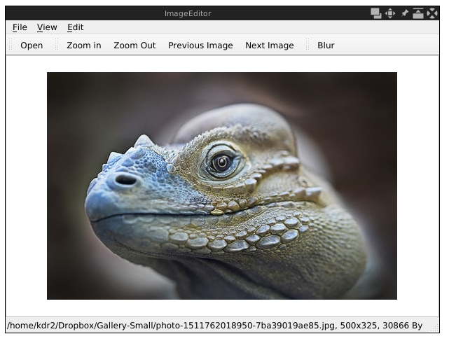
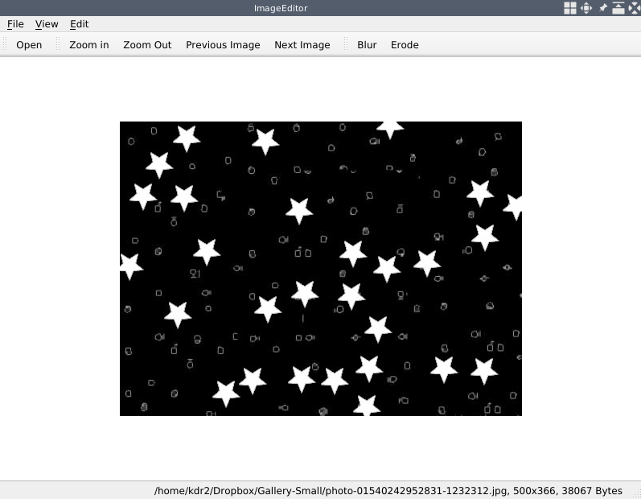
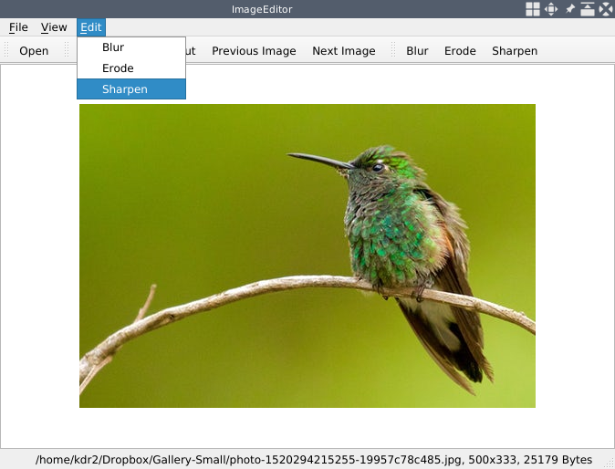
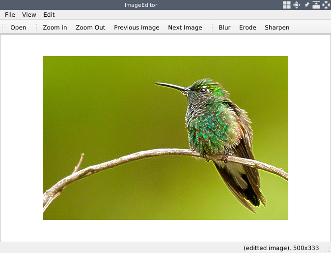
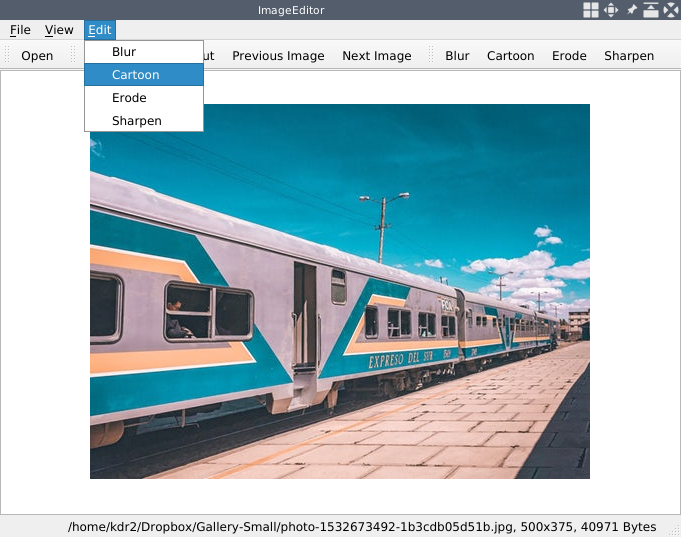
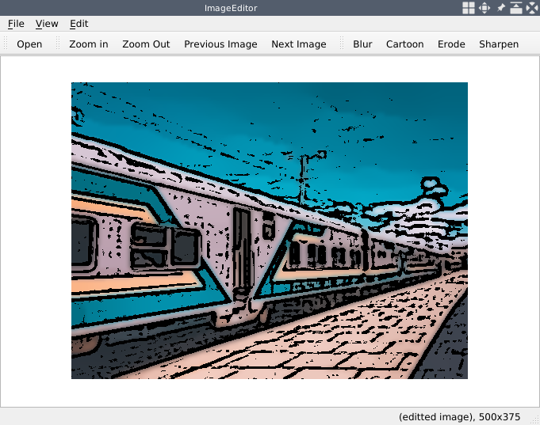

# プロ並みの画像編集

第1章「画像ビューアの構築」では、Qtで画像を閲覧するための簡単なアプリケーションをゼロから構築しました。このアプリケーションでは、ローカルディスクにある画像を表示したり、表示を拡大・縮小したり、開いているディレクトリ内を移動したりすることができます。この章では、そのアプリケーションを継続し、ユーザーがオープニング画像を編集できるようにするための機能を追加します。この目標を達成するために、本書の冒頭で紹介したOpenCVライブラリを巻き込みます。また、アプリケーションの拡張性を高めるために、これらの編集機能のほとんどをQtのプラグイン機構を利用してプラグインとして開発する予定です。

本章では、以下のようなトピックを取り上げます。

* QtとOpenCVの間で画像を変換する
* Qt のプラグイン機構を利用したアプリケーションの拡張
* OpenCVが提供する画像処理アルゴリズムによる画像の修正

***

## 技術的要件

前章で作成した ImageViewer アプリケーションが正常に動作していることが必要です。本章での開発は、そのアプリケーションをベースに行います。

また、前提条件としてOpenCVの基本的な知識が必要です。今回はOpenCVの最新版、つまり本書の執筆時である2018年12月にリリースされたバージョン4.0を使用する予定です。この新バージョンは、Debian、Ubuntu、Fedoraなど多くのオペレータシステムのソフトウェアリポジトリにまだ含まれていないため、ソースからビルドする予定です。この点については心配しないでください。この章の後半で、インストール方法について簡単に説明します。

この章のコードはすべて、本書の GitHub リポジトリ（[https://github.com/PacktPublishing/Qt-5-and-OpenCV-4-Computer-Vision-Projects/tree/master/Chapter-02](https://github.com/PacktPublishing/Qt-5-and-OpenCV-4-Computer-Vision-Projects/tree/master/Chapter-02)）に掲載されています。

次のビデオで、コードが実際に動いているところをご覧ください： [http://bit.ly/2FhYLro](http://bit.ly/2FhYLro)

***

## ImageEditor アプリケーション

この章では、画像を編集するためのアプリケーションを作りますので、ImageEditorと名付けます。GUIアプリケーションで画像を編集するには、まずそのアプリケーションで画像を開いて見ることが必要ですが、これは前章でやったとおりです。そこで、画像編集機能を追加する前に、ImageViewerアプリケーションのコピーを作成し、ImageEditorと名前を変更することにしました。

まずは、ソースをコピーするところから始めましょう。

```sh
    $ mkdir Chapter-02
    $ cp -r Chapter-01/ImageViewer/ Chapter-02/ImageEditor
    $ ls Chapter-02
    ImageEditor
    $ cd Chapter-02/ImageEditor
    $ make clean
    $ rm -f ImageViewer
```

以上のコマンドで、Chapter-01 ディレクトリの下にある ImageViewer ディレクトリを Chapter-02/ImageEditor にコピーしています。そして、そのディレクトリに入り、make clean を実行して、コンパイル時に生成された中間ファイルをすべてクリーニングし、rm -f ImageViewer を使って古いターゲットの実行ファイルを削除してください。

 クリーンアップされたプロジェクトができたので、その一部をリネームしてみましょう。

* プロジェクトディレクトリには、コピー時に新しいプロジェクト名ImageEditorが付けられているので、ここでは何もする必要がありません。
* QtプロジェクトファイルImageViewer.proは、ImageEditor.proに名前を変更する必要があります。これは、ファイルマネージャかターミナルで行います。
* ImageEditor.proファイルのTARGET = ImageViewerの行をTARGET = ImageEditorに変更して、TARGETをImageEditorに変更する必要があります。
* ソースファイル main.cpp の window.setWindowTitle("ImageViewer"); の行を window.setWindowTitle("ImageEditor"); に変更し、ウィンドウタイトルを変更する必要があります。

これですべての名前が変更されたので、ImageViewerからコピーした新しいImageEditorアプリケーションをコンパイルして実行しましょう。

```sh
    $ qmake -makefile
    $ make
    g++ -c -pipe ...
    # output truncated
    # ...
    $ ls
    ImageEditor ImageEditor.pro main.cpp main.o mainwindow.cpp mainwindow.h
    mainwindow.o Makefile moc_mainwindow.cpp moc_mainwindow.o moc_predefs.h
    $ export LD_LIBRARY_PATH=/home/kdr2/programs/opencv/lib/.
    $ ./ImageEditor
```

ImageEditorというウィンドウタイトルが違うだけで、ImageViewerのウィンドウと全く同じであることが分かると思います。とにかく、今は画像編集の機能はないものの、エディタアプリケーションをセットアップすることができました。次の章では、簡単な編集機能を追加する予定です。

***

## OpenCVを用いた画像のぼかし処理

前節では、エディタアプリケーションをセットアップしました。このセクションでは、画像編集の簡単な機能である、画像をぼかすためのアクション（メニューとツールバーの両方）を追加します。

これは、2つのステップで行います。

* まず、UIをセットアップしてアクションを追加し、アクションをダミースロットに接続します。
* 次に、ダミースロットを画像をぼかすように書き換えて、OpenCVライブラリーを巻き込みます。

***

## ブラーアクションの追加

この章で追加するアクションのほとんどは、画像を編集するために使用されるので、新しいメニューとツールバーに分類しておきます。まず、mainwindow.hヘッダーファイルのprivateセクションで、編集メニュー、編集ツールバー、ブラーアクションの3つのメンバを宣言します。

```cpp
         QMenu *editMenu;
         QToolBar *editToolBar;
         QAction *blurAction;
```

そして、以下のように、それぞれMainWindow::initUI、MainWindow::createActionsのメソッドで作成することになります。

MainWindow::initUIでは、以下のように実行しています。

```cpp
         editMenu = menuBar()->addMenu("&Edit");
         editToolBar = addToolBar("Edit")。
```

MainWindow::createActionsでは、以下のように実行されます。

```cpp
         blurAction = new QAction("Blur", this);
         editMenu->addAction(blurAction);
         editToolBar->addAction(blurAction);
```

今までは、編集メニューと編集ツールバーがあり、その両方にぼかしアクションがありました。しかし、ユーザーがツールバーのぼかしボタンや編集メニューのぼかし項目をクリックしても、何も起こりません。これは、まだそのアクションにスロットを接続していないためです。では、そのアクションにスロットを与えてみましょう。まず、mainwindow.h の private slots セクションで、以下のようにスロットを宣言します。

```cpp
         // for editting
         void blurImage();
```

   次に、mainwindow.cpp でダミーの実装をします。

```cpp
     void MainWindow::blurImage()
     {
         qDebug() << "Blurring the image!";
     }
```

スロットの準備ができたので、mainwindow::createActionsメソッドの最後で、blurアクションのトリガーシグナルをこのスロットに接続しましょう。

```cpp
         connect(blurAction, SIGNAL(triggered(bool)), this, SLOT(blurImage()));
```

アプリケーションをコンパイルして実行すると、メニュー、ツールバー、そしてアクションが表示されます。アクションをクリックしてトリガーすると、Blurring the image! というメッセージが印刷されるのがわかります。

ウィンドウと印刷されたメッセージはこのような感じです。


UI部分の準備ができたので、次の章からはOpenCVをスロットに使って、どのように画像をぼかすかに集中できます。

***

## OpenCVのソースからのビルドとインストール

前の節では、ぼかし処理用のダミースロットをインストールしました。このスロットは、簡単なメッセージを表示するだけで、何もしません。今度は、そのスロットの実装を書き換えて、本当のぼかし処理を行うようにします。

前のセクションで述べたように、画像の編集には OpenCV ライブラリ、より正確にはその最新版 (4.0) を使用する予定です。そこで、コードを書き始める前に、最新版のOpenCVライブラリをインストールし、プロジェクトに組み込みます。

OpenCV は、コンピュータビジョンアプリケーションの構築に必要なクラスや関数を含むライブラリ、ツール、モジュールのセットです。そのリリースファイルは、公式サイトのリリースページ（[https://opencv.org/releases.html](https://opencv.org/releases.html)）で見ることができます。もう一つ知っておくべきことは、OpenCVはCMakeと呼ばれる最新のビルドツールを使ってビルドシステムを構築していることです。つまり，OpenCV をソースからビルドするには，オペレーティングシステムに CMake がインストールされている必要があり，少なくともバージョン 3.12 の CMake が必要なので，お使いの CMake のバージョンが適切に設定されていることを確認してください．

*プロジェクト、特に大規模なプロジェクトをどのように構築するかは、ソフトウェア工学の世界では複雑なテーマです。ソフトウェア工学の発展過程における波乱の中で、このテーマに関連して様々な状況に対処するために、多くのツールが発明されてきました。makeからAutotools、SConsからCMake、Ninjaからbazelまで、ここでは語り尽くせないほどです。しかし、これまで本書で紹介したのは、そのうちの2つだけでした。Qmakeは、Qtチームによって開発された、Qtプロジェクトのビルドに特化したものです。CMakeは、OpenCVを含む多くのプロジェクトで広く採用されているもう一つのものです。

この本では，これらのツールの使い方を簡単かつ明確にすることに努めます。*

OpenCVのリリースページは以下のような感じです。


Sources のリンクをクリックすると，そのソースの ZIP パッケージをローカルディスクにダウンロードし，それを解凍することができます．OpenCV のビルドは，ターミナル上で CMake を用いて行いますので，ターミナルを開き，ワークディレクトリを解凍されたソースのディレクトリに変更します．また、OpenCVはソースツリーのルートディレクトリに直接ビルドすることができないので、別のディレクトリを作成してビルドする必要があります。

以下は、OpenCVをビルドする際に使用したターミナルでの手順です。

```sh
     $ cd ~/opencv-4.0.0 # path to the unzipped source
     $ mkdir release # create the separate dir
     $ cd release
     $ cmake -D CMAKE_BUILD_TYPE=RELEASE -D CMAKE_INSTALL_PREFIX=$HOME/programs/opencv ..
     # ... output of cmake ...
     # rm ../CMakeCache.txt if it tells you are not in a separate dir
     $ make
     # ... output of make ...
     $ make install
```

cmake ...行は、解凍したソースのルートディレクトリにあるCMakeLists.txtを読み込んで、makefileを生成しています。cmake コマンドに -D で渡す CMAKE_BUILD_TYPE 変数は、OpenCV を RELEASE モードでビルドすることを指定します。同様に、CMAKE_INSTALL_PREFIX変数でOpenCVのライブラリのインストール先を指定します。ここでは、$HOME/programs/opencv、つまり、/home/kdr2/programs/opencvにOpenCVをインストールしていますが、必要に応じてCMAKE_INSTALL_PREFIXの値を変更し、インストール先ディレクトリを変更することが可能です。cmakeコマンドが成功に終わると、Makefileというファイルが生成されます。このMakefileがあれば、あとはmakeとmake installを実行して、ライブラリのコンパイルとインストールを行うことができます。

これまでの手順がすべてうまくいけば、OpenCVのバージョンは正しくインストールされているはずです。インストール先のディレクトリを閲覧することで確認できます。

```sh
     $ ls ~/programs/opencv/
     bin include lib share
     $ ls ~/programs/opencv/bin/
     opencv_annotation opencv_interactive-calibration opencv_version
     opencv_visualisation setup_vars_opencv4.sh
     $ ls -l ~/programs/opencv/lib/
     # ...
     lrwxrwxrwx 1 kdr2 kdr2 21 Nov 20 13:28 libopencv_core.so -> libopencv_core.so.4.0
     lrwxrwxrwx 1 kdr2 kdr2 23 Nov 20 13:28 libopencv_core.so.4.0 -> libopencv_core.so.4.0.0
     -rw-r--r-- 1 kdr2 kdr2 4519888 Nov 20 12:34 libopencv_core.so.4.0.0
     # ...
     lrwxrwxrwx 1 kdr2 kdr2 24 Nov 20 13:28 libopencv_imgproc.so -> libopencv_imgproc.so.4.0
     lrwxrwxrwx 1 kdr2 kdr2 26 Nov 20 13:28 libopencv_imgproc.so.4.0 -> libopencv_imgproc.so.4.0.0
     -rw-r--r-- 1 kdr2 kdr2 4714608 Nov 20 12:37 libopencv_imgproc.so.4.0.0
     # ... output truncated
```

OpenCV はモジュール化されたライブラリです．メインモジュールとエクストラモジュールの2種類から構成されています。

メインモジュールは，OpenCV をソースからビルドしたときにデフォルトで含まれ，画像処理タスク，フィルタリング，変換，その他多くの機能で利用されるモジュールとともに，OpenCV のコア機能をすべて含んでいます。

追加モジュールには，OpenCV ライブラリにデフォルトで含まれていないすべての OpenCV 機能が含まれており，そのほとんどはコンピュータビジョン関連の追加機能を含んでいます。

OpenCV が正しくインストールされているかどうかを確認した際に，OpenCV のインストールパスの下にある lib ディレクトリの内容を振り返ってみると，libopencv_*.so* というパターンの名前のファイルがたくさん見つかると思います．通常，これらのファイルはそれぞれ1つのOpenCVモジュールに対応しています．例えば，libopencv_imgproc.so ファイルは，画像処理タスクに使用される imgproc モジュールです。

OpenCVライブラリのインストールが完了したので、いよいよQtプロジェクトに取り込みます。Qt プロジェクトファイル ImageEditor.pro を開いて、以下の行を追加しましょう。

```qmake
     unix: !mac {
         INCLUDEPATH += /home/kdr2/programs/opencv/include/opencv4
         LIBS += -L/home/kdr2/programs/opencv/lib -lopencv_core -l opencv_imgproc
     }
```

unix: !macディレクティブは、macOS以外のUNIX系システムで、その隣の括弧内の設定を使用することを意味します。私はDebian GNU/Linuxを使用しているので、このディレクティブを使用しています。括弧の中のディレクティブは，以下の行でOpenCVライブラリをインポートするための重要な部分です．

* 最初の行は，INCLUDEPATH の値を更新することで，コード内で使用する OpenCV のヘッダファイルがどこにあるかをコンパイラに知らせます。
* 2行目は，リンカにどの OpenCV モジュール（共有オブジェクト）をリンクすべきか，そしてどこにあるべきかを伝えます。より具体的には、-lopencv_core -l opencv_imgproc は、私たちのアプリケーションを libopencv_core.so と libopencv_imgproc.so に対してリンクすべきであり、-L・・・はリンカが /home/kdr2/programs/opencv/lib ディレクトリの下でこれらの lib ファイル（共有オブジェクト）を見つけるべきであることを意味しています。

macOS や Windows では，OpenCV は別の方法でビルド，リンクされますが，モジュールの各ライブラリファイルには含まれません．その場合、すべてのモジュールは opencv_world と呼ばれる1つのライブラリにリンクされます。CMake に -DBUILD_opencv_world=on を渡すことで、Linux でも同じ効果を得ることができます。

```sh
     # on mac
     $ ls -l
     -rwxr-xr-x 1 cheftin staff 25454204 Dec 3 13:47 libopencv_world.4.0.0.dylib
     lrwxr-xr-x 1 cheftin staff 27 Dec 3 13:36 libopencv_world.4.0.dylib -> libopencv_world.4.0.0.dylib
     lrwxr-xr-x 1 cheftin staff 25 Dec 3 13:36 libopencv_world.dylib -> libopencv_world.4.0.dylib

     # on Linux with -D BUILD_opencv_world=on
     $ ls -l
     lrwxrwxrwx 1 kdr2 kdr2 22 Nov 29 22:55 libopencv_world.so -> libopencv_world.so.4.0
     lrwxrwxrwx 1 kdr2 kdr2 24 Nov 29 22:55 libopencv_world.so.4.0 -> libopencv_world.so.4.0.0
     -rw-r--r-- 1 kdr2 kdr2 57295464 Nov 29 22:09 libopencv_world.so.4.0.0
```

この方法で OpenCV をビルドすると、ソースをコンパイルする際のリンカーオプションが簡単になります -lopencv_core -lopencv_imgproc でやったようにリンカーにモジュールリストを与える必要がありません。opencv_world に対してリンクするようにリンカに指示すれば十分です。macOSとWindowsの場合、以下のコードをImageEditor.proに記述します。

```qmake
     unix: mac {
         INCLUDEPATH += /path/to/opencv/include/opencv4
         LIBS += -L/path/to/opencv/lib -lopencv_world
     }

     win32 {
         INCLUDEPATH += c:/path/to/opencv/include/opencv4
         LIBS += -lc:/path/to/opencv/lib/opencv_world
     }
```

この方法の方が簡単ですが、本書では、私たちが学習し使用しているOpenCVモジュールについて深く理解してもらうために、今でも個別のモジュールを使用しています。

Qmake は，サードパーティライブラリを設定する別の方法，つまり，ライブラリのメタ情報を管理するための機能である pkg-config を利用する方法を提供しています。残念ながら，[https://github.com/opencv/opencv/issues/13154](https://github.com/opencv/opencv/issues/13154) によると，OpenCVはバージョン4.0からpkg-configのサポートを非推奨にしたようです。つまり，QtプロジェクトでOpenCVを設定するためには，pkg-configを使うよりも，もっと直接的で柔軟な方法を使う必要があるのです。

***

## 画像をぼかす

最後に、OpenCVライブラリのインストールと設定を行いました。それでは、このライブラリを使って、blur アクションに接続されたスロット内の画像をぼかしてみましょう。

まず、mainwindow.cpp ファイルの冒頭に以下の行を追加し、OpenCV のヘッダーファイルをインクルードできるようにします。

```cpp
     #include "opencv2/opencv.hpp"
```

これで準備は完了しましたので、スロットメソッドの実装に集中しましょう。開いている1枚の画像に対して操作しようとする他のスロットと同様に、何かをする前に、現在開いている画像があるかどうかをチェックする必要があります。

```cpp
         if (currentImage == nullptr) {
             QMessageBox::information(this, "Information", "No image to edit.");
             return;
         }
```

このように、開いている画像がない場合は、メッセージボックスを表示し、関数からすぐに戻っています。

アプリケーションの現在時刻に開いている画像があることを確認したら、開いている画像を QPixmap のインスタンスとして取得すればよいことはわかりました。しかし、OpenCVを使ってQPixmapの形をした画像をぼかすにはどうしたらよいのでしょうか？答えは、「できない」です。OpenCV で画像に対して何らかの操作を行う前に，OpenCV が画像をどのように保持しているかを示す形式，つまり Mat クラスのインスタンスとして，画像を用意する必要があります．OpenCV の Mat クラスは，行列を意味します．つまり，画像は実際には，与えられた幅，高さ，チャンネル数，そして深度を持つ行列なのです．Qt では，画像の行列データを保持するために QImage という類似のクラスが利用されています．つまり，OpenCV を用いて QPixmap をぼかす方法は，QPixmap を QImage に変換し，QImage を用いて Mat を作成し，その Mat をぼかし，そして Mat を QImage と QPixmap にそれぞれ戻せばよいということです。

変換に関しては，かなり多くの作業を行わなければなりません．これについて，以下のコード行を通して説明しましょう．

```cpp
         QPixmap pixmap = currentImage->pixmap();
         QImage image = pixmap.toImage();
```

このスニペットは非常に簡単です。現在の画像のデータをQPixmapのインスタンスとして取得し、そのtoImageメソッドを呼び出してQImageのインスタンスに変換しているのです。

次のステップは，QImage を Mat に変換することですが，ここで少し複雑なことが起こります．モノクロ画像，グレースケール画像，あるいは異なるビット深度を持つカラー画像など，開く画像はどのような形式であっても構いません．ぼかすためには、そのフォーマットを知っておく必要があります。そこで、元のフォーマットとは別に、深さ8ビット、3チャンネルの通常のフォーマットに変換しておきます。これは，Qtでは QImage::Format_RGB888 によって表され，OpenCVでは CV_8UC3 によって表されます．では，どのように変換を行い，Mat オブジェクトを構築するかを見てみましょう。

```cpp
         image = image.convertToFormat(QImage::Format_RGB888);
         cv::Mat mat = cv::Mat(
             image.height(),
             image.width(),
             CV_8UC3,
             image.bits(),
             image.bytesPerLine());
```

ようやく，精査可能なコードになりました．Mat オブジェクトを得たので，それをぼかしてみましょう．

```cpp
         cv::Mat tmp;
         cv::blur(mat, tmp, cv::Size(8, 8));
         mat = tmp;
```

Blur 関数は，OpenCV の imgproc モジュールで提供されています．この関数は，正規化ボックスフィルタとカーネルを用いて画像をぼかします．最初の引数は，ぼかしたい画像，2番目の引数は，ぼかした画像を配置する場所です．一時的な行列を使ってぼかした画像を保存し、ぼかしが終わった後に元の行列に代入します。第3引数はカーネルの大きさである。ここで、カーネルは、任意のピクセルの値を、隣接するピクセルの異なる量と組み合わせることによってどのように変更するかをOpenCVに伝えるために使用されます。

これで，ぼかされた画像が Mat のインスタンスとして得られましたので，それを QPixmap のインスタンスに戻し，シーンやビューに表示しなければいけません．

```cpp
         QImage image_blurred(
             mat.data,
             mat.cols,
             mat.rows,
             mat.step,
             QImage::Format_RGB888);
         pixmap = QPixmap::fromImage(image_blurred);
         imageScene->clear();
         imageView->resetMatrix();
         currentImage = imageScene->addPixmap(pixmap);
         imageScene->update();
         imageView->setSceneRect(pixmap.rect());
```

このコードの新しい部分は、mat オブジェクトから QImage オブジェクト image_blurred を生成し、QPixmap::fromImage スタティックメソッドで QImage オブジェクトを QPixmap に変換しているところです。これは新しいものですが、十分に明確です。このコードの残りの部分は、MainWindowクラスのshowImageメソッドで使用しているコードと同じで、目新しいものではありません。

ぼやけた画像を表示できたので、ステータスバーのメッセージを更新して、表示している画像が編集されたものであり、開いた元の画像ではないことをユーザーに伝えることができます。

```cpp
         QString status = QString("(editted image), %1x%2")
             .arg(pixmap.width()).arg(pixmap.height());
         mainStatusLabel->setText(status);
```

この時点で、MainWindow::blurImage メソッドは終了です。それでは、Terminal から qmake -makefile と make コマンドを実行してプロジェクトを再構築し、新しい実行ファイルを実行してみましょう。

私のようにOpenCVを/usrや/usr/localでないパスにインストールした場合、実行ファイルを実行する際に問題が発生することがあります。

```sh
     $ ./ImageEditor
     ./ImageEditor: error while loading shared libraries: libopencv_core.so.4.0: cannot open shared object file: No such file or directory
```

これは，OpenCVのライブラリがシステムのライブラリ検索パスに含まれていないことが原因です．LinuxではLD_LIBRARY_PATH，macOSではDYLD_LIBRARY_PATHという環境変数を設定して，ライブラリの検索パスに追加してあげればよいでしょう．

```sh
     $ export LD_LIBRARY_PATH=/home/kdr2/programs/opencv/lib/を設定します。
     $ ./ImageEditor
```

このアプリで画像を開くと、次のような出力が得られます。



ツールバーの「ぼかし」ボタンをクリックすると、以下のように表示されます。


画像がうまくぼかされていることがわかります。

***

## QPixmap, QImage, そして Mat

前節では、ImageEditor アプリで開いた画像にぼかしをかける機能を新たに追加しました。画像をぼかしながら，QPixmap→QImage→Mat と変換し，さらに OpenCV を用いてぼかした後に逆変換を行いました．そこでは，作業を行いましたが，これらのクラスについては多くを語らなかったのです．それでは，これらのクラスについて説明しましょう．

***

## QPixmap

QPixmap は Qt ライブラリが提供するクラスで、画面に画像を表示するときに使用することを意図しています。このプロジェクトでは、このクラスのインスタンスとして画像を読み込み、そのインスタンスをQGraphicsSenceに追加して表示させています。

QPixmapのインスタンスを作成する方法はたくさんあります。第1章「画像ビューアの構築」やこの章の前のセクションで行ったように、画像ファイルのパスでインスタンスを作成することができます。

```cpp
      QPixmap map("/path/to/image.png");
```

あるいは、空の QPixmap をインスタンス化し、後からデータを読み込むこともできます。

```cpp
      QPixmap map;
      map.load("/path/to/image.png");
```

画像を保持しているインスタンスでは、save as アクションのスロットで行ったように、その save メソッドを呼び出して画像をファイルに保存することができます。

```cpp
      map.save("/path/to/output.png");
```

最後に、QPixmap メソッドを QImage メソッドに変換するには、その toImage メソッドを呼び出します。

```cpp
      //...
      QImage image = map.toImage();
```

***

## QImage

QPixmap は主に Qt で画像を表示するためのものですが、QImage は I/O 用に設計され、ピクセルへの直接アクセスや操作に最適化されています。このクラスでは、画像のサイズ、アルファチャンネルの有無、グレースケール画像かどうか、ピクセルの色などの情報を取得することができます。

QImageは、ピクセルに直接アクセスして操作するために設計されており、ピクセル操作や変換などの画像処理を行うための関数を提供します。結局のところ、Qtライブラリは画像処理に特化したライブラリではないので、この領域で提供される機能ではこの章の要件を満たすことはできません。したがって，QImage オブジェクトを Mat オブジェクトに変換した後，OpenCV を用いて画像処理を行う予定です．

ここで問題となるのは，QImage，QPixmap，Mat という 3 つのデータ型の間をどのように変換するか，ということです．前節では，QPixmap を QImage に変換する方法について述べましたが，ここでは，その逆変換の方法について見てみましょう．

```cpp
      QPixmap pixmap = QPixmap::fromImage(image);
```

QPixmap クラスの fromImage スタティックメソッドを QImage オブジェクトを唯一の引数として呼び出すだけです。

QImageの他の機能の詳細に興味があれば、[https://doc.qt.io/qt-5/qimage.html](https://doc.qt.io/qt-5/qimage.html) にあるドキュメントを参照するとよいでしょう。次のセクションでは，QImage を Mat に，あるいはその逆に変換する方法について述べます．

***

## Mat

Mat クラスは，OpenCV ライブラリで最も重要なクラスの1つであり，その名前は matrix の略です．コンピュータビジョンの領域では，前述したように，任意の画像は与えられた幅，高さ，チャンネル数，そして深度を持つ行列です．したがって，OpenCV では，画像を表現するために Mat クラスを利用します．実際， Mat クラスは，任意のデータ型を持つ 1 つまたは複数のチャンネルのデータを格納するために利用できる n 次元配列であり，それを様々な方法で作成，変更，操作するための多くのメンバやメソッドを含んでいます．

Mat クラスは，多くのコンストラクタを持ちます．例えば，以下のように，幅（列）が 800，高さ（行）が 600 で，8 ビット unsigned int 値を含む 3 つのチャンネルを持つインスタンスを作成することができます．

```cpp
      Mat mat(600, 800, CV_8UC3);
```

このコンストラクタの第 3 引数は，行列の型です．OpenCV では，行列に利用できる多くの値があらかじめ定義されています．これらの定義済み値は，その名前を見れば行列の型が分かるように，あるいは行列の性質が判明したときに使うべき名前を推測できるように，名前にパターンが用意されています．

このパターンは，CV_\<depth>\<type>C\<channels>と呼ばれます．

* \<depth> は，8，16，32，64で置き換えることができ，これらは，ピクセル内の各要素を格納するために使われるビット数を表します．
* \<type>は符号なし整数、符号あり整数、浮動小数点数でそれぞれU、S、Fに置き換える必要がある
* \<channel> は，チャンネル数を表します．

つまり，このコードにおいて CV_8UC3 は，宣言された画像のビット深度が8であり，各ピクセルが8ビットの符号なし整数型であり，3つのチャンネルを持つことを意味します． つまり，各ピクセルには3つの要素があり， CV_8UC3 は24ビット（深度 * チャンネル）を占有します．

また，画像を構成する際に，何らかのデータで埋めることもできます．例えば，以下のように定数色で埋めることができます．

```cpp
      int R = 40, G = 50, B = 60;
      Mat mat(600, 800, CV_8UC3, Scalar(B, G, R));
```

先のコードでは，前の例で作成した画像と同じものを作成していますが，第4引数で指定された定数色 RGB(40, 50, 60) で塗りつぶしています．

ここで重要なのは，OpenCVのデフォルトの色の順番はRGBではなくBGRであり，BとRの値が入れ替わっていることです．したがって，コード中では定常色を Scalar(R, G, B) ではなく Scalar(B, G, R) として表現しています．これは、OpenCVを使って画像を読み込んだ後、色の順序が異なる別のライブラリを使って操作する場合、またはその逆の場合、特に操作の際に画像の各チャンネルを別々に扱う場合に重要なことです。

このアプリケーションでは，Qt で画像を読み込んで OpenCV の Mat データ構造に変換し，それを処理して再び QImage に変換しています．しかし，ご覧の通り，画像をぼかしている間は，赤と青のチャンネルを入れ替えて色の順番に頼ることはしていません．これは、ぼかし関数がチャンネルに対して対称的に動作するためで、チャンネル間の干渉はないため、この状況では色順序は重要ではありません。以下のようにすれば，チャンネルの入れ替えを省略することができます．

* QImage を Mat に変換し，その Mat を処理してから再び QImage に変換します．
* Mat 上で行われる処理期間中のすべての操作は，チャンネルに対して対称的なものであり，つまりチャンネル間の干渉はありません．
* 処理中の画像は表示されず，QImage に変換された後の画像のみが表示されます．

このような状況では、色の順序の問題は無視すればよいのです。これは、この後書くプラグインのほとんどに適用されるでしょう。しかし、状況によっては、単純に無視できないこともある。例えば，OpenCV を用いて画像を読み込み，それを QImage のインスタンスに変換して Qt で表示する場合，以下のコードでは，赤と青のチャンネルが入れ替わった画像が表示されることになります．

```cpp
      cv::Mat mat = cv::imread("/path/to/an/image.png") ．
      QImage image(
          mat.data,
          mat.cols,
          mat.rows,
          mat.step,
          QImage::Format_RGB888
      );
```

QImage に変換する前に，R と B のチャンネルを入れ替えておく必要があります．

```cpp
      cv::Mat mat = cv::imread("/path/to/an/image.png");
      cv::cvtColor(mat, mat, cv::COLOR_BGR2RGB);
      QImage image(
          mat.data,
          mat.cols,
          mat.rows,
          mat.step,
          QImage::Format_RGB888
      );
```

OpenCV を用いて色チャンネルを対称的に扱わない処理を行う場合，その前に色の順序が BGR であることを確認しなければならないことを覚えておいてください．

色の順序について説明したところで，Mat オブジェクトの作成の話題に戻りましょう．先ほど、Mat オブジェクトを作成する際に一定の色で塗りつぶすことができることを学びましたが、我々のアプリケーションでは、与えられた QImage オブジェクトと同じ画像を保持する Mat オブジェクトを作成すべきです。これをどのように行ったか振り返ってみましょう．

```cpp
      // image is the give QImage object
      cv::Mat mat = cv::Mat(
          image.height(),
          image.width(),
          CV_8UC3,
          image.bits(),
          image.bytesPerLine()
      );
```

既に説明した最初の 3 つの引数の他に，QImage オブジェクトが保持し，その bits メソッドが返すデータポインタを第 4 の引数として渡します．これは，画像のパディングバイトをどのように処理し，効率的にメモリに保存するかを OpenCV に知らせるためのものです．

前述したように， Mat クラスのコンストラクタは，ここでは語り尽くせないほど多く存在します．また，より高い次元を持つ Mat オブジェクトを作成することもできます．コンストラクタの完全なリストは， [https://docs.opencv.org/4.0.0/d3/d63/classcv_1_1Mat.html](https://docs.opencv.org/4.0.0/d3/d63/classcv_1_1Mat.html) にあるドキュメントを参照してください．この章では，これらのコンストラクタについてこれ以上触れません．

さて，Qt と OpenCV の間で画像オブジェクトを変換する方法についての知識を得たので，次の節では，OpenCV を用いて画像を編集する方法に進みます．

***

## Qt のプラグイン機構を使った機能追加

前節では、アプリケーションに「編集」という名前の新しいメニューとツールバーを追加し、その両方にオープニング画像をぼかすためのアクションを追加しました。この機能を追加するまでの経過を思い出してみましょう。

まず、メニューとツールバーを追加し、次にアクションを追加しました。アクションを追加した後、アクションに新しいスロットを接続しました。このスロットでは、オープニング画像を QPixmap のインスタンスとして取得し、QImage オブジェクトに変換し、さらに Mat オブジェクトに変換しています。 重要な編集作業はここから始まります．編集作業を行うために，OpenCV を用いて Mat インスタンスを変更しました．そして，編集された画像を表示するために， Mat を QImage と QPixmap に適宜変換し直します．

さて，このアプリに別の編集機能を追加したい場合，どうすればよいでしょうか？もちろん、先ほどのぼかし処理の追加を繰り返すだけでも良いのですが、効率的ではありません。ぼかしアクションを追加したのと同じ方法で、別の編集アクションをアプリに追加しただけだと想像すると、ほとんどの作業やコードが同じであることに気づくでしょう。私たちは、同じことを繰り返しているのです。これは悪い開発パターンであるだけでなく、退屈な作業でもあります。

この問題を解決するには、繰り返されるプロセスを注意深く調べ、ステップに分割し、どのステップがまったく同じで、どのステップが異なるかを見つけることです。

そうすることで、異なる編集機能を追加する際のポイントが見えてくるのです。

* 編集機能が異なると，操作の名称が異なる．
* Mat インスタンスに対する操作は、異なる編集機能によって異なります。

異なる編集機能を追加する処理では，前の2つ以外の手順やロジックはすべて同じです．つまり，新しい編集機能を追加したい場合，2つのことだけを行えばよいのです．まず，名前をつけること，そして，OpenCV を用いて Mat インスタンスに対して編集操作を行う方法を考えることです．この2つがクリアになれば，新しい編集機能が決定されます．次にやるべきことは，この新機能をアプリケーションに組み込むことです．

では，どのようにアプリケーションに組み込むのでしょうか？これは，Qt のプラグイン機構を利用して行うことになり，各編集機能はプラグインとなります．

***

## プラグインインターフェース

Qtのプラグイン機構は、Qtアプリケーションをより拡張性の高いものにする強力な手法です。前回説明したように，この機構を利用して，新しい編集機能を簡単に追加できるような方法を抽象化します．これが終われば、新しい編集機能を追加する際に、編集機能の名前と Mat インスタンスに対する操作にだけ注意すればよいことになります。

まず最初に，アプリケーションとプラグインの間で共通のプロトコルを提供し，プラグインがどのように実装されていてもロードして呼び出すことができるようにするために，インタフェースを考える必要があります．C++では、インターフェースは純粋な仮想メンバー関数を持つクラスとなります。私たちのプラグインでは、アクション名とMatへの操作に注意して、以下のようにeditor_plugin_interface.hでインターフェイスを宣言しています。

```cpp
     #ifndef EDITOR_PLUGIN_INTERFACE_H
     #define EDITOR_PLUGIN_INTERFACE_H

     #include <QObject>
     #include <QString>
     #include "opencv2/opencv.hpp"

     class EditorPluginInterface
     {
     public:
         virtual ~EditorPluginInterface() {};
         virtual QString name() = 0;
         virtual void edit(const cv::Mat &input, cv::Mat &output) = 0; virtual QString name() = 0; virtual QString name() = 0;
     };


     #define EDIT_PLUGIN_INTERFACE_IID "com.kdr2.editorplugininterface".
     Q_DECLARE_INTERFACE(EditorPluginInterface, EDIT_PLUGIN_INTERFACE_IID);

     #endif
```

ifndef/defineイディオム（最初の2行と最後の1行）を使って、このヘッダーファイルがソースファイルに一度だけ含まれるようにします。最初の2行に続いて，QtとOpenCVが提供するいくつかのヘッダファイルをインクルードして，関連するデータ構造を紹介します．そして，EditorPluginInterfaceという名前のクラスを宣言します．このクラスには，仮想的な空のデストラクタの他に，name関数とedit関数という2つの純粋な仮想メンバー関数があります．name関数はQStringを返し、これが編集アクションの名前となります。edit関数は，Matの2つの参照を入出力関数として受け取り，編集操作に利用されます．各プラグインは，このインタフェースのサブクラスとなり，これら2つの関数の実装によって，アクション名と編集操作が決定されます．

クラス宣言の後、インターフェースのIDとして com.kdr2.editorplugininterface という一意な識別子文字列を定義します。このIDはアプリケーションスコープ内で一意でなければなりません。つまり、他のインターフェイスを記述する場合は、異なるIDを使用する必要があります。次に、Q_DECLARE_INTERFACE マクロを使って、インターフェースのクラス名と定義した一意の識別子を関連付け、Qt のプラグインシステムがこのインターフェースのプラグインを認識してからロードできるようにします。

この時点で、機能を編集するためのインターフェイスが判明しています。では、このインターフェイスを実装するプラグインを書いてみましょう。

***

## ErodePluginによる画像のエロージョン化

Qtプラグインを書くには、ゼロから新しいQtプロジェクトを立ち上げる必要があります。前回の編集機能では、OpenCVのblur関数を呼び出して画像を単純にぼかしました。今回の主目的はQtライブラリのプラグイン機構を紹介することなので、この部分をわかりやすくするために、やはりOpenCVライブラリの簡単な関数を使って、簡単な編集を行います。ここでは、OpenCVライブラリからerode関数を呼び出して、画像中のオブジェクトを侵食することにします。

プラグインを ErodePlugin と名付け、プロジェクトを一から作成しましょう。

```sh
     $ ls
     ImageEditor
     $ mkdir ErodePlugin
     $ ls
     ErodePlugin ImageEditor
     $ cd ErodePlugin
     $ touch erode_plugin.h erode_plugin.cpp
     $ qmake -project
     $ ls
     erode_plugin.h erode_plugin.cpp ErodePlugin.pro
```

まず、Terminal で ImageEditor プロジェクトの親ディレクトリに移動し、ErodePlugin という名前の新しいディレクトリを作成し、そのディレクトリに入ります。そして、空のソースファイル、erode_plugin.h と erode_pluigin.cpp を作成します。この2つのファイルには、後でソースを書きます。ここで、ターミナルでqmake -projectを実行すると、ErodePlugin.proというQtのプロジェクトファイルが返ってきます。このプロジェクトはQtのプラグインプロジェクトなので、そのプロジェクトファイルには様々な設定がされています。それでは見てみましょう。

```qmake
     TEMPLATE = lib
     TARGET = ErodePlugin
     COPNFIG += plugin
     INCLUDEPATH += . ../ImageEditor
```

プロジェクトファイルの冒頭で、TEMPLATE設定の値をappではなくlibとしています。TARGETの設定も同様で、プロジェクト名を値として使用しています。また、CONFIG += pluginという特別な行を追加して、qmakeにこのプロジェクトがQtプラグインプロジェクトであることを伝えています。最後に、前のコードブロックの最後の行で、ImageEditor プロジェクトのルートディレクトリをこのプロジェクトのインクルードパスの一項目として追加し、プラグインのコンパイル中に、前節で ImageEditor プロジェクトに配置したインターフェースヘッダーファイル editor_plugin_interface.h をコンパイラが見つけることができるようにしています。

このプラグインでは、編集機能を実装するために OpenCV も必要なので、ImageEditor プロジェクトで行ったように、Qt プラグイン・プロジェクトの設定に OpenCV ライブラリの情報、より正確にはライブラリのパスとインクルードを追加する必要があります。

```qmake
     unix: !mac {
         INCLUDEPATH += /home/kdr2/programs/opencv/include/opencv4
         LIBS += -L/home/kdr2/programs/opencv/lib -lopencv_core -l opencv_imgproc
     }

     unix: mac {
         INCLUDEPATH += /path/to/opencv/include/opencv4
         LIBS += -L/path/to/opencv/lib -lopencv_world
     }

     win32 {
         INCLUDEPATH += c:/path/to/opencv/include/opencv4
         LIBS += -lc:/path/to/opencv/lib/opencv_world
     }
```

プロジェクトファイルの最後に、ヘッダーファイルとC++のソースファイルを追加します。

```qmake
     HEADERS += erode_plugin.h
     SOURCES += erode_plugin.cpp
```

これで、プラグインのプロジェクト・ファイルは完成です。設計どおり、新しい編集機能のプラグインを書くには、前節で抽象化したEditorPluginInterfaceインターフェースの実装を提供すればよいのです。そこで、そのインターフェイスのサブクラスをerode_plugin.hで宣言します。

```cpp
     #include <QObject>
     #include <QtPlugin>

     #include "editor_plugin_interface.h"

     class ErodePlugin: public QObject, public EditorPluginInterface
     {
         Q_OBJECT
         Q_PLUGIN_METADATA(IID EDIT_PLUGIN_INTERFACE_IID);
         Q_INTERFACES(EditorPluginInterface);
     public:
         QString name();
         void edit(const cv::Mat &input, cv::Mat &output);
     };
```

このように，必要なヘッダファイルを含めた後，ErodePlugin というクラスを宣言し，QObject と EditorPluginInterface の両方を継承しています．後者は、前節のeditor_plugin_interface.hで定義したインターフェイスです。ここで、プラグインの実装をQOBjectのサブクラスにしているのは、Qtのメタオブジェクトシステムとプラグインメカニズムの必要条件だからです。クラスの本体では、Qtライブラリで定義されたいくつかのマクロを使用して、さらに情報を追加しています。

```cpp
         Q_OBJECT
         q_plugin_metadata(iid edit_plugin_interface_iid);
         Q_INTERFACES(EditorPluginInterface);
```

前章で Q_OBJECT マクロを紹介しました。これは Qt のメタオブジェクトシステムに関するものです。Q_PLUGIN_METADATA(IID EDIT_PLUGIN_INTERFACE_IID) 行は、このプラグインのメタデータを宣言しています。ここでは、editor_plugin_interface.h で定義したプラグインインターフェースの一意の識別子をそのIIDメタデータとして宣言しています。そして、Q_INTERFACES(EditorPluginInterface) 行を使って、このクラスが実装しようとしているのがEditorPluginInterfaceインターフェースであることをQtに伝えています。これまでの情報で、Qtのプラグインシステムはこのプロジェクトについてすべてを知っています。

* Qtのプラグインプロジェクトなので、プロジェクトのターゲットはライブラリファイルになります。
* プラグインはEditorPluginInterfaceのインスタンスで、そのIIDはEDIT_PLUGIN_INTERFACE_IIDなので、Qtアプリケーションはこれを伝えてこのプラグインを読み込むことができるのです。

さて、このインターフェイスをどのように実装するかに焦点を当てます。まず、インターフェイスの中で2つの純粋に重要な関数を宣言します。

```cpp
     public:
         QString name();
         void edit(const cv::Mat &input, cv::Mat &output);
```

そして、erode_plugin.cpp ファイルに実装します。name関数については、単純にプラグインの名前（編集アクションの名前でもある）としてQStringであるErodeを返すだけです。

```cpp
     QString ErodePlugin::name()
     {
         return "Erode";
     }
```

編集機能については、以下のように実装します。

```cpp
     void ErodePlugin::edit(const cv::Mat &input, cv::Mat &output).
     {
         erode(input, output, cv::Mat());
     }
```

これも簡単です．OpenCV ライブラリが提供する erode 関数を呼び出すだけです．この関数が行うのは，画像歪み補正（image erosion）と呼ばれるものです．これは，数学的形態論における2つの基本演算子のうちの1つです．エロージョンとは、画像の前景や1値化されたオブジェクトを縮小する処理です。オブジェクトの境界を滑らかにし、半島や指、小さなオブジェクトを削除します。次のセクションで、このプラグインをアプリケーションにロードした後、その効果を確認します。

OKです。プラグインプロジェクトのほとんどの作業が終わったので、コンパイルしてみましょう。コンパイルの方法は、通常のQtアプリケーションのコンパイル方法と同じです。

```sh
     $ qmake -makefile
     $ make
     g++ -c -pipe -O2 ...
     # output trucated
     ln -s libErodePlugin.so.1.0.0 libErodePlugin.so
     ln -s libErodePlugin.so.1.0.0 libErodePlugin.so.1
     ln -s libErodePlugin.so.1.0.0 libErodePlugin.so.1.0
     $ ls -l *.so*
     lrwxrwxrwx 1 kdr2 kdr2 23 Dec 12 16:24 libErodePlugin.so -> libErodePlugin.so.1.0.0
     lrwxrwxrwx 1 kdr2 kdr2 23 Dec 12 16:24 libErodePlugin.so.1 -> libErodePlugin.so.1.0.0
     lrwxrwxrwx 1 kdr2 kdr2 23 Dec 12 16:24 libErodePlugin.so.1.0 -> libErodePlugin.so.1.0.0
     -rwxr-xr-x 1 kdr2 kdr2 78576 Dec 12 16:24 libErodePlugin.so.1.0.0
     $
```

まず、qmake -makefile を実行して Makefile を生成し、make コマンドを実行 してソースをコンパイルします。コンパイルが完了したら、ls -l *.so* で出力ファイルを確認すると、多くの共有オブジェクトファイルが見つかります。これらは、アプリケーションに読み込まれるプラグインファイルです。

*出力ファイルをチェックしていると、1.0.0 のような拡張子を持つファイルがたくさんあることに気がつくかもしれません。 これらの文字列は、ライブラリファイルのバージョン番号を教えてくれます。これらのファイルのほとんどは、1つの実際のライブラリファイルのエイリアス（シンボルリンクの形式）です。次のセクションでプラグインをロードするとき、バージョン番号を除いた本物のライブラリファイルのコピーを作成します。*

*GNU/Linux とは異なるプラットフォームを使っている場合、出力されるファイルも異なるかもしれません。Windows では ErodePlugin.dll のようなファイル名、 macOS では libErodePlugin.dylib のようなファイル名となるでしょう。*

***

## プラグインをアプリケーションに読み込む

前節では、アプリケーションの編集機能のインターフェースを抽象化し、OpenCVライブラリのerode関数をオープニング画像に適用してそのインターフェースを満足するプラグインを実装しました。本節では、そのプラグインをアプリケーションに読み込ませて、画像の消去に使用できるようにします。その後、編集メニューと編集ツールバーにあるErodeという名前の新しいアクションを見ます。このアクションをクリックすると、画像上でErodeが何をするかを見ることができます。

では、プラグインをロードしてみましょう。まず、ImageEditorプロジェクトのプロジェクトファイルを修正し、HEADERS設定のリストに、プラグインインターフェイスを含むヘッダーファイルを追加します。

```qmake
     HEADERS += mainwindow.h editor_plugin_interface.h
```

そして、このファイルをmainwindow.cppのソースファイルにインクルードします。また、読み込んだプラグインのリストを保存するためにQMapという別のデータ構造を使用するので、QMapのヘッダーファイルもインクルードします。

```cpp
     #include <QMap>

     #include "editor_plugin_interface.h"
```

そして、MainWindowクラスの宣言の本文で、2つのメンバ関数を宣言しています。

* void loadPlugins()。あるディレクトリに現れるすべてのプラグインをロードするために使用されます。
* void pluginPerform()。これは、ロードされたプラグインによって作成されるすべてのアクションに接続される共通のスロットです。このスロットでは、どのアクションがトリガーされてこのスロットが呼び出されたかを区別し、そのアクションに関連するプラグインを見つけてその編集操作を実行する必要があります。

これら2つのメンバ関数を追加した後、ロードしたすべてのプラグインを登録するためにQMap型のメンバフィールドを追加しています。

```cpp
     QMap<QString, EditorPluginInterface*> editPlugins;
```

このマップのキーはプラグインの名前で、値はロードされたプラグインのインスタンスへのポインタになります。

ヘッダーファイルでの作業はすべて完了しましたので、プラグインを読み込むためのloadPlugins関数を実装してみましょう。まず、mainwindow.cpp に必要なヘッダファイルをインクルードしておきます。

```cpp
    #include <QPluginLoader>
```

次に、loadPluginsメンバ関数の実装を以下のように用意します。

```cpp
     void MainWindow::loadPlugins()
     {
         QDir pluginsDir(QApplication::instance()->applicationDirPath() + "/plugins");
         QStringList nameFilters;
         nameFilters << "*.so" << "*.dylib" << "*.dll";
         QFileInfoList plugins = pluginsDir.entryInfoList(
             nameFilters, QDir::NoDotAndDotDot | QDir::Files, QDir::Name);
         foreach(QFileInfo plugin, plugins) {
             QPluginLoader pluginLoader(plugin.absoluteFilePath(), this);
             EditorPluginInterface *plugin_ptr = dynamic_cast<EditorPluginInterface*>(pluginLoader.instance());
             if(plugin_ptr) {
                 QAction *action = new QAction(plugin_ptr->name());
                 editMenu->addAction(action);
                 editToolBar->addAction(action);
                 editPlugins[plugin_ptr->name()] = plugin_ptr;
                 connect(action, SIGNAL(triggered(bool)), this, SLOT(pluginPerform()));
                 // pluginLoader.unload();
             } else {
                 qDebug() << "bad plugin: " << plugin.absoluteFilePath();
             }
         }
     }
```

ここでは、実行ファイルが存在するディレクトリに plugins という名前のサブディレクトリがあると仮定します。QApplication::instance()->applicationDirPath() を呼び出すだけで、実行ファイルを含むディレクトリを取得することができ、その最後に /plugins という文字列を追加して、プラグインディレクトリを生成しているのです。前のセクションで述べたように、プラグインは、使用しているオペレーティングシステムに応じて、名前が .so, .dylib, または .dll で終わるライブラリファイルです。そして、pluginsディレクトリにあるこれらの拡張子名を持つファイルをすべてリストアップします。

QFileInfoListとして潜在的なプラグインファイルをすべてリストアップした後、foreachを使って各プラグインのロードを試みるためにそのリストを繰り返し処理します。ループの中では、各ファイルはQFileInfoのインスタンスです。そのabstractFilePathメソッドを呼び出して絶対パスを取得し、そのパスでQPluginLoaderのインスタンスを構築しています。

その後、いくつかの重要なステップを経なければなりません。まず、QPluginLoaderのインスタンスに対してinstanceメソッドを呼び出します。ターゲット・プラグインがロードされていれば、QObjectへのポインタが返され、そうでなければ0が返されます。そして、そのポインタを私たちのプラグイン・インターフェイスの型、つまりEditorPluginInterface*へのポインタにキャストして返します。もしそのポインタが0でなければ、それはプラグインのインスタンスになります。それから、QActionを作ります。その名前はロードされたプラグインの名前、つまり、plugin_ptr->name()の結果です。これは何だったか覚えていますか？これはErodePluginのname関数で、Erodeの文字列を返しているのです。

```cpp
     QString ErodePlugin::name()
     {
         return "Erode";
     }
```

Erodeアクションが作成されたので、そのアクションを使用して、編集メニューと編集ツールバーのaddActionメソッドを呼び出すことで、編集メニューに追加します。そして、ロードされたプラグインをeditPluginsマップに登録します。

```cpp
       editPlugins[plugin_ptr->name()] = plugin_ptr;
```

このマップは後でプラグインによって作られたすべてのアクションの共通のスロットでプラグインの名前で見つけるために使われます。

最後に、スロットとアクションを結びつけます。

```cpp
       connect(action, SIGNAL(triggered(bool)), this, SLOT(pluginPerform()));
```

この行はループの中にあり、すべてのアクションのトリガー信号を同じスロットに接続していることに興味があるかもしれませんが、これでよいのでしょうか？そうです、どのアクションがスロットでトリガーされたかを区別し、それに応じた処理を実行する方法があるのです。では、その方法をみてみましょう。pluginPerformスロットの実装では、画像が開かれているかどうかをチェックしています。

```cpp
         if (currentImage == nullptr) {
             QMessageBox::information(this, "Information", "No image to edit.");
             return;
         }
```

次に、それがシグナルを送るようにトリガーしたアクションを見つけ、Qt ライブラリによって提供される sender() 関数を呼び出してスロットを起動させます。sender()関数は、QObjectのインスタンスへのポインタを返します。ここでは、このスロットにはQActionのインスタンスしか接続していないことが分かっているので、qobject_castを使って、返されたポインタを安全にQActionのポインタにキャストすることができます。これで、どのアクションがトリガーされたかがわかりました。そして、そのアクションのテキストを取得します。私たちのアプリケーションでは、アクションのテキストは、そのアクションを作成したプラグインの名前である。このテキストを使うことで、レジスタマップから特定のプラグインを見つけることができます。これがその方法です。

```cpp
         QAction *active_action = qobject_cast<QAction*>(sender());
         EditorPluginInterface *plugin_ptr = editPlugins[active_action->text()];
         if(!plugin_ptr) {
             QMessageBox::information(this, "Information", "No plugin is found.");
             return;
         }
```

プラグインポインタを取得した後、それが存在するかどうかをチェックします。存在しない場合は、ユーザーにメッセージボックスを表示し、スロット関数からリターンします。

この時点で、ユーザーのアクションによってトリガーされたプラグインを手に入れたので、次は編集操作を見てみましょう。このコード片はblurImageスロット関数内のものと非常によく似ています。まず，オープニング画像を QPixmap として取得し，それを順番に QImage と Mat に変換します．Mat のインスタンスになった後は，プラグインの編集関数を適用します．つまり， plugin_ptr->edit(mat, mat); とします．編集操作の後，編集された Mat を QImage と QPixmap にそれぞれ戻し，グラフィックスシーンに QPixmap を表示し，ステータスバーの情報を更新しています．

```cpp
         QPixmap pixmap = currentImage->pixmap();
         QImage image = pixmap.toImage();
         image = image.convertToFormat(QImage::Format_RGB888);
         Mat mat = Mat(
             image.height(),
             image.width(),
             CV_8UC3,
             image.bits(),
             image.bytesPerLine());

         plugin_ptr->edit(mat, mat);

         QImage image_edited(
             mat.data,
             mat.cols,
             mat.rows,
             mat.step,
             QImage::Format_RGB888);
         pixmap = QPixmap::fromImage(image_edited);
         imageScene->clear();
         imageView->resetMatrix();
         currentImage = imageScene->addPixmap(pixmap);
         imageScene->update();
         imageView->setSceneRect(pixmap.rect());
         QString status = QString("(editted image), %1x%2")
             .arg(pixmap.width()).arg(pixmap.height());
         mainStatusLabel->setText(status);
```

2つの新しい関数が追加されたので、最後にMainWindowクラスのコンストラクタでloadPlugins関数を呼び出すために、MainWindow::MainWindow(QWidget *parent)の最後に以下の行を追加してください。

```cpp
         loadPlugins();
```

実行ファイルがあるディレクトリのpluginsサブディレクトリからプラグインをロードしてセットアップしたので、アプリケーションをコンパイルしてテストしてみましょう。

まず、ターミナルで、ディレクトリを ImageEditor プロジェクトのルートに変更し、qmake -makefile と make コマンドを実行します。これらのコマンドの終了を待ちます。次に、./ImageEditorコマンドを実行して、私たちのアプリを起動します。以下の出力が表示されます。


*アプリケーションを実行する前に，LD_LIBRARY_PATH または DYLD_LIBRARY_PATH 環境変数を，Linux または macOS の OpenCV の lib ディレクトリに設定することを忘れないでください。*

編集メニューにも編集ツールバーにも、Erodeのアクションは見当たりません。これは、Erodeプラグインファイルをpluginsディレクトリにコピーしていないためです。今すぐこれを実行しましょう。

```sh
     $ ls
     ImageEditor ImageEditor.pro plugins ...
     $ ls -l ../ErodePlugin/*.so*
     lrwxrwxrwx 1 kdr2 kdr2 23 Dec 12 16:24 ../ErodePlugin/libErodePlugin.so -> libErodePlugin.so.1.0.0
     lrwxrwxrwx 1 kdr2 kdr2 23 Dec 12 16:24 ../ErodePlugin/libErodePlugin.so.1 -> libErodePlugin.so.1.0.0
     lrwxrwxrwx 1 kdr2 kdr2 23 Dec 12 16:24 ../ErodePlugin/libErodePlugin.so.1.0 -> libErodePlugin.so.1.0.0
     -rwxr-xr-x 1 kdr2 kdr2 78576 Dec 12 16:24 ../ErodePlugin/libErodePlugin.so.1.0.0
     $ cp ../ErodePlugin/libErodePlugin.so.1.0.0 plugins/libErodePlugin.so
     $ ls plugins/
     libErodePlugin.so
     $
```

*macOSをお使いの場合、プロジェクトをコンパイルした後、ImageEditorの実行ファイルではなく、ImageEditor.appというディレクトリが表示されます。これは、macOSでは、各アプリケーションが拡張子名として.appを持つディレクトリであるためです。本当の実行ファイルはImageEditor.app/Contents/MacOS/ImageEdtiorにあるので、macOSでは、プラグインディレクトリはImageEditor.app/Contents/MacOS/pluginsになります。そのディレクトリを作成し、そこにプラグインファイルをコピーする必要があります。*

もう一度、アプリケーションを実行してみましょう。


これで、「編集」メニューと「編集」ツールバーの両方に、「Erode」アクションが表示されるようになりました。画像を開いて、Erode が何をするのか見てみましょう。

この画像は、私たちが何もする前のアプリケーションで開かれたものです。



Erodeアクションをクリックすると、次のような出力が得られます。


ご覧のように、Erodeアクションをクリックすると、画像の暗い部分が拡大され、白いオブジェクトが縮小されます。これは、OpenCVによって画像の暗い部分が背景として扱われ、画像内のオブジェクト（明るい部分）を浸食しているためです。

Qtライブラリが提供するプラグイン機構を利用して、新しい編集機能を追加することに成功しました。本節のポイントは、そのプラグイン機構の紹介であって、画像編集の機能ではないので、画像編集を簡単にするために、erode関数だけを使って編集機能を実装しています。プラグインの仕組みが紹介されたところで、OpenCVライブラリとそれを利用した画像編集機能の紹介に移ります。

***

## プロ並みの画像編集

前のセクションでは、画像編集機能をアプリケーションのプラグインとして追加する方法について見てきました。こうすることで、ユーザーインターフェースや画像の開閉、ホットキーの設定を行う必要がなくなります。その代わり、新しい編集機能を追加する必要があります。そのためには、EditorPluginInterfaceインターフェースのサブクラスを記述し、その純粋仮想関数を実装し、それをプラグインファイル（共有ライブラリファイル）にコンパイルして、アプリケーションのプラグインディレクトリにコピーします。この章では、OpenCVを使った画像編集について説明します。

まず、画像のシャープネス処理から。

## 画像のシャープネス処理

画像のシャープ化は、GIMPやPhotoshopなど、有名な画像編集ソフトで実装されている一般的な機能です。画像のシャープ化の原理は、元の画像から平滑化した画像を引いて、その差を求め、その差を元の画像に足すというものです。画像のコピーにガウシアンスムージングフィルタを適用すると、平滑化されたバージョンを得ることができます。OpenCV を使ってこれを行う方法は後で説明しますが、ここではまず新しい Qt プラグイン・プロジェクトを作成します。

前節でErodePluginという名前のQtプラグインプロジェクトを作成したので、このような別のプロジェクトを作成することは難しくないはずです。

まず、ターミナルでディレクトリと必要なファイルを作成します。

```sh
     $ ls
     ErodePlugin ImageEditor
     $ mkdir SharpenPlugin
     $ ls
     ErodePlugin ImageEditor SharpenPlugin
     $ cd SharpenPlugin
     $ touch sharpen_plugin.h sharpen_plugin.cpp
     $ qmake -project
     $ ls
     sharpen_plugin.h sharpen_plugin.cpp SharpenPlugin.pro
```

次に、SharpenPlugin.proのプロジェクトファイルを編集し、その設定を行います。

```qmake
     TEMPLATE = lib
     TARGET = SharpenPlugin
     COPNFIG += plugin
     INCLUDEPATH += . ../ImageEditor
     unix: !mac {
         INCLUDEPATH += /home/kdr2/programs/opencv/include/opencv4
         LIBS += -L/home/kdr2/programs/opencv/lib -lopencv_core -l opencv_imgproc
     }

     unix: mac {
         INCLUDEPATH += /path/to/opencv/include/opencv4
         LIBS += -L/path/to/opencv/lib -lopencv_world
     }

     win32 {
         INCLUDEPATH += c:/path/to/opencv/include/opencv4
         LIBS += -lc:/path/to/opencv/lib/opencv_world
     }

     HEADERS += sharpen_plugin.h
     SOURCES += sharpen_plugin.cpp
```

このプロジェクトファイルの内容は、TARGET, HEADERS, SOURCESの設定を除いて、ほとんど私たちのErodePluginプラグインプロジェクトのプロジェクトファイルと同じです。この3つの設定の変更は、そのキーと値で簡単に説明できます。

では、ソースファイルを見てみましょう。まず、ヘッダーファイルであるsharpen_plugin.hです。

```cpp
     #include <QObject>
     #include <QtPlugin>

     #include "editor_plugin_interface.h"

     class SharpenPlugin: public QObject, public EditorPluginInterface
     {
         Q_OBJECT
         Q_PLUGIN_METADATA(IID EDIT_PLUGIN_INTERFACE_IID);
         Q_INTERFACES(EditorPluginInterface);
     public:
         QString name();
         void edit(const cv::Mat &input, cv::Mat &output);
     };
```

これは、ErodePluginプロジェクトで書いたerode_plugin.hヘッダーファイルと同じですが、ここではSharpenPluginという異なるクラス名を使っています。このクラスは、QObjectとEditorPluginInterfaceの両方の子孫になります。クラスの本体では、いくつかのQtマクロを使ってQtライブラリのメタオブジェクトとプラグインシステムに必要な情報を提供し、EditorPluginInterfaceインターフェースを満たすために実装しなければならない2つのメソッドを宣言しています。

プロジェクトファイルとヘッダーファイルの作成は終わりました。見ての通り、プロジェクト名、ターゲット名、ファイル名など一部の名前を変えただけで、その内容のほとんどはErodePluginプロジェクトで持っていたものと同じです。

さて、いよいよsharpen_plugin.cppにあるメソッドの実装を見てみましょう。驚くことではありませんが、名前の変更とメソッド本体の変更だけです。まず、name メソッドを見てみましょう。

```cpp
     QString SharpenPlugin::name()
     {
         return "Sharpen";
     }
```

ここでは、1行目でクラス名をSharpenPluginに変更し、その名前とラベルとしてSharpen文字列を返しています。これはとてもシンプルです。さて、次に編集メソッドに移りましょう。

```cpp
     void SharpenPlugin::edit(const cv::Mat &input, cv::Mat &output)
     {
         int intensity = 2;
         cv::Mat smoothed;
         GaussianBlur(input, smoothed, cv::Size(9, 9), 0);
         output = input + (input - smoothed) * intensity;
     }
```

最初の行でクラス名を変更しただけですが、このメソッドの本体では、シャープネス処理を行うために多くの変更を行っています。まず、2 つの変数を定義します。一方 smoothed は，画像の平滑化されたバージョンを保持するために利用される cv::Mat のインスタンスです．そして，関数 GaussianBlur を呼び出して，このメソッドに cv::Mat インスタンスとして渡された画像を滑らかにし，その滑らかな画像を変数 smoothed に格納します．

画像処理において，ガウスぼかしは広く採用されているアルゴリズムであり，特に画像のノイズやディテールを軽減しようとする場合によく利用されます．ガウス関数を用いて画像をぼかすことから、偉大な数学者であり科学者であったCarl Friedrich Gaussにちなんで命名されました。また、ガウススムージングと呼ばれることもある。

このアルゴリズムの詳細については，[http://homepages.inf.ed.ac.uk/rbf/HIPR2/gsmooth.htm](http://homepages.inf.ed.ac.uk/rbf/HIPR2/gsmooth.htm) を参照してください．OpenCV では，この効果を得るために GaussianBlur 関数を利用します．ほとんどの OpenCV の関数がそうであるように，この関数も多くの引数を取ります．1番目と2番目は，入力画像と出力画像です．3番目の引数は，カーネルの大きさを表す cv::Size オブジェクトです．4番目の引数は，X 方向のガウシアンカーネル標準偏差を表す double 型の変数です．また，デフォルト値を持つ2つの余分な引数を持っています．私たちのコードでは、メソッドを理解しやすくするためにそのデフォルト値を使用していますが、より詳しい情報は [https://docs.opencv.org/4.0.0/d4/d86/group__imgproc__filter.html](https://docs.opencv.org/4.0.0/d4/d86/group__imgproc__filter.html) にある GaussianBlur 関数のドキュメントを参照してください。

元画像のスムージング版を得たら、元画像からスムージング版を引くことで、元画像とスムージング版の間のきれいな区別を見つけることができます（これは input - smoothed です）。この式における引き算の演算は，OpenCVでは要素ごとの行列演算と呼ばれています．要素ごとの行列演算とは，コンピュータビジョンにおける数学的な関数やアルゴリズムのことで，行列の個々の要素，つまり画像のピクセルに対して行われるものです．要素ごとの演算は並列化できることに留意する必要があります。つまり、基本的に行列の要素を処理する順序は重要ではありません。この引き算を行うことで，区別がつきます．また，これは cv::Mat のインスタンスなので，アプリケーションで表示したい場合は，それを表示することができます．この区別は非常にわずかなものなので，これを表示すると黒い画像になりますが，完全に黒いわけではありません（ブロックでないピクセルがいくつか含まれています）．元画像をシャープにするには、この識別行列を元画像に1回以上、要素ごとの追加演算で重ね合わせればいいのです。このコードでは、回数のカウントは定義したintensity変数になります。まず、強度のスカラーと区別の行列を掛け合わせ（これもスカラーと行列の間の要素ごとの演算です）、その結果を元の画像の行列に追加します。

```cpp
     input + (input - smoothed) * intensity
```

最後に，結果の行列を出力変数（cv::Mat への参照）に代入し，シャープにされた画像を out パラメータで返します．

すべてのコードの準備が整いましたので，Terminal でプラグインをコンパイルしてみましょう．

```sh
     $ qmake -makefile
     $ make
     g++ -c -pipe -O2 ...
     # output truncated
     $ ls -l *so*
     lrwxrwxrwx 1 kdr2 kdr2 25 Dec 20 11:24 libSharpenPlugin.so -> libSharpenPlugin.so.1.0.0
     lrwxrwxrwx 1 kdr2 kdr2 25 Dec 20 11:24 libSharpenPlugin.so.1 -> libSharpenPlugin.so.1.0.0
     lrwxrwxrwx 1 kdr2 kdr2 25 Dec 20 11:24 libSharpenPlugin.so.1.0 -> libSharpenPlugin.so.1.0.0
     -rwxr-xr-x 1 kdr2 kdr2 78880 Dec 20 11:24 libSharpenPlugin.so.1.0.0
     $ cp libSharpenPlugin.so.1.0.0 ../ImageEditor/plugins/libSharpenPlugin.so
     $
```

プラグインをコンパイルし、ImageEditorアプリケーションのpluginディレクトリにコピーしたら、新しいプラグインをテストするためにアプリケーションを実行することができます。

```sh
     $ cd ../ImageEditor/
     $ export LD_LIBRARY_PATH=/home/kdr2/programs/opencv/lib/
     $ ./ImageEditor
```

うまくいけば、「編集」メニューと「編集」ツールバーの両方に「シャープ」アクションが表示されるはずです。画像を開いた後、どのように見えるか見てみましょう。



では、新しいプラグインが提供する「シャープ」アクションをクリックして、画像をシャープにした後の画像を見てみましょう。



両者の明らかな違いを見ることができます。ぜひ、intensity変数やGaussianBlur関数のパラメータを弄って、お好みの結果を得てください。

***

## カートゥーン効果

前項では、アプリケーションで画像を鮮明にするための新しい編集機能を追加しました。このセクションでは、新しい編集機能を追加して、画像に面白い漫画のような効果を作成することができます。まず、マンガ風の画像にするために、カラーパレットを減らすこと、次に画像のエッジを検出し、それに沿って大胆なシルエットを生成することです。次に、画像のエッジを検出し、太いシルエットを生成します。その後、これらのステップで得られた画像を結合し、漫画の効果を実装した新しい画像を得ます。

幸いなことに、これらはすべてOpenCVのライブラリを利用することで実現できます。それでは、CartoonPluginと名付けた新しいプラグインプロジェクトを開始しましょう。プラグインプロジェクトの作成手順とプロジェクトのディレクトリ構成は、前回行ったものと非常によく似ています。この章を簡潔にするために、ここではプロジェクトの作成手順を順を追って説明することはしません。

プロジェクトを作成するために、CartoonPlugin という名前の新しいディレクトリを作成し、その中にプロジェクトファイルとソースファイルを作成します。ディレクトリは以下のように表示されるはずです。

```sh
     $ ls
     cartoon_plugin.cpp cartoon_plugin.h CartoonPlugin.pro
     $
```

過去のプラグインプロジェクトからプロジェクトファイルをコピーし、TARGET、HEADERS、SOURCESの設定値をこのプロジェクトに適した値に変更することができます。ソースファイルの内容も以前のプロジェクトとよく似ているので、完成したプラグインプロジェクトのソースファイルをテンプレートとして使用すれば、ファイル名を変更し、その中のプラグインクラス名、nameとeidtメソッドの実装を変更するだけで、開発作業を簡素化することができます。

このプロジェクトでは、プラグインのクラス名をCartoonPluginとし、CartoonPlugin::nameメソッドで "Cartoon";を返しています。あとは、CartoonPlugin::edit メソッドを実装するだけです。では、この肝心な部分に移っていきましょう。

最初の作業は、カラーパレットを減らすことです。これを実現するためには，OpenCVライブラリで提供されているバイラテラルフィルタを利用します．バイラテラルフィルタは非常によく機能し、平坦な領域を平滑化しシャープなエッジを維持することで、一般的なRGB画像に漫画のような外観と感触を与えますが、他の平滑化アルゴリズム（例えば、前のセクションで用いたガウスぼかしアルゴリズム）に比べて数桁も遅いのです。しかし、今回のアプリケーションでは、コードを理解しやすくするために、編集作業を行うための別のワーカースレッドを作成しないため、速度が重要です。編集処理が遅すぎると、アプリケーションのUIがフリーズしてしまいます。つまり、編集中はアプリケーションがインタラクティブに動作せず、UIが更新されないのです。

幸い、この時間を短縮し、フリーズする時間を短くするために、2つの方法があります。

1. 元画像をダウンスケールして、そのダウンスケール版にフィルタを適用する。
2. 大きなバイラテラルフィルターを一度かけるのではなく、小さなバイラテラルフィルターを複数回かけるのです。

どうすればいいのか、見ていきましょう。

```cpp
         int num_down = 2;
         int num_bilateral = 7;

         cv::Mat copy1, copy2;

         copy1 = input.clone();
         for(int i = 0; i < num_down; i++) {
             cv::pyrDown(copy1, copy2);
             copy1 = copy2.clone();
         }

         for(int i = 0; i < num_bilateral; i++) {
             cv::bilateralFilter(copy1, copy2, 9, 9, 7);
             copy1 = copy2.clone();
         }

         for(int i = 0; i < num_down; i++) {
             cv::pyrUp(copy1, copy2);
             copy1 = copy2.clone();
         }
```

まず， copy1 と copy2 という 2 つの Mat クラスオブジェクトを定義し， copy1 に入力のクローンを代入します．

そして， cv::pyrDown を用いて， copy1 を繰り返しスケールダウンします（ int num_down = 2; を介して2回）．このループでは，定義された 2 つの行列 copy1 と copy2 を操作します．cv::pyrDown 関数は，インプレース操作をサポートしないので，出力には入力行列とは異なる行列を使用しなければいけません．繰り返し演算を行うためには，各演算の後に，結果の行列の copy2 のクローンを copy1 に代入する必要があります．

スケールダウン操作の後、copy1には元画像をダウンサンプルしたものが得られます。ここで、スケールダウン処理と同様に、小さなバイラテラルフィルタをcopy1に繰り返し適用します（int num_bilateral = 7;で7回）。この関数はインプレースをサポートしていないので、入力画像として copy1 を、出力画像として copy2 を使います。cv::bilateralFilter 関数に渡す最後の3つの引数は，それぞれピクセル近傍領域の直径（値は 9），色空間におけるフィルタシグマ（値は同じく 9），座標空間におけるフィルタシグマ（値は 7）を指定するものです．これらの値がどのようにフィルターに使われるかは、[http://homepages.inf.ed.ac.uk/rbf/CVonline/LOCAL_COPIES/MANDUCHI1/Bilateral_Filtering.html](http://homepages.inf.ed.ac.uk/rbf/CVonline/LOCAL_COPIES/MANDUCHI1/Bilateral_Filtering.html) を参照してください。

カラーパレットを縮小した後は，ダウンサンプリングした画像を元のサイズに拡大する必要があります．これは，cv::pyrDown を呼び出した回数と同じだけ，cv::pyrUp を copy1 に対して呼び出すことによって行われます．

結果の画像のサイズは，縮小時には Size((input.cols + 1) / 2, (input.rows + 1) / 2) として計算され，拡大時には Size(input.cols \* 2, (input.rows * 2)) として計算されるので，コピー1の行列サイズは元の画像と同じにはならないかもしれません．元の画像と同じか、それより数ピクセル大きいかもしれません。ここで、copy1が元画像と寸法的に同じでない場合は、元画像のサイズにリサイズする必要があります。

```cpp
         if (input.cols != copy1.cols || input.rows != copy1.rows) {
             cv::Rect rect(0, 0, input.cols, input.rows);
             copy1(rect).copyTo(copy2);
             copy1 = copy2;
         }
```

この時点で、カラーパレットを減らし、寸法を変更しない元画像のコピーを手に入れました。さて、次にエッジを検出して、大胆なシルエットを作りましょう。OpenCVには，エッジを検出するための様々な機能が用意されています．ここでは，cv::adaptiveThreshold 関数を選択し，その閾値の型として cv::THRESH_BINARY を指定して呼び出すことで，エッジの検出を行うことにします．適応的閾値アルゴリズムでは，グローバルな値を閾値として用いるのではなく，現在のピクセルの周りの小さな領域のピクセルによって決定される動的な閾値を用います．こうすることで、閾値を算出する各小領域で最も目立つ特徴を検出することができる。これらの特徴は、まさに画像中のオブジェクトの周囲に太い輪郭や黒い輪郭を描くべき場所である。一方、適応アルゴリズムには、ノイズの影響を受けやすいという弱点もあります。そこで、エッジを検出する前に、画像にメディアンフィルターをかけるとよいでしょう。メディアンフィルターは、各画素の値を周囲の画素の中央値に設定するため、ノイズを減らすことができます。どのようにすればよいか見てみましょう。

```cpp
         cv::Mat image_gray, image_edge;

         cv::cvtColor(input, image_gray, cv::COLOR_RGB2GRAY);
         cv::medianBlur(image_gray, image_gray, 5);

         cv::adaptiveThreshold(image_gray, image_gray, 255,
             cv::ADAPTIVE_THRESH_MEAN_C, cv::THRESH_BINARY, 9, 2);

         cv::cvtColor(image_gray, image_edge, cv::COLOR_GRAY2RGB);
```

まず，関数 cvtColor を呼び出して入力画像をグレースケール画像に変換し，その第3引数に色空間変換コードとして cv::COLOR_RGB2GRAY を渡します．この関数もインプレースでは動作しないので，入力行列とは別の image_gray という行列を出力行列として利用します．この後，元の画像のグレースケール版を image_gray 行列に格納します．そして， cv::medianBlur を呼び出して，このグレースケール画像にメディアンフィルタを適用します．ご覧のように，この関数の呼び出しでは， image_gray 行列を入力行列と出力行列の両方として利用しています．つまり、入力からデータを読み込み、計算を行い、その結果を入力行列に書き込むことで、画像に関しては他の何にも邪魔されることがないのです。

メディアンフィルタを適用した後，グレースケール画像に対して cv::adaptiveThreshold を呼び出し，画像中のエッジを検出します．この処理は，グレースケール画像に対してインプレースで行われるので，この処理の後，グレースケール画像はエッジのみを含む2値画像になります．そして，この2値のエッジをRGB画像に変換し， cvtColor を呼び出して image_edge 行列に格納します．

カラーパレットが減り，エッジ画像の準備ができたので，それらを返すために，ビット単位の演算と演算を用いてマージし，出力行列に代入してみましょう．

```cpp
         output = copy1 & image_edge;
```

この時点で、すべての開発作業が完了しました。さて、いよいよプラグインをコンパイルしてテストする段階です。

```sh
     $ make
     g++ -c -pipe -O2 -Wall ...
     # output truncated
     $ cp libCartoonPlugin.so.1.0.0 ../ImageEditor/plugins/libCartoonPlugin.so
     $ ls ../ImageEditor/plugins/
     libCartoonPlugin.so libErodePlugin.so libSharpenPlugin.so
     $ export LD_LIBRARY_PATH=/home/kdr2/programs/opencv/lib/
     $ ../ImageEditor/ImageEditor
```

アプリケーションを起動し、そのアプリケーションで画像を開くと、次のような出力が得られます。



Cartoonアクションをクリックして、何が起こるか見てみましょう。



その気になれば、すべてのフィルタ関数のパラメータをいじって、カートゥーン効果を自分で調整することができます。

このセクションでは、OpenCVが提供する多くのフィルタ関数を使用しました。これらの関数を呼び出す際に、medianBlur関数はインプレース操作をサポートしていますが、bilateralFilter関数はサポートしていないことを指摘しました。これはどういうことで、関数がインプレース操作をサポートしているかどうかは、どうすれば分かるのでしょうか？

前述したように、ある関数がインプレース演算をサポートしているということは、その関数が入力画像を読み込んで演算を行い、その結果を行列に書き込むことができるということです。行列は、入力行列として使ったものでも、入力行列とは異なるものでもかまいません。入力と出力の両方に 1 つの行列を使用した場合でも，この関数は正常に動作し，データを破壊することなく結果を入力行列に書き込むことができます．もし関数がインプレース操作をサポートしていない場合は，入力行列とは異なる行列を出力として用いなければならず，そうでなければデータが破損してしまう可能性があります．実際，OpenCV の実装では，インプレース操作をサポートしないような関数において，入力と出力が同じ行列や，同じデータバッファを共有する異なる行列でないことを保証するためのアサーションが行われています．インプレース操作をサポートしている関数であれば，このような方法でメモリを節約することができるので，プログラムのパフォーマンス向上に利用することができます．OpenCVはドキュメントが充実しているので，関数がインプレース操作をサポートしているかどうかは，ドキュメントを参照すればよいのです．先ほど利用した medianBlur 関数のドキュメントを見てみましょう．


先のスクリーンショットでは、この関数がインプレース操作をサポートしていることを示す行をハイライトしています。インプレース操作をサポートしていない関数（すべてではありません）にも、その旨を明示する記述があります。たとえば、このセクションでも使用した bilateralFilter() 関数です。


注意すべきは、ある関数がインプレース操作をサポートしているとドキュメントに書かれている場合、それはサポートされているということです。もし、ある関数がインプレース操作をサポートしているかどうかについて、ドキュメントに何も書かれていない場合は、その関数はインプレース操作をサポートしていないと考えた方がよいでしょう。

***

## 画像を回転させる

