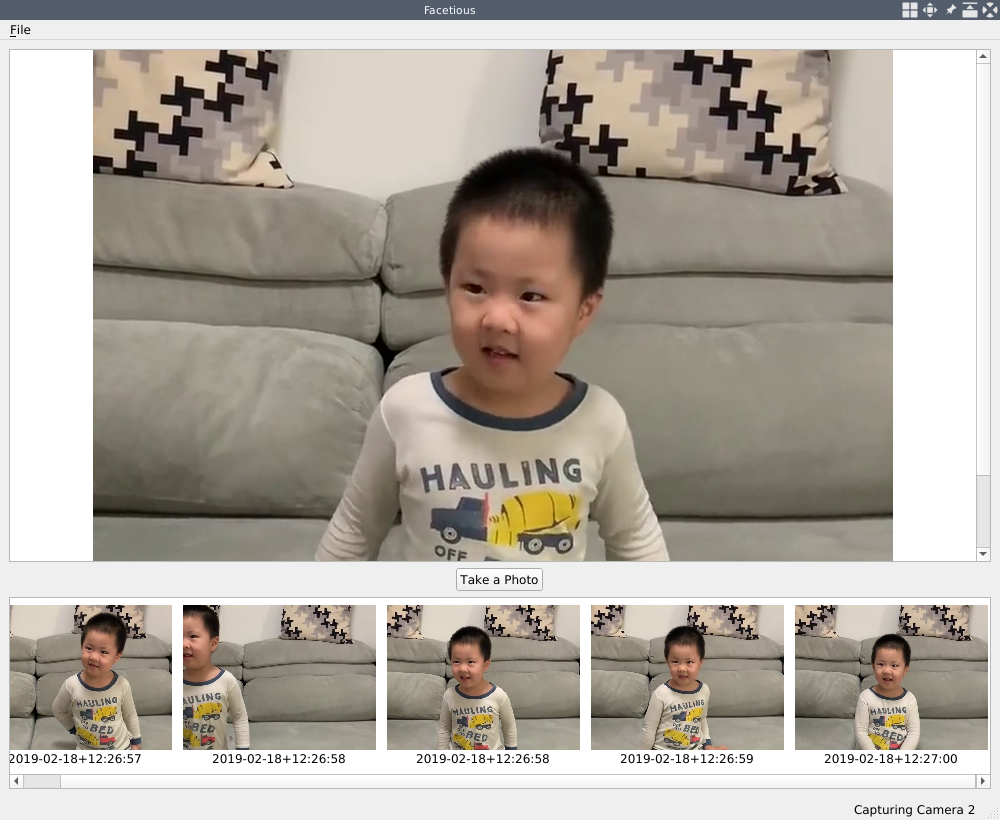

# 顔で楽しむ

第3章「ホームセキュリティアプリケーション」では、Gazerという新しいアプリケーションを作成し、パソコンに取り付けたウェブカメラからビデオを撮影したり、動きを検出したりすることができました。この章では、ウェブカメラを使った遊びを続け、動きを検出する代わりに、カメラを使って顔を検出する新しいアプリケーションを作成します。まず、Webカメラに写っている顔を検出します。次に、検出された顔から顔のランドマークを検出します。この顔のランドマークにより、検出された顔の目、鼻、口、頬の位置がわかるので、顔に面白いマスクを適用することができます。

この章では、以下のトピックを取り上げます。

* ウェブカメラからの写真撮影
* OpenCVを使った顔の検出
* OpenCV を用いた顔のランドマークの検出
* Qt ライブラリのリソースシステム
* 顔へのマスクの適用

***

## 技術的要件

前の章で見たように、ユーザは少なくとも Qt バージョン 5 をインストールし、C++ と Qt プログラミングの基本的な知識を持っていることが要求されます。また、OpenCVの最新版である4.0が正しくインストールされている必要があります。さらに、この章では、OpenCV の core モジュールと imgproc モジュールの他に、video モジュールと videoio モジュールも利用されます。もしあなたがこれまでの章を読んできたのであれば、これらの要件はすでに満たされていることでしょう。

顔や顔のランドマークを検出するために、OpenCVが提供するいくつかの事前学習済みの機械学習モデルを使用しますので、機械学習技術に関する基礎知識があればより良いでしょう。これらの機械学習モデルのいくつかは、OpenCVライブラリのエクストラモジュールのものなので、OpenCVのエクストラモジュールもコアモジュールと一緒にインストールされている必要があります。この章では、OpenCVの追加モジュールを段階的にインストールしてから使用するので、不安な方はご安心ください。

この章のすべてのコードは、私たちのコードリポジトリ（[https://github.com/PacktPublishing/Qt-5-and-OpenCV-4-Computer-Vision-Projects/tree/master/Chapter-04](https://github.com/PacktPublishing/Qt-5-and-OpenCV-4-Computer-Vision-Projects/tree/master/Chapter-04)）で見ることができます。

次のビデオでコードの動作を確認してください： [http://bit.ly/2FfQOmr](http://bit.ly/2FfQOmr)

***

## アプリケーション「Facetious」

この章で作成するアプリケーションは、検出された顔にリアルタイムで面白いマスクを適用することで、多くの楽しみを与えてくれますので、私はこのアプリケーションをFacetiousと名付けました。Facetiousアプリケーションで最初にできることは、ウェブカメラを開き、そこからビデオフィードを再生することです。これは、前章で私たちが作ったGazerアプリケーションで行っていた作業です。そこで、ここでは、Gazerアプリケーションの骨格を借りて、新しいアプリケーションのベースとします。計画としては、まず、Gazerのコピーを作り、Facetiousに名前を変え、動き検出に関する機能を削除し、ビデオ撮影機能を写真撮影の新機能に変更します。そうすることで、シンプルでクリーンなアプリケーションに、顔や顔の特徴を検出する新しい機能を追加することができます。

***

### GazerからFacetiousへ

まず、Gazerアプリケーションのソースをコピーすることから始めましょう。

```sh
     $ mkdir Chapter-04
     $ cp -r Chapter-03/Gazer Chapter-04/Facetious
     $ ls Chapter-04
     Facetious
     $ cd Chapter-04/Facetious
     $ make clean
     $ rm -f Gazer
     $ rm -f Makefile
```

これらのコマンドで、Chapter-03 ディレクトリの下にある Gazer ディレクトリを Chapter-04/Facetious にコピーします。そして、そのディレクトリに入り、make clean を実行して、コンパイル時に生成された中間ファイルをすべてクリーニングし、rm -f Gazer で古いターゲットの実行ファイルを削除しています。

では、プロジェクトファイルごとにリネームとクリーニングを行ってみましょう。

まず、Gazer.pro のプロジェクトファイルです。 Facetious.pro にリネームして、エディタで開き、内容を編集します。エディタで、TARGET キーの値を Gazer から Facetious に変更し、QT キーの値から、この新しいアプリケーションでは使わない Qt モジュール、network と concurrent を削除し、ファイルの最後にある GAZER_USE_QT_CAMERA の関連行を削除しています。Facetious.proの変更された行は以下の通りです。

```qmake
     TARGET = Facetious
     # ...
     QT += core gui multimedia
     # ...
     # the below lines are deleted in this update:
     # Using OpenCV or QCamera
     # DEFINES += GAZER_USE_QT_CAMERA=1
     # QT += multimediawidgets
```

次にmain.cppファイルです。 このファイルは、ウィンドウのタイトルをGazerからFacetiousに変えるだけなので、シンプルです。

```cpp
     window.setWindowTitle("Facetious");
```

次に、capture_thread.h ファイルです。このファイルでは、CaptureThreadクラスから多くのフィールドとメソッドを削除しています。削除されるフィールドは以下の通りです。

```cpp
         // FPS calculating
         bool fps_calculating;
         int fps;

         // video saving
         // int frame_width, frame_height; // notice: we keep this line
         VideoSavingStatus video_saving_status;
         QString saved_video_name;
         cv::VideoWriter *video_writer;

         // motion analysis
         bool motion_detecting_status;
         bool motion_detected;
         cv::Ptr<cv::BackgroundSubtractorMOG2> segmentor;
```

このクラスで削除されるメソッドは以下の通りです。

```cpp
         void startCalcFPS() {...};
         void setVideoSavingStatus(VideoSavingStatus status) {...};
         void setMotionDetectingStatus(bool status) {...};
     // ...
     signals:
         // ...
         void fpsChanged(int fps);
         void videoSaved(QString name);

     private:
         void calculateFPS(cv::VideoCapture &cap);
         void startSavingVideo(cv::Mat &firstFrame);
         void stopSavingVideo();
         void motionDetect(cv::Mat &frame);
```

enum VideoSavingStatus型も不要になったので、同様に削除します。

さて、capture_thread.hはきれいになりましたので、次にcapture_thread.cppに移りましょう。ヘッダファイルの変更点に従って、まず、以下のことを行いましょう。

* コンストラクタの中で，ヘッダファイルで削除したフィールドの初期化を削除する。
* ヘッダファイルで削除したメソッド（スロットを含む）の実装を削除する。
* runメソッドの実装において、動画保存、モーション検出、FPS（Frames per Second）計算に関するコードをすべて削除。

これで、キャプチャスレッドから、ビデオ保存、モーション検出、FPS計算に関するコードがすべて削除されました。この章では、ビデオキャプチャはOpenCVで行うので、まず、#ifdef GAZER_USE_QT_CAMERA から #endif 行の間のコードを削除してください。このようなコードのブロックが2つあるので、その両方を削除します。次に、多くのメソッドとフィールドを削除します。そのほとんどは、ビデオの保存、モーション検出、FPSの計算に関するものです。これらのフィールドとメソッドは次のとおりです。

```cpp
         void calculateFPS();
         void updateFPS(int);
         void recordingStartStop();
         void appendSavedVideo(QString name);
         void updateMonitorStatus(int status);

     private:
         // ...
         QAction *calcFPSAction;
         // ...
         QCheckBox *monitorCheckBox;
         QPushButton *recordButton;
```

appendSavedVideoメソッドとQPushButton *recordButtonフィールドは、実際には削除されないことに注意してください。それぞれ、appendSavedPhoto、QPushButton *shutterButtonに名前を変えています。

```cpp
         void appendSavedPhoto(QString name);
         // ...
         QPushButton *shutterButton;
```

これは、新しいアプリケーションで写真を撮るための準備です。これまで述べてきたように、Facetiousでは、ビデオは録画せず、写真だけを撮ります。

次に、mainwindow.cppのヘッダーファイルと同じように、#ifdef GAZER_USE_QT_CAMERA と #else の間のコードを削除してください。また、この種のブロックが2つありますので、それぞれのブロックの#endif行を削除することを忘れないでください。その後、削除された5つのメソッドの実装を削除します。

* void calculateFPS();
* void updateFPS(int);
* void recordingStartStop();
* void appendSavedVideo(QString name);
* void updateMonitorStatus(int status);

ほとんどの削除は終わりましたが、MainWindowクラスはまだやることがたくさんあります。まずは、ユーザーインターフェースから。MainWindow::initUIメソッドで、モニター状態のチェックボックス、記録ボタン、記録ボタンの横のプレースホルダーに関するコードを削除し、新たにシャッターボタンを作成します。

```cpp
         shutterButton = new QPushButton(this);
         shutterButton->setText("Take a Photo");
         tools_layout->addWidget(shutterButton, 0, 0, Qt::AlignHCenter);
```

先ほどのコードで、シャッターボタンを tools_layout の唯一の子ウィジェットにし、ボタンが中央に配置されていることを確認します。

そして、ステータスバーを作成した後、ステータスバーの起動メッセージを「Facetious is Ready」に変更します。

```cpp
         mainStatusLabel->setText("Facetious is Ready");
```

次に、MainWindow::createActionsメソッドです。このメソッドでは、calcFPSActionアクションの作成とシグナルスロットの接続に関するコードを削除します。

次に、MainWindow::openCameraメソッドで、FPSの計算と動画の保存に関するコードをすべて削除します（そのほとんどはシグナルスロットの接続と切断です）。このメソッドの最後にあるチェックボックスとプッシュボタンに関するコードも削除します。

最後に、新しく追加された appendSavedPhoto メソッドに空の実装を与え、populateSavedList メソッドのボディを空にすることです。次のサブセクションでは、これらのメソッドに新しい実装を追加します。

```cpp
     void MainWindow::populateSavedList()
     {
         // TODO
     }

     void MainWindow::appendSavedPhoto(QString name)
     {
         // TODO
     }
```

次は、utilities.h と utilities.cpp ファイルの番です。ヘッダーファイルでは、notifyMobileメソッドを削除し、newSavedVideoNameメソッドとgetSavedVideoPathメソッドをそれぞれnewPhotoNameとgetPhotoPathにリネームしています。

```cpp
     public:
         static QString getDataPath();
         static QString newPhotoName();
         static QString getPhotoPath(QString name, QString postfix);
```

utilities.cppでは、ヘッダーファイルの変更に合わせて名前の変更と削除を行うほか、getDataPathメソッドの実装を変更しています。

```cpp
     QString Utilities::getDataPath()
     {
         QString user_pictures_path = QStandardPaths::standardLocations(QStandardPaths::PicturesLocation)[0];
         QDir pictures_dir(user_pictures_path);
         pictures_dir.mkpath("Facetious");
         return pictures_dir.absoluteFilePath("Facetious");
     }
```

最も重要な変更点は、QStandardPaths::MoviesLocation の代わりに QStandardPaths::PicturesLocation を使用して、ビデオ用ではなく写真用の標準ディレクトリを取得するようになったことです。

さて、Gazer アプリケーションを簡略化することで、私たちの新しい Facetious アプリケーションの基礎を得ることに成功しました。それでは、コンパイルと実行を試してみましょう。

```sh
     $ qmake -makefile
     $ make
     g++ -c #...
     # output truncated
     $ export LD_LIBRARY_PATH=/home/kdr2/programs/opencv/lib
     $ ./Facetious
```

うまくいけば、Gazer のメイン・ウィンドウに非常によく似た空白のウィンドウが表示されます。このサブセクションのすべてのコードの変更は、[https://github.com/PacktPublishing/Qt-5-and-OpenCV-4-Computer-Vision-Projects/commit/0587c55e4e8e175b70f8046ddd4d67039b431b54](https://github.com/PacktPublishing/Qt-5-and-OpenCV-4-Computer-Vision-Projects/commit/0587c55e4e8e175b70f8046ddd4d67039b431b54) の単一の Git コミットで見つけることができます。もし、このサブセクションを完了するのに問題があれば、遠慮なくそのコミットを参照してください。

***

### 写真を撮る

前節では、Gazerから動画保存機能と動体検知機能を削除し、新しいアプリケーション「Facetious」の基盤を作りました。また、写真撮影のためのいくつかのスタブを新しいアプリケーションに配置しました。このサブセクションでは、写真撮影の機能を完成させます。

ビデオ撮影機能に比べ、写真撮影は非常にシンプルです。まず、capture_thread.h ヘッダーファイルで、CaptureThread クラスにフィールドと多くのメソッドを追加しています。

```cpp
     public:
         // ...
         void takePhoto() {taking_photo = true; }
         // ...
     signals:
         // ...
         void photoTaken(QString name);

     private:
         void takePhoto(cv::Mat &frame);

     private:
         // ...
         // take photos
         bool taking_photo;
```

bool taking_photo フィールドは、キャプチャスレッドが現在のフレームを写真としてハードディスクに保存すべきかどうかを示すフラグであり、void takePhoto() public inline メソッドはこのフラグを true に設定するためのメソッドである。このメソッドは、ユーザがメインウィンドウのシャッターボタンをクリックしたときにメインスレッドで呼び出すことにします。写真を撮るたびに void photoTaken(QString name) シグナルが発行され、Qt メタオブジェクトシステムがその実装を担当します。void takePhoto(cv::Mat &frame) private メソッドは，フレームを写真としてディスクに保存するためのメソッドで， capture_thread.cpp のソースファイルで実装する必要があるのはこのメソッドのみです． その実装を見てみましょう．

```cpp
     void CaptureThread::takePhoto(cv::Mat &frame)
     {
         QString photo_name = Utilities::newPhotoName();
         QString photo_path = Utilities::getPhotoPath(photo_name, "jpg");
         cv::imwrite(photo_path.toStdString(), frame);
         emit photoTaken(photo_name);
         taking_photo = false;
     }
```

メソッド本体では、Utilitiesクラスで書いた関数を使って新しい名前を生成し、生成した名前で保存する写真のパスを取得し、拡張子名をjpgとしています。そして、OpenCVのimgcodecsモジュールのimwrite関数を使って、フレームをJPEG画像ファイルとして、指定したパスのディスクに書き込んでいます。写真が保存された後、写真名とともに photoTaken シグナルを出力します。このシグナルに興味を持つ人がいれば、スロットを接続する必要があり、シグナルが発せられた瞬間にそのスロットが呼ばれます。メソッド本体の最後では、taking_photoフラグをfalseに戻しています。

CaptureThread::takePhoto(cv::Mat &frame) メソッドが実装されたので、 CaptureThread::run() メソッド内のキャプチャ無限ループでこれを呼び出してみましょう。

```cpp
             if(taking_photo) {
                 takePhoto(tmp_frame);
             }
```

このコード片では、写真を撮るべきかどうかを調べるために taking_photo フラグをチェックしています。もしこれが真であれば、 takePhoto(cv::Mat &frame) メソッドを呼び出して、現在のフレームを写真として保存します。このコード片は、 tmp_frame が空でないチェックを通過した後、そのフレームの色順序が BGR から RGB に変換される前に配置されなければならず、これにより、imwrite 関数に渡すことができる適切な色順序のフレームであることが確認されます。

CaptureThreadクラスで最後に行うことは、そのコンストラクタでtaking_photoフラグをfalseに初期化することです。

さて、ユーザーインターフェイスに移りましょう。まず、mainwindow.h で MainWindow クラスに新しいプライベートスロットを追加します。

```cpp
     private slots:
         // ...
         void takePhoto();
```

このスロットは、シャッターボタンのシグナルに接続されることになります。その実装をmainwindow.cppのソースファイルから見てみましょう。

```cpp
     void MainWindow::takePhoto()
     {
         if(capturer != nullptr) {
             capturer->takePhoto();
         }
     }
```

単純な作業です。このメソッドでは、CaptureThreadのインスタンスであるcapturerのvoid takePhoto()メソッドを呼び出して、nullでなければ写真を撮るように指示しています。そして、MainWindow::initUI()メソッドで、シャッターボタンを作成した後、このスロットをshutterButtonのclickedシグナルに接続します。

```cpp
         connect(shutterButton, SIGNAL(clicked(bool)), this, SLOT(takePhoto()));
```

これまでの作業で、キャプチャースレッドに写真を撮るように指示することができるようになりました。しかし、写真が撮影されたとき、メインウィンドウはどうやってそれを知るのでしょうか？CaptureThread::photoTaken シグナルと MainWindow::appendSavedPhoto スロットの間の接続によって実現されます。 この接続は、MainWindow::openCamera()メソッドでキャプチャスレッドのインスタンスが生成された後に行います。

```cpp
         connect(capturer, &CaptureThread::photoTaken, this, &MainWindow::appendSavedPhoto);
```

また、同じメソッドで閉じたキャプチャースレッドインスタンスの前に切断することを忘れないでください。

```cpp
             disconnect(capturer, &CaptureThread::photoTaken, this, &MainWindow::appendSavedPhoto);
```

さて、MainWindow::appendSavedPhoto(QString name) スロットが何をするのかを見てみましょう。前のサブセクションで、私たちはこのスロットに空のボディを与えました。さて、このスロットはその責任を負わなければなりません。

```cpp
     void MainWindow::appendSavedPhoto(QString name)
     {
         QString photo_path = Utilities::getPhotoPath(name, "jpg");
         QStandardItem *item = new QStandardItem();
         list_model->appendRow(item);
         QModelIndex index = list_model->indexFromItem(item);
         list_model->setData(index, QPixmap(photo_path).scaledToHeight(145), Qt::DecorationRole);
         list_model->setData(index, name, Qt::DisplayRole);
         saved_list->scrollTo(index);
     }
```

これは、第3章「ホームセキュリティの応用」でGazerアプリケーションの保存ビデオリストに新しく録画したビデオのカバー画像を追加したときに行ったことと非常によく似ています。したがって、ここではこのコードの一部を一行ずつ説明することはしません。

もうひとつ、アプリケーションの起動中に、撮影したすべての写真を保存済み写真リストに登録するためのメソッド、MainWindow::populateSavedList()を実装する必要があります。このメソッドも、Gazerアプリケーションで保存された動画をポピュレートするために使用したメソッドと非常によく似ているので、実装はおまかせします。もし困ったことがあれば、GitHubにある本書の付属コードリポジトリを参照してください。このサブセクションのすべての変更は、このコミットにあります: [https://github.com/PacktPublishing/Qt-5-and-OpenCV-4-Computer-Vision-Projects/commit/744d445ad4c834cd52660a85a224e48279ac2cf4](https://github.com/PacktPublishing/Qt-5-and-OpenCV-4-Computer-Vision-Projects/commit/744d445ad4c834cd52660a85a224e48279ac2cf4)

さて、もう一度アプリケーションをコンパイルして実行してみましょう。アプリケーションがメインウィンドウを表示した後、FileメニューのOpen Cameraアクションをクリックしてカメラを開き、シャッターボタンをクリックして写真を撮影します。これらのアクションの後、私のメインウィンドウは次のスクリーンショットのようになります。



この章では、新しいアプリケーションの基本的な機能を設定します。次章では、OpenCVを用いて、撮影したフレームからリアルタイムに顔を検出します。

***

## カスケード分類器による顔検出
