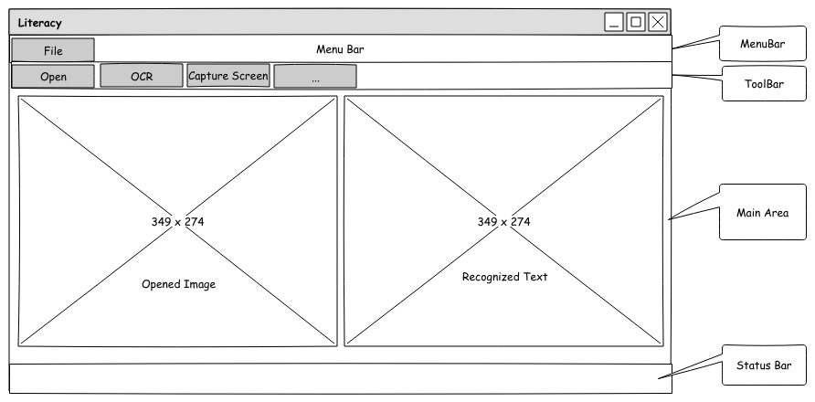
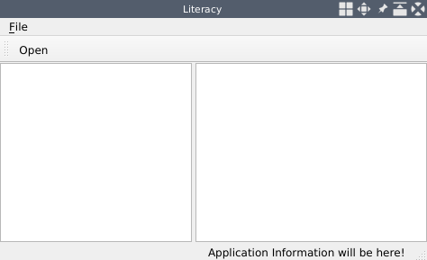
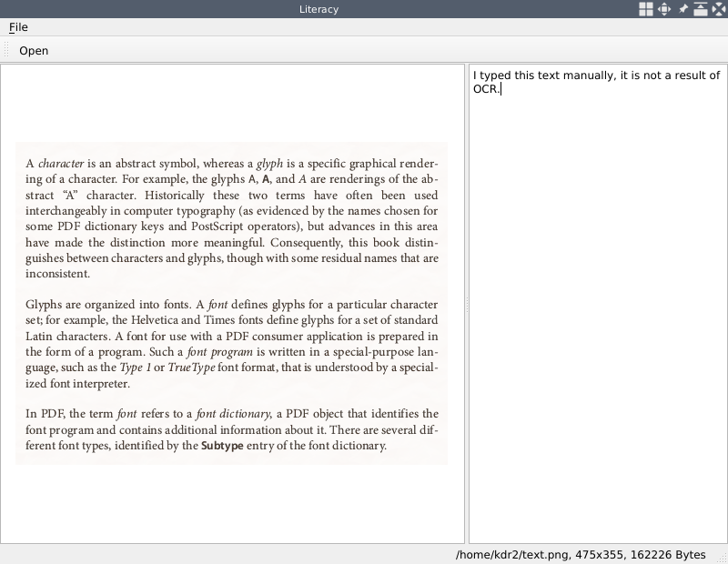
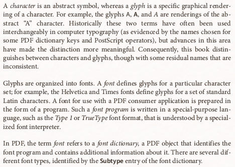
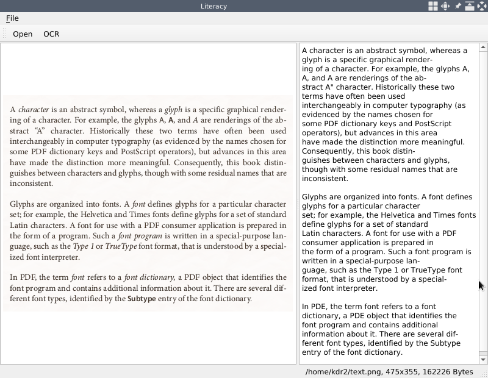

# 光学式文字認識

前の章では、ビデオやカメラを使った作業を多く行いました。パソコンに取り付けたウェブカメラから動画を再生するアプリケーション（GazerとFacetious）を作成しました。また、これらのアプリケーションを使って、動画の撮影、写真撮影、動きや顔の検出、動画から検出した顔へのマスクの適用をリアルタイムに行うことができます。

さて、ここからは画像中の文字に焦点を移します。画像から文字やテキストを抽出したい場面は多くあります。コンピュータビジョンの分野では、このような作業を人手で書き写すのではなく、自動的に行うOCR（Optical Character Recognition）と呼ばれる技術があります。この章では、Qt と数多くの OCR ライブラリを用いて、画像やスキャンした文書からテキストを抽出する新しいアプリケーショ ンを構築します。

この章では、以下のトピックを取り上げます。

* 画像からテキストを抽出する
* 画像からテキストを抽出する 画像からテキスト領域を検出する
* 画面のコンテンツにアクセスする
* ウィジェットへの描画と画面の一部分の切り出し

***

## 技術的要件

これまでの章で見てきたように、ユーザーは少なくともQtバージョン5がインストールされており、C++とQtプログラミングの基本的な知識があることが必要です。また、本章ではOCR機能としてこのライブラリを使用するため、Tesseractの最新版であるバージョン4.0が正しくインストールされている必要があります。Windowsの場合、Tesseractのビルド済みバイナリパッケージは、[https://github.com/UB-Mannheim/tesseract/wiki](https://github.com/UB-Mannheim/tesseract/wiki) にあります。UNIX系システムでは、Tesseractを使用する前に、ソースから順を追ってビルドします。

また、深層学習の知識があれば、本章の内容を理解する上で大きな助けとなるでしょう。

本章のコードは全て、私たちのコードリポジトリ（[https://github.com/PacktPublishing/Qt-5-and-OpenCV-4-Computer-Vision-Projects/tree/master/Chapter-05](https://github.com/PacktPublishing/Qt-5-and-OpenCV-4-Computer-Vision-Projects/tree/master/Chapter-05)）にあります。

次のビデオでコードの動きを確認してください： [http://bit.ly/2FhuTvq](http://bit.ly/2FhuTvq)

***

## Literacyの作成

先に述べたように、画像やスキャンした文書からテキストを抽出するための新しいアプリケーションを作成することにします。まず、このアプリケーションの目的を明確にする必要があります。主な機能は画像からテキストを抽出することですが、ユーザーの利便性を考えて、画像を指定する方法を複数用意する必要があります。

* 画像はローカルのハードディスクにあるものでもよい。
* 画像はローカルのハードディスクにあるものでもよいし、画面からキャプチャしたものでもよい。

このように要件を明確にした上で、UIを設計していきましょう。

***

### UIをデザインする

アプリケーションのUIのデザインとして、以下のワイヤーフレームを描きます。



左側は開いた画像、右側は取り出したテキストを表示するエリアです。その他、メニューバー、ツールバー、ステータスバーなど、私たちがよく知っているウィンドウの構成です。

このデザインのソースファイルは、GitHubのコードリポジトリ（[https://github.com/PacktPublishing/Qt-5-and-OpenCV-4-Computer-Vision-Projects](https://github.com/PacktPublishing/Qt-5-and-OpenCV-4-Computer-Vision-Projects)）から入手できます。このファイルはリポジトリのルートディレクトリにあり、名前は WireFrames.epgz です。この章のワイヤーフレームは、3ページ目にあります。このファイルは、Pencilアプリケーションで開く必要があることを忘れないでください。

***

### UIを設定する

前のサブセクションでは、私たちの新しいアプリケーション、LiteracyのUIをデザインしました。それでは、Qt プロジェクトを作成し、Qt のメインウィンドウに UI を設定してみましょう。

まず、ターミナルでプロジェクトを作成しましょう。

```sh
     $ mkdir Literacy/
     $ cd Literacy/
     $ touch main.cpp
     $ ls
     main.cpp
     $ qmake -project
     $ ls
     Literacy.pro main.cpp
     $
```

そして、プロジェクトファイル「Literacy.pro」を開き、以下の内容を記入します。

```qmake
     TEMPLATE = app
     TARGET = Literacy

     QT += core gui
     greaterThan(QT_MAJOR_VERSION, 4): QT += widgets

     INCLUDEPATH += .

     # Input
     HEADERS += mainwindow.h
     SOURCES += main.cpp mainwindow.cpp
```

これは何度もやっていることなので、簡単です。しかし、このプロジェクトファイルでは、1つのヘッダーファイルと2つのソースファイルを指定していますが、この時点では、空のソースファイルmain.cppが1つしかないことは、やはり注目すべき点でしょう。この点については心配しないでください。このプロジェクトをコンパイルする前に、これらすべてのソースファイルを完成させます。

main.cppも非常にわかりやすいファイルです。

```cpp
     #include <QApplication>
     #include "mainwindow.h"

     int main(int argc, char *argv[])
     {
         QApplication app(argc, argv);
         MainWindow window;
         window.setWindowTitle("Literacy");
         window.show();
         return app.exec();
     }
```

他のプロジェクトで行ったのと同様に、QApplicationのインスタンスとMainWindowのインスタンスを作成し、ウィンドウのshowメソッドとアプリケーションのexecメソッドを呼び出してアプリケーションを起動させます。しかし、MainWindowクラスはまだ存在しないので、今これを作成しましょう。

プロジェクトのルートディレクトリに、MainWindowクラスを収容するためのmainwindow.hというファイルを新規に作成します。ifndef/define のイディオムや include ディレクティブを省略すると、このクラスは次のようになります。

```cpp
     class MainWindow : public QMainWindow
     {
         Q_OBJECT

     public:
         explicit MainWindow(QWidget *parent=nullptr);
         ~MainWindow();

     private:
         void initUI();
         void createActions();
         void setupShortcuts();

     private:
         QMenu *fileMenu;

         QToolBar *fileToolBar;

         QGraphicsScene *imageScene;
         QGraphicsView *imageView;

         QTextEdit *editor;

         QStatusBar *mainStatusBar;
         QLabel *mainStatusLabel;

         QAction *openAction;
         QAction *saveImageAsAction;
         QAction *saveTextAsAction;
         QAction *exitAction;
     };
```

これは明らかにQMainWindowのサブクラスであり、それゆえ本体の最初にQ_OBJECTマクロを持ちます。最も重要な点は、プライベートセクションで宣言したウィジェットです。ファイルメニューのfileMenu、ツールバーのfileToolBar、ターゲット画像を表示するQGraphicsSceneとQGraphicsView、認識したテキスト、ステータスバー、ラベルを配置するQTextEditor、そして、最後に4つのQActionポインターがあります。

これらのウィジェットの宣言とは別に、これらのウィジェットをインスタンス化し、設計通りにメイン・ウィンドウに配置するための3つのプライベート・メソッドも用意されています。

* initUI: アクションを除くすべてのウィジェットをインスタンス化する。
* createActions: initUIメソッドから呼び出されます。
* setupShortcuts: ショートカットの設定。アプリケーションをより使いやすくするために、いくつかのホットキーを設定する。これはcreateActionsメソッドで呼び出される。

さて、いよいよこれらのメソッドを実装してみましょう。これらの実装に対応するために、プロジェクトのルートディレクトリにmainwindow.cppという新しいソースファイルを作成します。まず、initUIメソッドを見てみましょう。

```cpp
     void MainWindow::initUI()
     {
         this->resize(800, 600);
         // setup menubar
         fileMenu = menuBar()->addMenu("&File");

         // setup toolbar
         fileToolBar = addToolBar("File");

         // main area
         QSplitter *splitter = new QSplitter(Qt::Horizontal, this);

         imageScene = new QGraphicsScene(this);
         imageView = new QGraphicsView(imageScene);
         splitter->addWidget(imageView);

         editor = new QTextEdit(this);
         splitter->addWidget(editor);

         QList<int> sizes = {400, 400};
         splitter->setSizes(sizes);

         setCentralWidget(splitter);

         // setup status bar
         mainStatusBar = statusBar();
         mainStatusLabel = new QLabel(mainStatusBar);
         mainStatusBar->addPermanentWidget(mainStatusLabel);
         mainStatusLabel->setText("Application Information will be here!");
         createActions();
     }
```

この方法では、まずウィンドウサイズを設定し、ファイルメニューを作成してメニューバーに追加し、ファイルツールバーを作成し、最後にステータスバーを作成してそこにラベルを貼ります。この作業はすべて、これまでのプロジェクトで行ってきたものと同じです。これまでのプロジェクトと異なる顕著な点は、メソッド本体の中央部分であるメインエリアの作成です。この部分では、グラフィックスビューとエディタに対応するために、QGridLayoutインスタンスの代わりに、水平方向を持つQSplitterオブジェクトを作成します。

QSplitterを使うことで、QGridLayoutでは不可能な、スプリッターバーをドラッグして子ウィジェットの幅を自由に変更することができるようになります。その後、グラフィックシーンとグラフィックビューを作成し、エディタがそれらを整然とスプリッタに追加していきます。スプリッターの子の幅は、intのリストでsetSizesメソッドを呼び出して設定します。各子の幅は、400ピクセルで等しくなるようにします。最後に、スプリッターをメイン・ウィンドウの中心的なウィジェットとして設定する。

次のコードは、createActions メソッドに関連するものです。

```cpp
     void MainWindow::createActions()
     {
         // create actions, add them to menus
         openAction = new QAction("&Open", this);
         fileMenu->addAction(openAction);
         saveImageAsAction = new QAction("Save &Image as", this);
         fileMenu->addAction(saveImageAsAction);
         saveTextAsAction = new QAction("Save &Text as", this);
         fileMenu->addAction(saveTextAsAction);
         exitAction = new QAction("E&xit", this);
         fileMenu->addAction(exitAction);

         // add actions to toolbars
         fileToolBar->addAction(openAction);

         setupShortcuts();
     }
```

ここでは、宣言したすべてのアクションを作成し、ファイルメニューとツールバーに追加しています。このメソッドの最後に、setupShortcutsを呼び出しています。では、その中で設定したショートカットの内容を見てみましょう。

```cpp
     void MainWindow::setupShortcuts()
     {
         QList<QKeySequence> shortcuts;
         shortcuts << (Qt::CTRL + Qt::Key_O);
         openAction->setShortcuts(shortcuts);

         shortcuts.clear();
         shortcuts << (Qt::CTRL + Qt::Key_Q);
         exitAction->setShortcuts(shortcuts);
     }
```

ご覧のように、Ctrl-OでopenActionを、Ctrl-QでexitActionをトリガーしています。

最後に、コンストラクタとデストラクタです。

```cpp
     MainWindow::MainWindow(QWidget *parent) :
         QMainWindow(parent)
     {
         initUI();
     }

     MainWindow::~MainWindow()
     {
     }
```

この2つはかなり簡単なので、ここではあまり詳しく説明しません。では、Literacyアプリケーションをコンパイルして実行します。

```sh
     $ qmake -makefile
     $ make
     g++ -c -pipe -O2 -Wall -W # ...
     # output trucated
     $ ./Literacy
```

アプリケーションを実行すると、デスクトップに次のようなウィンドウが表示されます。



つまり、インタラクティブな機能を持たない完全な UI を設定したことになります。次に、このアプリケーションに以下のようなインタラクティブな機能を追加していきます。

* ローカルディスクから画像を開く
* 現在の画像をファイルとしてローカルディスクに保存する
* エディタウィジェットのテキストを、テキストファイルとしてローカルディスクに保存する。

これらの目標を達成するために、mainwindow.h ヘッダーファイルの MainWindow クラスにいくつかのメソッド、スロット、メンバ フィールドを追加する必要があります。

```cpp
     private:
         // ...
         void showImage(QString);
         // ...
     private slots:
         void openImage();
         void saveImageAs();
         void saveTextAs();

     private:
         // ...
         QString currentImagePath;
         QGraphicsPixmapItem *currentImage;
```

showImageメソッドとopenImageスロットは、ImageViewerアプリケーション（第1章画像ビューアの構築参照）で書いたMainWindow::showImageとMainWindow::openImageメソッドと同じ実装を持ちます。また、saveImageAs スロットは、その ImageViewer アプリケーションの MainWindow::saveAs メソッドと全く同じ実装になっています。新しいアプリケーションではテキストだけでなく画像も保存する必要があり、このメソッドは画像を保存するためだけのものであるという理由から、ここでは異なる名前を使用しているだけです。したがって、これらの実装を新しいプロジェクトにコピーします。この章を簡潔にするために、これらについてあまり詳しく説明することはありません。

まだカバーしていない唯一のメソッドは、saveTextAs スロットです。では、その実装を見てみましょう。

```cpp
     void MainWindow::saveTextAs()
     {
         QFileDialog dialog(this);
         dialog.setWindowTitle("Save Text As ...");
         dialog.setFileMode(QFileDialog::AnyFile);
         dialog.setAcceptMode(QFileDialog::AcceptSave);
         dialog.setNameFilter(tr("Text files (*.txt)"));
         QStringList fileNames;
         if (dialog.exec()) {
             fileNames = dialog.selectedFiles();
             if(QRegExp(".+\\.(txt)").exactMatch(fileNames.at(0))) {
                 QFile file(fileNames.at(0));
                 if (!file.open(QIODevice::WriteOnly | QIODevice::Text)) {
                     QMessageBox::information(this, "Error", "Can't save text.");
                     return;
                 }
                 QTextStream out(&file);
                 out << editor->toPlainText() << "\n";
             } else {
                 QMessageBox::information(this, "Error", "Save error: bad format or filename.");
             }
         }
     }
```

saveImageAsメソッドと非常によく似ています。 異なる点は以下の通りです。

* ファイルダイアログで、拡張子名txtの名前フィルタを設定し、テキストファイルのみが選択できるようにしています。
* テキストを保存しながら、選択されたファイル名でQFileインスタンスを作成し、そのQFileインスタンスで書き込み可能なQTextStreamインスタンスを作成します。最後に、テキストエディタのtoPlainText()メソッドを呼び出して内容を取得し、先ほど作成したストリームに書き込んでいます。

さて、すべてのメソッドとスロットが終了しましたので、createActionsメソッドでシグナルとこれらのスロットを接続してみましょう。

```cpp
         // connect the signals and slots
         connect(exitAction, SIGNAL(triggered(bool)), QApplication::instance(), SLOT(quit()));
         connect(openAction, SIGNAL(triggered(bool)), this, SLOT(openImage()));
         connect(saveImageAsAction, SIGNAL(triggered(bool)), this, SLOT(saveImageAs()));
         connect(saveTextAsAction, SIGNAL(triggered(bool)), this, SLOT(saveTextAs()));
```

最後に、コンストラクタで currentImage メンバフィールドを nullptr に初期化します。

```cpp
     MainWindow::MainWindow(QWidget *parent) :
         QMainWindow(parent), currentImage(nullptr)
     {
         initUI();
     }
```

ここで、新しく追加されたこれらのインタラクティブな機能をテストするために、アプリケーションを再度コンパイルして実行します。アクションをクリックし、画像を開き、エディターで文字を入力し、スプリッターバーをドラッグして列の幅を調整し、画像やテキストをファイルとして保存してみましょう。対話するメインウィンドウは、このようになります。



図にあるように、多くの文字を含む画像を開き、右側のエディタにテキストを入力します。次のセクションでは、画像からテキストを抽出し、ツールバーのボタンをクリックして抽出したテキストを自動的にエディタに入力します。

このセクションのコードにおけるすべての変更は、このコミットにあります: [https://github.com/PacktPublishing/Qt-5-and-OpenCV-4-Computer-Vision-Projects/commit/bc1548b97cf79ddae5184f8009badb278c2750b2(https://github.com/PacktPublishing/Qt-5-and-OpenCV-4-Computer-Vision-Projects/commit/bc1548b97cf79ddae5184f8009badb278c2750b2).

***

## TesseractによるOCR

ここでは、Tesseractを使って画像からテキストを抽出します。TesseractをWindowsにインストールするには、前述したように、ビルド済みのバイナリパッケージを使用することができます。UNIX系のシステムであれば、システムのパッケージマネージャを利用して、例えばDebianであればapt-get、macOSであればbrewでインストールすることが可能です。Debianを例にとると、libtesseract-devとtesseract-ocr-allパッケージをインストールすれば、必要なライブラリやデータファイルがすべてインストールされます。どのようにインストールするにしても、正しいバージョンである4.0.0がインストールされていることを確認してください。

ビルド済みのパッケージもありますが、教育的な目的から、Linuxシステム上でソースからビルドし、どのようなコンポーネントが含まれ、どのようにコマンドラインツールを使用するかを確認することにします。

***

### Tesseractをソースからビルドする

バージョン4.0.0をソースからビルドします。まず、[https://github.com/tesseract-ocr/tesseract/releases](https://github.com/tesseract-ocr/tesseract/releases)、リリースページの4.0.0 Releaseからzipファイルを選択し、ダウンロードを行います。.zipファイルがダウンロードされたら、それを解凍し、ビルドするためのディレクトリを入力します。

```sh
$ curl -L https://github.com/tesseract-ocr/tesseract/archive/4.0.0.zip -o tesseract-4.0.0.zip
  % Total % Received % Xferd Average Speed Time Time Time Current
                                 Dload Upload Total Spent Left Speed
100 127 0 127 0 0 159 0 --:--:-- --:--:-- --:--:-- 159
100 2487k 0 2487k 0 0 407k 0 --:--:-- 0:00:06 --:--:-- 571k
$ unzip tesseract-4.0.0.zip
# output omitted
$ cd tesseract-4.0.0/
$ ./configure --prefix=/home/kdr2/programs/tesseract
# output omitted
$ make && make install
# output omitted
```

Tesseractはautotoolsを使ってビルドシステムを構築しているため、そのビルド方法は非常に簡単です。まず、configureスクリプトを実行し、次にmake && make installを実行します。configureスクリプトを実行する際に、-prefix=/home/kdr2/programs/tesseractという引数を与えてインストール先を指定しているので、予定通りであれば、このディレクトリの下にTesseractライブラリが、ヘッダーファイル、スタティックライブラリ、ダイナミックライブラリと、その他多くのファイルを含めてインストールされることになります。

Tesseract 4では、LSTM（Long Short-Term Memory）ニューラルネットワークをベースとした、線認識に特化した新しいOCRエンジンが導入されましたが、Tesseract 3のレガシーなOCRエンジンである、文字パターンの認識も踏襲されています。そのため、Tesseract 4ではどちらのエンジンを使うかを自由に選択することができます。新しいOCRエンジンを利用するには、そのエンジンに搭載されているLSTM AIモデルの事前学習データをダウンロードする必要があります。この学習済みデータは、GitHubのリポジトリ（[https://github.com/tesseract-ocr/tessdata](https://github.com/tesseract-ocr/tessdata)）で公開されています。このリポジトリの内容をダウンロードし、Tesseractのインストールディレクトリの下に配置します。

```sh
$ curl -O -L https://github.com/tesseract-ocr/tessdata/archive/master.zip
# output omitted
$ unzip master.zip
Archive: master.zip
590567f20dc044f6948a8e2c61afc714c360ad0e
   creating: tessdata-master/
  inflating: tessdata-master/COPYING
  inflating: tessdata-master/README.md
  inflating: tessdata-master/afr.traineddata
  ...
$ mv tessdata-master/* /home/kdr2/programs/tesseract/share/tessdata/
$ ls /home/kdr2/programs/tesseract/share/tessdata/ -l |head
total 1041388
-rw-r--r-- 1 kdr2 kdr2 7851157 May 10 2018 afr.traineddata
-rw-r--r-- 1 kdr2 kdr2 8423467 May 10 2018 amh.traineddata
-rw-r--r-- 1 kdr2 kdr2 2494806 May 10 2018 ara.traineddata
-rw-r--r-- 1 kdr2 kdr2 2045457 May 10 2018 asm.traineddata
-rw-r--r-- 1 kdr2 kdr2 4726411 May 10 2018 aze_cyrl.traineddata
-rw-r--r-- 1 kdr2 kdr2 10139884 May 10 2018 aze.traineddata
-rw-r--r-- 1 kdr2 kdr2 11185811 May 10 2018 bel.traineddata
-rw-r--r-- 1 kdr2 kdr2 1789439 May 10 2018 ben.traineddata
-rw-r--r-- 1 kdr2 kdr2 1966470 May 10 2018 bod.traineddata
```

このステップでは、拡張子が traineddata のファイルが大量に生成されます。これらのファイルは異なる言語の学習済みデータファイルであり、言語名がファイル名のベースとして使用されます。例えば、eng.traineddata は英字を認識するためのファイルです。

*実はこの学習済みデータは、Tesseractのインストール先であるデータディレクトリの下に置く必要はありません。好きな場所にファイルを置き、環境変数TESSDATA_PREFIXにそのディレクトリを設定します。Tesseractはこの環境変数に従うことで、これらのファイルを見つけることができます。*

Tesseractは、画像からテキストを抽出するためのコマンドラインツールを提供しています。このツールを使って、Tesseractのライブラリが正しくインストールされているかどうかを確認してみましょう。

```sh
$ ~/programs/tesseract/bin/tesseract -v
tesseract 4.0.0
 leptonica-1.76.0
  libgif 5.1.4 : libjpeg 6b (libjpeg-turbo 1.5.2) : libpng 1.6.36 : libtiff 4.0.9 : zlib 1.2.11 : libwebp 0.6.1 : libopenjp2 2.3.0
 Found AVX
 Found SSE
```

-v オプションは、テッセラクトツールにバージョン情報を表示する以外何もしないように指示します。Tesseract 4.0.0がインストールされていることが確認できます。このメッセージにあるleptonicaという単語は、Tesseractがデフォルトで使用する別の画像処理ライブラリです。今回のプロジェクトでは、すでにQtとOpenCVで画像処理をしているので、この情報は無視すればよいでしょう。

では、このコマンドラインツールを使って、画像からテキストを抽出してみましょう。入力として以下のような図が用意されています。



そして、これが図上でのコマンドラインツールの性能の結果です。


ご覧のように、今回はコマンドラインツールに多くの引数を与えています。

* 最初の引数は入力画像です。
* 2つ目は出力です。stdoutは、コマンドラインツールが結果をターミナルの標準出力に書き出すことを指示するために使用します。ここでベースとなるファイル名を指定することができます。例えば、text-outと指定すると、テキストファイルtext-out.txtに結果を書き出すように指示します。
* 残りの引数はオプションです。ここでは-l engを使い、抽出したいテキストが英語で書かれていることを伝えています。

Tesseractは図中のテキストを非常によく認識していることがわかります。

Tesseractのコマンドラインツールには、-lオプションの他に、--oemと-psmという重要なオプションがあります。

oemオプションは、その名前から推測できるように、OCRエンジンモードを選択するためのものです。以下のコマンドを実行することで、TesseractがサポートしているすべてのOCRエンジンモードを一覧することができます。

```sh
$ ~/programs/tesseract/bin/tesseract --help-oem
OCR Engine modes:
  0 Legacy engine only.
  1 Neural nets LSTM engine only.
  2 Legacy + LSTM engines.
  3 Default, based on what is available.
```

Tesseract 4.0ではLSTMモードがデフォルトで使用されており、ほとんどの状況において非常に良いパフォーマンスを発揮します。テキストを抽出するために実行したコマンドの最後に--oem 0を追加すれば、レガシーエンジンを試すことができ、この図ではレガシーエンジンがあまりうまく動作していないことがわかるでしょう。

psmオプションは、ページ分割モードを指定するためのものです。tesseract --help-psmを実行すると、Tesseractのページ分割には多くのモードがあることがわかります。

```sh
$ ~/programs/tesseract/bin/tesseract --help-psm
Page segmentation modes:
  0 Orientation and script detection (OSD) only.
  1 Automatic page segmentation with OSD.
  2 Automatic page segmentation, but no OSD, or OCR.
  3 Fully automatic page segmentation, but no OSD. (Default)
  4 Assume a single column of text of variable sizes.
  5 Assume a single uniform block of vertically aligned text.
  6 Assume a single uniform block of text.
  7 Treat the image as a single text line.
  8 Treat the image as a single word.
  9 Treat the image as a single word in a circle.
 10 Treat the image as a single character.
 11 Sparse text. Find as much text as possible in no particular order.
 12 Sparse text with OSD.
 13 Raw line. Treat the image as a single text line,
       bypassing hacks that are Tesseract-specific.
```

複雑なタイプセットを持つスキャン文書を扱う場合は、おそらくそのページ分割モードを選択する必要があります。しかし、今回は単純な画像を扱うので、このオプションは無視することにします。

ここまでで、Tesseractライブラリのインストールに成功し、そのコマンドラインツールを使って画像からテキストを抽出する方法について学びました。次のサブセクションでは、このライブラリを我々のアプリケーションであるLiteracyに統合し、テキスト認識機能を促進させることにします。

***

### リテラシーで文字を認識する

テッサー・アクト・ライブラリーの準備ができたので、それを使ってリタイア・アプリのキャラクターを再定義してみよう。

まず最初にすべきことは、プロジェクトファイルを更新し、Tesserのアクトリブラリに反映させます：

```sh
# use your own path in the following config
unix: {
    INCLUDEPATH += homekdr2/programs/tesseract/include
    LIBS += -Lhomekdr2/programs/tesseract/lib -ltesseract
}
win32 {
    INCLUDEPATH += c:/path/to/tesseract/include
    LIBS += -lc:/path/to/opencv/lib/tesseract
}
DEFINES += TESSDATA_PREFIX=\\\"homekdr2/programs/tesseract/share/tessdata/\\\"
```

先の変更セットでは、異なるプラットフォーム用のTesseractライブラリのインクルードパスとライブラリパスを追加し、TESSDATA_PREFIXというマクロを定義しました。このマクロは後ほど学習済みデータをロードする際に使用します。

次に、mainwindow.hヘッダーファイルを開き、新しい行を追加します：

```cpp
     #include "tesseract/baseapi.h"

     class MainWindow : public QMainWindow
     {
         // ...
     private slots:
         // ...
         void extractText();

     private:
         // ...
         QAction *ocrAction;
         // ...
         tesseract::TessBaseAPI *tesseractAPI;
     };
```

この変更セットでは、まずTesseractライブラリのベースAPIヘッダーファイルをインクルードするためにincludeディレクティブを追加し、次にMainWindowクラスに1つのスロットと2つのメンバーを追加します。

QAction \*ocrActionメンバーは、メインウィンドウのツールバーに表示されます。このアクションがトリガーされると、新しく追加されたスロットであるextractTextが呼び出され、そのスロットはtesseract::TessBaseAPI *tesseractAPIメンバを使用して、開かれたイメージ内の文字を認識します。

では、ソースファイルmainwindow.cppでこれらのことがどのように行われるかを見てみましょう。

MainWindowクラスのコンストラクタで、メンバ・フィールドのtesseractAPIをnullptrに初期化します：

```cpp
     MainWindow::MainWindow(QWidget *parent) :
         QMainWindow(parent)
         , currentImage(nullptr)
         , tesseractAPI(nullptr)
     {
         initUI();
     }
```

createActionsメソッドでは、ocrActionアクションを作成し、ツールバーに追加し、そのトリガーシグナルを新しく追加されたextractTextスロットに接続します：

```cpp
     void MainWindow::createActions()
     {
         // ...
         ocrAction = new QAction("OCR", this);
         fileToolBar->addAction(ocrAction);

         // ...
         connect(ocrAction, SIGNAL(triggered(bool)), this, SLOT(extractText()));
         // ...
     }
```

あとは、最も複雑で重要な部分であるextractTextスロットの実装だけです：

```cpp
     void MainWindow::extractText()
     {
         if (currentImage == nullptr) {
             QMessageBox::information(this, "Information", "No opened image.");
             return;
         }

         char *old_ctype = strdup(setlocale(LC_ALL, NULL));
         setlocale(LC_ALL, "C");
         tesseractAPI = new tesseract::TessBaseAPI();
         // Initialize tesseract-ocr with English, with specifying tessdata path
         if (tesseractAPI->Init(TESSDATA_PREFIX, "eng")) {
             QMessageBox::information(this, "Error", "Could not initialize tesseract.");
             return;
         }

         QPixmap pixmap = currentImage->pixmap();
         QImage image = pixmap.toImage();
         image = image.convertToFormat(QImage::Format_RGB888);

         tesseractAPI->SetImage(image.bits(), image.width(), image.height(),
             3, image.bytesPerLine());
         char *outText = tesseractAPI->GetUTF8Text();
         editor->setPlainText(outText);
         // Destroy used object and release memory
         tesseractAPI->End();
         delete tesseractAPI;
         tesseractAPI = nullptr;
         delete [] outText;
         setlocale(LC_ALL, old_ctype);
         free(old_ctype);
     }
```

メソッド本体の冒頭で、currentImageメンバ・フィールドがnullかどうかをチェックする。もしnullであれば、アプリケーションで開いている画像はないので、メッセージボックスを表示した後、すぐにリターンします。

もしnullでなければ、Tesseract APIインスタンスを作成します。TesseractはロケールをCに設定する必要があるため、まず、LC_ALLカテゴリとnull値でsetlocale関数を呼び出し、現在のロケール設定を取得し保存します。OCR作業が完了したら、保存されたLC_ALL値を使用してロケール設定を復元します。

ロケールをCに設定した後、Tesseract APIのインスタンスを作成します。作成にはnew tesseract::TessBaseAPI()を使用します。新しく作成したAPIインスタンスは、使用する前に初期化する必要があります。初期化はInitメソッドを呼び出すことで実行されます。Initメソッドには多くのバージョン（オーバーロード）があります：

```cpp
// 1
int Init(const char* datapath, const char* language, OcrEngineMode mode,
         char **configs, int configs_size,
         const GenericVector<STRING> *vars_vec,
         const GenericVector<STRING> *vars_values,
         bool set_only_non_debug_params);
// 2
int Init(const char* datapath, const char* language, OcrEngineMode oem) {
  return Init(datapath, language, oem, nullptr, 0, nullptr, nullptr, false);
}
// 3
int Init(const char* datapath, const char* language) {
  return Init(datapath, language, OEM_DEFAULT, nullptr, 0, nullptr, nullptr, false);
}
// 4
int Init(const char* data, int data_size, const char* language,
         OcrEngineMode mode, char** configs, int configs_size,
         const GenericVector<STRING>* vars_vec,
         const GenericVector<STRING>* vars_values,
         bool set_only_non_debug_params, FileReader reader);
```

これらのバージョンのいくつかでは、事前学習されたデータ・パス、言語名、OCR エンジン・モード、ページ分割モード、その他多くの設定を指定することができます。コードを単純化し、API インスタンスを初期化するために、このメソッドの最も単純なバージョンである 3 番目のバージョンを使用します。この呼び出しでは、データパスと言語名を渡すだけです。データ・パスは、プロジェクト・ファイルで定義したマクロで表されていることに注意してください。初期化プロセスは失敗する可能性があるため、その結果をチェックし、初期化に失敗した場合は簡単なメッセージを表示した後、すぐにリターンします。

Tesseract APIインスタンスの準備ができたら、現在開いている画像を取得し、以前のプロジェクトで行ったようにQImage::Format_RGB888フォーマットの画像に変換します。

RGB888フォーマットの画像を取得したら、SetImageメソッドを呼び出すことで、Tesseract APIインスタンスに画像を渡すことができます。SetImageメソッドには様々なオーバーロードがあります：

```cpp
// 1
void SetImage(const unsigned char* imagedata, int width, int height,
              int bytes_per_pixel, int bytes_per_line);
// 2
void SetImage(Pix* pix);
```

最初のものは、指定された画像のデータフォーマットの情報を使って呼び出すことができます。これは、Qt の QImage や OpenCV の Mat などのライブラリで定義されたクラスに制限されません。2番目のバージョンは、入力画像として Pix ポインタを受け付けます。Pix クラスは、画像処理ライブラリ Leptonica によって定義されています。この例で最も適しているのは、明らかに最初のバージョンです。必要な情報はすべてQImageインスタンスから取得でき、QImageは3つのチャンネルと8ビットの深度を持ちます：

```cpp
         tesseractAPI->SetImage(image.bits(), image.width(), image.height(),
             3, image.bytesPerLine());
```

Tesseract APIインスタンスが画像を取得したら、そのGetUTF8Text()メソッドを呼び出し、画像から認識したテキストを取得することができます。ここで注意すべき点は、このメソッドの結果として得られるデータバッファを解放するのは呼び出し側の責任であるということです。

残りのタスクは、抽出されたテキストをエディタ・ウィジェットに設定し、Tesseract APIインスタンスを破棄し、GetUTF8Textコールの結果データ・バッファを削除し、ロケール設定を回復することです。

OK。アプリケーションをコンパイルし、再起動しましょう。アプリケーションが起動したら、テキストを含む画像を開き、ツールバーのOCRアクションをクリックします。すると、画像から抽出されたテキストが左側のエディターに表示されます：



結果に満足したら、ファイルメニューの「名前を付けてテキストを保存」をクリックして、テキストをファイルとして保存できます。

これまでのところ、このアプリケーションは、本の写真やスキャンした文書などの画像からテキストを認識し、抽出する機能を持っています。これらの画像には、活字の組版が上手なテキストしかありません。もしこのアプリケーションに、さまざまな要素を含む写真を与え、テキストがその中のほんの一部を占めるだけ、例えばお店の正面の写真や道路上の交通標識の写真などを与えた場合、どのような確率でも文字を認識できないでしょう。次の写真で試してみよう：


推測通り、我々のアプリケーションはテキストを抽出することができなかった。このような画像を扱うには、単に画像全体をTesseractに渡すだけでは駄目です。画像のどの領域にテキストが含まれているかをTesseractに伝える必要があります。そのため、この種の画像からテキストを抽出する前に、まず画像内のテキスト領域を検出しなければなりません。次のセクションでOpenCVを使ってこれを行います。

### OpenCVによるテキスト領域の検出
