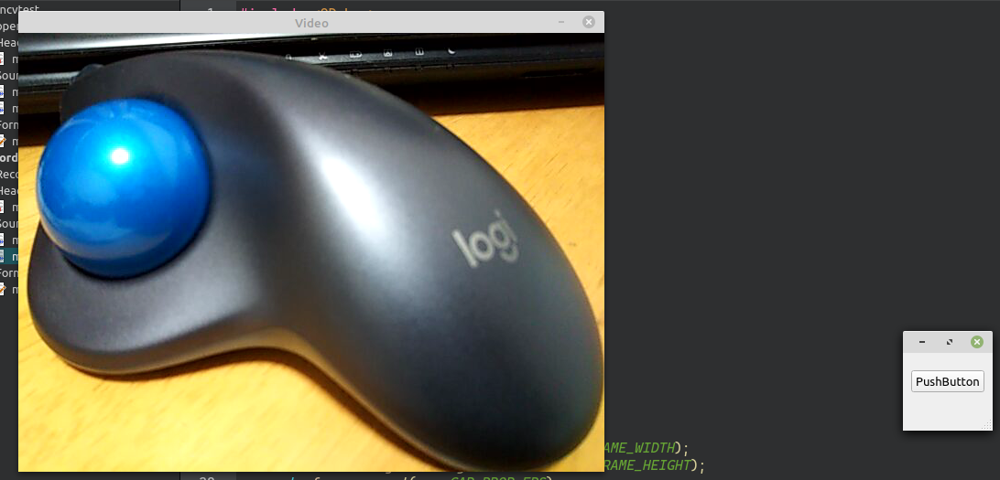

# OpenCV の映像を保存する

環境: Linux Mint 20 + Qt 5.15.1

**[全ソースはここ](https://github.com/Taro3/RecordOpenCVVideo)**

OpenCV の映像をファイルに保存してみます。

保存には OpenCV の VideoWriter クラスを使用し、保存形式はモーション JPEG の AVI ファイルです。

映像を保存するためには、VideoWriter のコンストラクタで、ファイルパス、 fourcc 、フレームレート、解像度を指定します。

```C++
    cv::VideoWriter vw((qApp->applicationDirPath() + "/video.avi").toStdString()
                       , cv::VideoWriter::fourcc('M', 'J', 'P', 'G'), fps, cv::Size(frame_width, frame_height));
```

あとは、各フレームを VideoWriter::write で書き込むだけです。

```C++
        vw.write(frame);
```

終了時に VideoWriter を開放することを忘れないように。

```C++
    vw.release();
```

これも至って簡単ですね。
サンプルでは、 VideoCapture から解像度とフレームレートを取得してそのまま指定しています。

実行するとこんな感じになります。



フォルダを確認すると AVI ファイルができています。


ちなみに、 fourcc を mp4v にして、出力ファイルを .mp4 にすると MP4 ファイルが出力できます。(ただし、ビットレートなどの指定はできないようです)
gstreamer がインストールされている場合は、ビットレートの指定も可能です。(ソース内のコメントアウト部分参照)

***

**[戻る](../Qt.md)**
