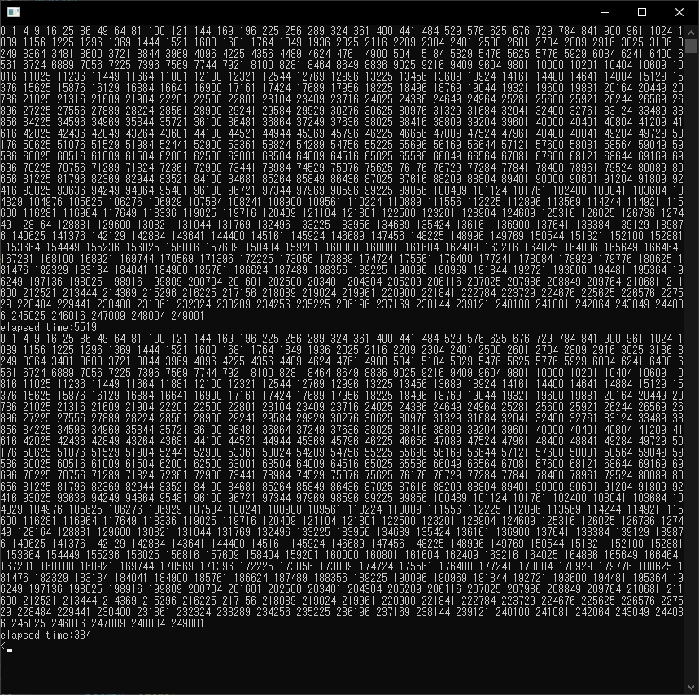

# QtConcurrentの簡単な例

QtConcurrentはQtの並列処理を行うモジュールです。

## プロジェクトファイルの設定

QtConcurrentを使用するには、.proファイルにconcurrentを追加します。

```QMake
QT += concurrent
```

## サンプルプログラム

QtConcurrentを使用した単純なサンプルプログラムです。

まず、処理を行うデータのクラスを作成します。
単純にint値を保持するだけです…(^_^;)

```c++
/**
 * @brief The Params class
 */
class Params {
public:
    /**
     * @brief       Params
     *              コンストラクタ
     * @param[in]   val 初期値
     */
    Params(const int val) : _value{val} {
    }
    /**
     * @brief       setValue
     *              値設定
     * @param[in]   val 設定値
     */
    void setValue(const int val) {
        _value = val;
    }
    /**
     * @brief   value
     *          設定値取得
     * @return
     */
    int value() const {
        return _value;
    }

private:
    int _value; //!< 設定値
};
```

次に処理結果を示すクラスを作成します。
これも単にint値を保持するだけです。

```c++
/**
 * @brief The Result class
 */
class Result {
public:
    /**
     * @brief       Result
     *              コンストラクタ
     * @param[in]   val 設定するリザルト値
     */
    Result(const int val) : _value{val} {
    }
    /**
     * @brief   Result
     *          デフォルトコンストラクタ
     */
    Result() : _value{0} {
    }
    /**
     * @brief   value
     *          リザルト値取得
     * @return  リザルト値
     */
    int value() const {
        return _value;
    }

private:
    int _value; //!< リザルト値
};
```

次に、順次処理と並列処理を行うクラスを作成します。

```c++
/**
 * @brief The TestClass class
 */
class TestClass {
public:
    /**
     * @brief   TestClass
     *          コンストラクタ
     */
    TestClass();
    void execute1();
    void execute2();

private:
    QList<Params> generateParamsSet();
    static Result someReallyTimeConsumingFunction(const Params &params);
    static Result calculateStats(const Params &params);
};

/**
 * @brief   TestClass
 *          コンストラクタ
 */
TestClass::TestClass() {
}

/**
 * @brief   execute1
 *          シーケンシャル処理テスト関数
 */
void TestClass::execute1() {
    QList<Params> params = generateParamsSet();
    QList<Result> results;
    for (int i = 0; i < params.size(); ++i)
        results.append(someReallyTimeConsumingFunction(params[i]));
    foreach (Result r, results)
        std::cout << r.value() << " ";
    std::cout << std::endl << std::flush;
}

/**
 * @brief   TestClass::execute2
 *          並列処理テスト関数
 */
void TestClass::execute2() {
    QList<Params> params = generateParamsSet();
    QList<Result> results = QtConcurrent::blockingMapped(params, &calculateStats);
    foreach (Result r, results)
        std::cout << r.value() << " ";
    std::cout << std::endl << std::flush;
}

/**
 * @brief   generateParamsSet
 *          初期値設定処理
 * @return  設定された初期値リスト
 */
QList<Params> TestClass::generateParamsSet() {
    QList<Params> params;
    for (int i = 0; i < COUNT_MAX; ++i)
        params.append(Params(i));
    return params;
}

/**
 * @brief       someReallyTimeConsumingFunction
 *              各要素に対する処理(時間のかかる処理本体)
 * @param[in]   params  処理するパラメータリスト
 * @return      リザルト値オブジェクト
 */
Result TestClass::someReallyTimeConsumingFunction(const Params &params) {
    qApp->thread()->msleep(10);
    int r = 0;
    r = std::pow(params.value(), 2);

    return Result(r);
}

/**
 * @brief   calculateStats
 *          並行処理実行関数
 * @param[in]   params  パラメータリスト
 * @return  リザルトオブジェクト
 */
Result TestClass::calculateStats(const Params &params) {
    return someReallyTimeConsumingFunction(params);
}
```

最後に、テストを実行するメイン処理を実装します。

```cpp
/**
 * @brief   main
 *          プログラムメイン
 * @param   argc
 * @param   argv
 * @return
 */
int main(int argc, char *argv[]) {
    QCoreApplication app(argc, argv);

    QElapsedTimer et;
    TestClass t;

    // シーケンシャル処理
    et.start();
    t.execute1();
    std::cout << "elapsed time:" << et.elapsed() << std::endl << std::flush;

    // 並列処理
    et.restart();
    t.execute2();
    std::cout << "elapsed time:" << et.elapsed() << std::endl << std::flush;

    return 0;
}
```

## 実行結果

上記のプログラムの実行結果を示します。



※これはWindows10上のQt 5.12.8を使用した結果です。(CPUはi9-9900K)
並列処理を行った場合の処理時間の短さがわかりますね(^_^;)

## QtConcurrent非対応の場合を加味する

QtConcurrentが使用できない環境のへの対応が必要な場合は、QT_NO_CONCURRENTを使用して処理を振り分けます。

```c++
#if defined(QT_NO_CONCURRENT)
    // シーケンシャル処理
    et.start();
    t.execute1();
    std::cout << "elapsed time:" << et.elapsed() << std::endl << std::flush;
#else
    // 並列処理
    et.restart();
    t.execute2();
    std::cout << "elapsed time:" << et.elapsed() << std::endl << std::flush;
#endif
```

## プログラム全体

最後に、プログラム全体を示します。

```c++
#include <iostream>

#include <QObject>
#include <QCoreApplication>
#include <QElapsedTimer>
#include <QThread>
#include <QtConcurrent>

constexpr int COUNT_MAX = 500;

/**
 * @brief The Params class
 */
class Params {
public:
    /**
     * @brief       Params
     *              コンストラクタ
     * @param[in]   val 初期値
     */
    Params(const int val) : _value{val} {
    }
    /**
     * @brief       setValue
     *              値設定
     * @param[in]   val 設定値
     */
    void setValue(const int val) {
        _value = val;
    }
    /**
     * @brief   value
     *          設定値取得
     * @return
     */
    int value() const {
        return _value;
    }

private:
    int _value; //!< 設定値
};

/**
 * @brief The Result class
 */
class Result {
public:
    /**
     * @brief       Result
     *              コンストラクタ
     * @param[in]   val 設定するリザルト値
     */
    Result(const int val) : _value{val} {
    }
    /**
     * @brief   Result
     *          デフォルトコンストラクタ
     */
    Result() : _value{0} {
    }
    /**
     * @brief   value
     *          リザルト値取得
     * @return  リザルト値
     */
    int value() const {
        return _value;
    }

private:
    int _value; //!< リザルト値
};

/**
 * @brief The TestClass class
 */
class TestClass {
public:
    /**
     * @brief   TestClass
     *          コンストラクタ
     */
    TestClass();
    void execute1();
    void execute2();

private:
    QList<Params> generateParamsSet();
    static Result someReallyTimeConsumingFunction(const Params &params);
    static Result calculateStats(const Params &params);
};

/**
 * @brief   TestClass
 *          コンストラクタ
 */
TestClass::TestClass() {
}

/**
 * @brief   execute1
 *          シーケンシャル処理テスト関数
 */
void TestClass::execute1() {
    QList<Params> params = generateParamsSet();
    QList<Result> results;
    for (int i = 0; i < params.size(); ++i)
        results.append(someReallyTimeConsumingFunction(params[i]));
    foreach (Result r, results)
        std::cout << r.value() << " ";
    std::cout << std::endl << std::flush;
}

/**
 * @brief   TestClass::execute2
 *          並列処理テスト関数
 */
void TestClass::execute2() {
    QList<Params> params = generateParamsSet();
    QList<Result> results = QtConcurrent::blockingMapped(params, &calculateStats);
    foreach (Result r, results)
        std::cout << r.value() << " ";
    std::cout << std::endl << std::flush;
}

/**
 * @brief   generateParamsSet
 *          初期値設定処理
 * @return  設定された初期値リスト
 */
QList<Params> TestClass::generateParamsSet() {
    QList<Params> params;
    for (int i = 0; i < COUNT_MAX; ++i)
        params.append(Params(i));
    return params;
}

/**
 * @brief       someReallyTimeConsumingFunction
 *              各要素に対する処理(時間のかかる処理本体)
 * @param[in]   params  処理するパラメータリスト
 * @return      リザルト値オブジェクト
 */
Result TestClass::someReallyTimeConsumingFunction(const Params &params) {
    qApp->thread()->msleep(10);
    int r = 0;
    r = std::pow(params.value(), 2);

    return Result(r);
}

/**
 * @brief   calculateStats
 *          並行処理実行関数
 * @param[in]   params  パラメータリスト
 * @return  リザルトオブジェクト
 */
Result TestClass::calculateStats(const Params &params) {
    return someReallyTimeConsumingFunction(params);
}

/**
 * @brief   main
 *          プログラムメイン
 * @param   argc
 * @param   argv
 * @return
 */
int main(int argc, char *argv[]) {
    QCoreApplication app(argc, argv);

    QElapsedTimer et;
    TestClass t;

    // シーケンシャル処理
    et.start();
    t.execute1();
    std::cout << "elapsed time:" << et.elapsed() << std::endl << std::flush;

    // 並列処理
    et.restart();
    t.execute2();
    std::cout << "elapsed time:" << et.elapsed() << std::endl << std::flush;

    return 0;
}
```

***

**[戻る](../Qt.md)**
