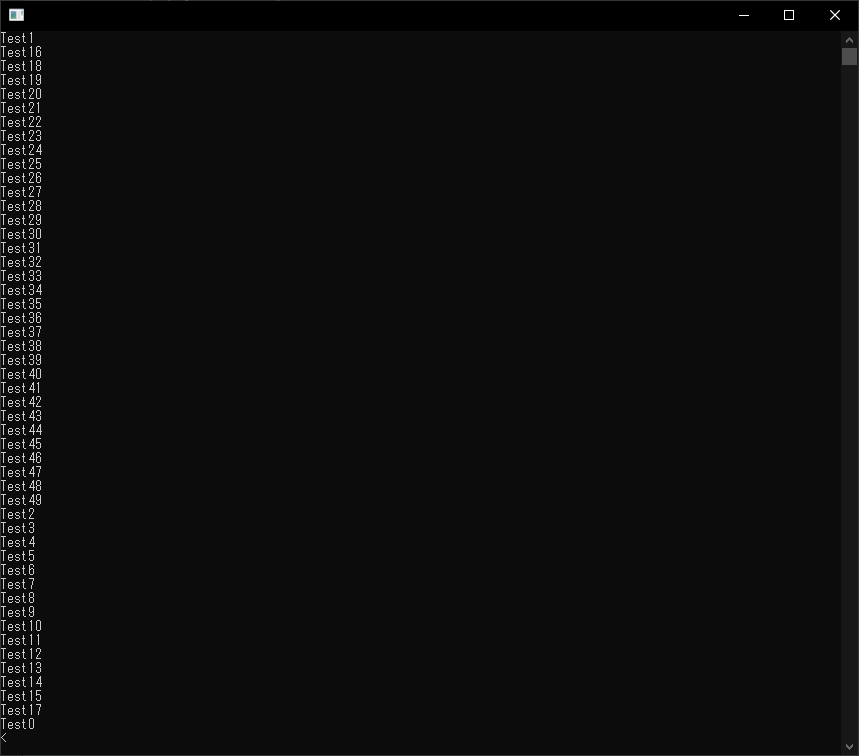

# QtConcurrentを使用してコレクション内の全オブジェクト関数を並列で呼び出す方法

QtConcurrentはQtの並列処理を行うモジュールです。

## プロジェクトファイルの設定

QtConcurrentを使用するには、.proファイルにconcurrentを追加します。

```QMake
QT += concurrent
```

## サンプルプログラム

まず、コレクションするオブジェクトのクラスを作成します。

```c++
/**
 * @brief The MyClass class
 */
class MyClass {
public:
    /**
     * @brief       MyClass
     *              コンストラクタ
     * @param[in]   i   データ
     */
    MyClass(int i) : _i{i} {
    }
    /**
     * @brief   MyClass
     *          デフォルトコンストラクタ
     */
    MyClass() : _i{0} {
    }
    /**
     * @brief   Test
     *          呼び出される関数
     */
    void Test() {
        std::string s = "Test" + std::to_string(_i) + "\n";
        std::cout << s;
    }
private:
    int _i; //!< データ
};
```

次にコレクション内の関数を呼び出すメイン処理を作成します。

```c++
/**
 * @brief       main
 *              プログラムメイン
 * @param argc
 * @param argv
 * @return
 */
int main(int argc, char *argv[]) {
    QCoreApplication a(argc, argv);

    QVector<MyClass> v;
    for (int i = 0; i < 50; ++i) {
        MyClass mc(i);
        v.push_back(mc);
    }
    QtConcurrent::blockingMap(v.begin(), v.end(), &MyClass::Test);

    return 0;
}
```

## 実行結果

実行結果を示します。
コレクション内の全Test関数が呼び出されているのがわかりますね(^_^;)



## プログラム全体

最後に、プログラム全体を示します。

```c++
#include <iostream>

#include <QCoreApplication>
#include <QtConcurrentMap>

/**
 * @brief The MyClass class
 */
class MyClass {
public:
    /**
     * @brief       MyClass
     *              コンストラクタ
     * @param[in]   i   データ
     */
    MyClass(int i) : _i{i} {
    }
    /**
     * @brief   MyClass
     *          デフォルトコンストラクタ
     */
    MyClass() : _i{0} {
    }
    /**
     * @brief   Test
     *          呼び出される関数
     */
    void Test() {
        std::string s = "Test" + std::to_string(_i) + "\n";
        std::cout << s;
    }
private:
    int _i; //!< データ
};

/**
 * @brief       main
 *              プログラムメイン
 * @param argc
 * @param argv
 * @return
 */
int main(int argc, char *argv[]) {
    QCoreApplication a(argc, argv);

    QVector<MyClass> v;
    for (int i = 0; i < 50; ++i) {
        MyClass mc(i);
        v.push_back(mc);
    }
    QtConcurrent::blockingMap(v.begin(), v.end(), &MyClass::Test);

    return 0;
}
```

***

**[戻る](../Qt.md)**
